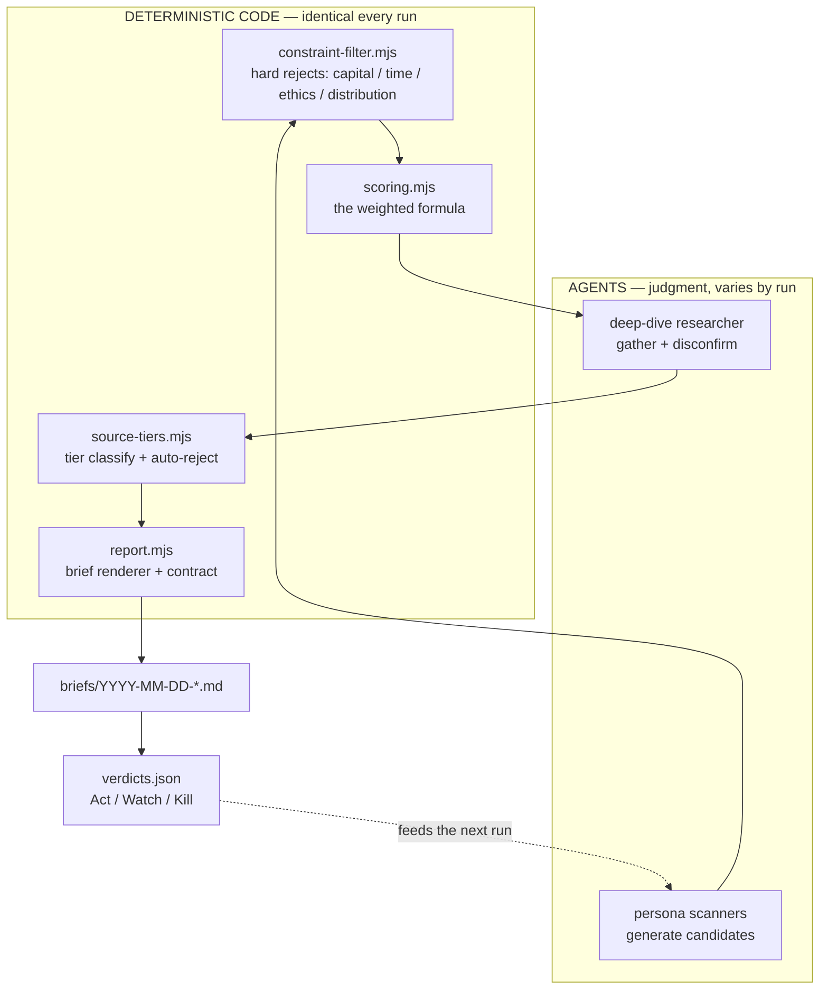

# PROSPECTOR

A tool that narrows a large space of possible money-making opportunities down to a **small, scored, evidence-backed shortlist** — for one specific operator, with one specific set of constraints and edges.

It is not a conversation. It runs again next week, and the week after, and gets sharper each time.

```bash
node scripts/scan.mjs --domain "AI automation and compliance services for regulated industries"
```

That command writes a scored brief to `briefs/`. That is the whole point of the repo.

---

## The one command

| | |
|---|---|
| **Run a scan** | `node scripts/scan.mjs --domain "<what to look at this week>"` |
| **Try it free** | `node scripts/scan.mjs --domain "anything" --dry-run` — fixtures, no network, no spend |
| **Record a verdict** | `node scripts/verdict.mjs --brief <id> --verdict act\|watch\|kill --why "..."` |
| **See the north star** | `node scripts/verdict.mjs --list` |
| **Run the tests** | `npm test` |

**Requires:** Node ≥ 20.6 and the `claude` CLI on `PATH`, logged in. No npm dependencies.

### Options worth knowing

| Flag | Default | Why you'd change it |
|---|---|---|
| `--research-transport websearch\|direct-api` | `websearch` | `websearch` in a sandbox (WebFetch and curl are egress-blocked). `direct-api` on your own machine, where agents can hit sec.gov / FRED / BLS directly. |
| `--max-spend <usd>` | `8.00` | Hard ceiling. The runner refuses to start a call that would cross it. |
| `--shortlist <n>` / `--min-score <n>` | `3` / `6.0` | How many briefs, and how good a candidate must be to earn one. |
| `--candidates <n>` | `6` | Candidates requested per persona. |
| `--personas <a,b>` | all enabled | Restrict the panel. |
| `--dry-run` | off | Fixtures instead of agents. Proves the pipeline without spending. |

---

## How it works

The split between **code** and **agents** is the whole design. Anything that must give the *same answer for the same input* is code. Anything requiring judgment about the world is an agent. **An agent never does arithmetic.**



**Why this ordering matters:** the constraint filter runs *before* any deep-dive call. A candidate needing $250K is killed for free, not after $0.30 of research.

### Modules

| File | Responsibility | Tests |
|---|---|---|
| `lib/scoring.mjs` | `score({edgeFit, asymmetry, tractability, timing, downsideProtection})` → number + shown arithmetic | 13 |
| `lib/constraint-filter.mjs` | Hard-rejects candidates violating the operator's constraints | 20 |
| `lib/source-tiers.mjs` | Tier 1/2/3/REJECTED classification + SEO-content-farm detection + the evidence gate | 24 |
| `lib/memory.mjs` | The three memory banks + the learning-rate guard | 11 |
| `lib/funnel.mjs` | Orchestrates generate → filter → dedupe → score → deep-dive → tier → brief | 8 |
| `lib/agent-runner.mjs` | Agent + research transports, JSON recovery, retry, spend ledger | 9 |
| `lib/report.mjs` | Brief renderer; enforces the output contract | 3 |
| `lib/personas/` | Persona lenses and prompt construction | — |
| `scripts/scan.mjs` | **The entry point** | dry-run smoke |
| `scripts/verdict.mjs` | Records Act / Watch / Kill; the 6-month checkpoint | — |

### Scoring

```
Score = 0.25·EdgeFit + 0.25·Asymmetry + 0.20·Tractability + 0.15·Timing + 0.15·DownsideProtection
```

The weights are a **hypothesis, not a law**. They live in `config/prospector.config.json` and every brief prints the weights it was scored under, so old briefs stay interpretable after you change them.

### Research standards, encoded

`lib/source-tiers.mjs` holds the tier lists as **data**. It auto-rejects Reddit, Medium, LinkedIn posts, press-release wires, market-research PDF-sellers, salary/rate aggregators, and — the trap that caught the first attempt by hand — **any page shaped like SEO content** (`How much do X charge`, `Average X rates 2026`, `Ultimate guide to…`, `Top 10 …`). Wikipedia classifies as `pointer-only`: follow its citations, never cite it.

Rejected sources are not silently dropped. Every brief carries an **Appendix — rejected sources** table showing exactly what was thrown away and why.

---

## What the operator has to do

Two things, and only two:

1. **Pick the domain** to scan this week.
2. **Record a verdict** on each brief.

The verdict is what makes the loop a loop. Recorded verdicts are injected into the next scan prompt as prior-verdict context, so the personas see which of their previous calls you bought and which you killed.

### Learning rates — the anti-overfit guard

Encoded in `lib/memory.mjs`, enforced in code:

| Change | Needs |
|---|---|
| Add an example | **1 signal** — additive, safe, immediate |
| Change a process rule | **2+ similar signals** |
| Change the loop structurally | **3+ signals AND explicit approval** |

**Never overfit to one bad brief.**

**North-star metric:** % of *Acted* briefs the operator still endorses **6 months later**. Record it with `--endorsed true|false`; read it with `--list`.

---

## Build status

| Phase | Deliverable | State |
|---|---|---|
| **1** | `scoring` + `constraint-filter` + `source-tiers` with passing tests | ✅ **Done** — `npm test` green |
| **2** | `scan.mjs` + one persona (AI & Automation Analyst) + brief renderer | ✅ **Done** — writes real scored briefs |
| **3** | Remaining 3 personas + Synthesizer with recorded dissent | ⏸ **Not started** — awaiting operator sign-off on the Phase 2 slice |
| **4** | Memory forward/backward pass — a verdict demonstrably changes the next run | ◐ **Partial** — banks, verdict recording and the learning-rate guard exist; verdicts are injected into scan prompts. The backward pass (verdicts reshaping weights/rules) is not built. |
| **5** | Cadence + docs — weekly scan, monthly deep dive, quarterly recalibration | ◐ **Partial** — this README; no scheduler |

Phase 3's roster is stubbed in `lib/personas/index.mjs` with each persona's domain and reason for existing, marked `enabled: false`. Until then `lib/funnel.mjs` dedupes deterministically instead of via the Synthesizer, and no dissent is recorded — with one persona there is nobody to disagree with.

### Cadence (Phase 5 intent)

| Rhythm | Action |
|---|---|
| **Weekly** | One `scan.mjs` run on a chosen domain. Record verdicts. |
| **Monthly** | Deep dive on the standing `watch` list. |
| **Quarterly** | Re-read `memory/operator-profile.md` against reality. Constraints and edges drift. |

---

## Files

```
prospector/
├── config/prospector.config.json   every tunable number
├── memory/operator-profile.md      the operator, calibrated 2026-08-07 — the tool reads this
├── references/
│   ├── examples.json               worked examples of good output
│   ├── antipatterns.json           observed failures + the rule each produces
│   └── verdicts.json               Act / Watch / Kill history
├── lib/                            modules (see table above)
├── scripts/scan.mjs                THE ENTRY POINT
├── scripts/verdict.mjs             record a verdict
├── test/                           91 tests
├── briefs/                         output
└── runs/                           full JSON record of every run
```

---

## Limits — read these

- **Not financial advice, not an auto-trader, not a guarantee.** Every decision is the operator's. Every brief carries risks and kill criteria; the renderer refuses to emit a brief without blind spots.
- **A brief is a hypothesis with citations, not a verified fact.** The source-tier gate raises the floor; it does not make claims true.
- **Agent output varies run to run.** That is by design — the deterministic layer is what stays fixed.
- **Cost is real.** A full run is a handful of `claude` calls. The ledger prints the spend and the budget refuses to exceed `--max-spend`.
- **The operator profile is an input, not a discovery.** If it goes stale the whole tool aims at the wrong target. Re-check it quarterly.
