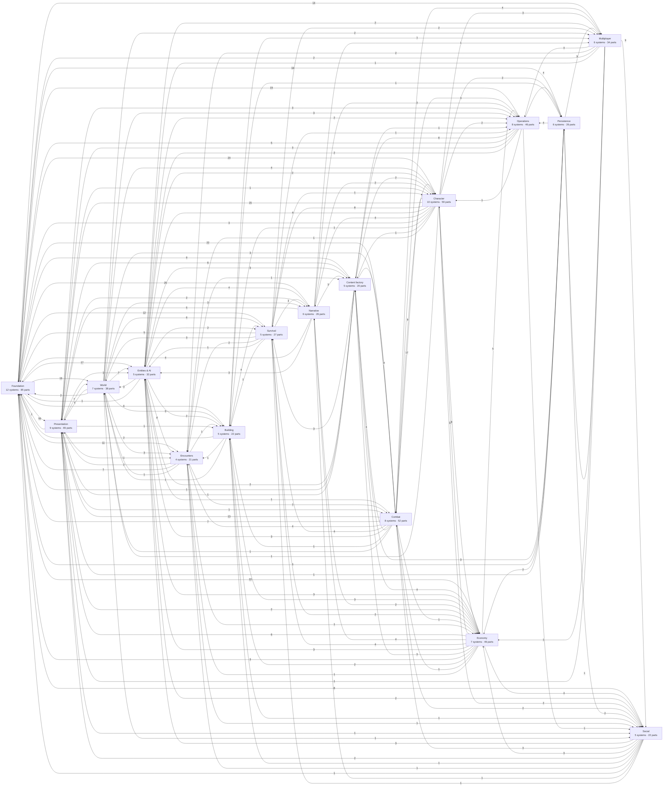

<!-- GENERATED by scripts/lib/systems-map.mjs render — do not edit; edit systems/registry/*.md and re-run. registry-hash: 949cf432b712 -->
# EMBER Systems Atlas

> The map of every system the game needs, tiered by containment (1 = domain, 2 = system, 3–4 = parts), and the wiring between them. Per [ADR-0065](../adr/0065-systems-atlas-and-impact-map.md). Source of truth: [`registry/`](./registry/). Ask questions with `scripts/systems-map.sh impact <id>` — the answer is computed, not read.

**How to read a badge:** `[P3][spec][orchestrator]` = lands in **Phase 3**, is **in the spec**, owned by the **orchestrator** role. Status: `spec` = named in GAME_INFRA_SPEC.md · `implied` = required by something the spec says · `candidate` = requested (by the Director or genre-standard) but **not in the spec → needs a DIRECTOR decision and a spec PR (R10/§14)** · `non-goal` = the spec says do not build.

**How to read an arrow:** `A → B` means *a change in A can affect B*. Each edge carries **how** (listens/reads/references/…), **where** (the signal, field, or path it runs through), **strength** (hard = breaks; soft = degrades), and **why**.

## At a glance

| Nodes | Influence edges | Tier 1 | Tier 2 | Tier 3 | Tier 4 | spec | implied | candidate | non-goal |
|---|---|---|---|---|---|---|---|---|---|
| 745 | 1131 | 16 | 108 | 621 | 0 | 266 | 232 | 242 | 5 |

| Domain | Phase | Systems | Parts | spec | implied | candidate | Edges in / internal / out | Coupling | Blast radius |
|---|---|---|---|---|---|---|---|---|---|
| [Foundation](#foundation) | 0 | 12 | 85 | 58 | 18 | 22 | 41 / 33 / 276 | 91% | 494 |
| [Character](#character) | 1 | 10 | 59 | 15 | 24 | 31 | 57 / 49 / 72 | 72% | 232 |
| [Combat](#combat) | 1 | 8 | 52 | 26 | 12 | 23 | 53 / 47 / 54 | 69% | 158 |
| [Survival](#survival) | 3 | 5 | 27 | 9 | 12 | 12 | 44 / 16 / 21 | 80% | 147 |
| [Economy](#economy) | 2 | 7 | 46 | 17 | 9 | 28 | 54 / 37 / 48 | 73% | 225 |
| [Entities & AI](#ai_entities) | 1 | 5 | 32 | 13 | 16 | 9 | 47 / 25 / 35 | 77% | 149 |
| [Encounters](#encounters) | 2 | 4 | 21 | 3 | 13 | 10 | 35 / 10 / 9 | 81% | 11 |
| [World](#world) | 1 | 7 | 38 | 9 | 19 | 18 | 33 / 40 / 43 | 66% | 209 |
| [Building](#building) | 3 | 5 | 22 | 6 | 9 | 13 | 21 / 25 / 14 | 58% | 176 |
| [Narrative](#narrative) | 2 | 6 | 26 | 14 | 7 | 11 | 45 / 23 / 23 | 75% | 124 |
| [Presentation](#presentation) | 1 | 9 | 65 | 22 | 38 | 14 | 109 / 26 / 27 | 84% | 260 |
| [Multiplayer](#multiplayer) | 4 | 6 | 34 | 12 | 22 | 5 | 32 / 16 / 21 | 77% | 98 |
| [Social](#social) | 4 | 5 | 22 | 0 | 11 | 17 | 34 / 14 / 16 | 78% | 64 |
| [Persistence](#persistence) | 3 | 6 | 26 | 19 | 3 | 11 | 24 / 23 / 18 | 65% | 23 |
| [Operations](#operations) | 0 | 8 | 46 | 25 | 17 | 12 | 50 / 27 / 24 | 73% | 328 |
| [Content factory](#content_factory) | 2 | 5 | 20 | 18 | 2 | 6 | 40 / 1 / 18 | 98% | 171 |

*Coupling* = share of a domain's edges that cross its border. *Blast radius* = how many systems outside the domain a change inside it can reach.

## The big picture (tier 1)

## Load-bearing systems (largest blast radius)

Change these carefully; they reach the most. *Fan-out / fan-in* are direct edges; *blast* is transitive.

| Tier-2 system | Domain | Status | Blast | Fan-out | Fan-in |
|---|---|---|---|---|---|
| `data_schemas` Data schemas (the nouns) | Foundation | spec | 419 | 4 | 1 |
| `architecture_rules` Architecture rules (R1–R10) | Foundation | spec | 378 | 1 | 1 |
| `documentation` Documentation | Operations | spec | 344 | 0 | 0 |
| `art_pipeline` Art pipeline | Presentation | spec | 291 | 0 | 0 |
| `state_model` Serializable game state | Foundation | spec | 290 | 1 | 0 |
| `engine_platform` Engine & Build | Foundation | spec | 269 | 2 | 0 |
| `items` Items | Economy | spec | 249 | 19 | 1 |
| `inventory` Inventory | Character | spec | 227 | 12 | 0 |
| `equipment` Equipment & gear | Character | spec | 202 | 3 | 0 |
| `command_intents` Command / intent events | Foundation | spec | 200 | 0 | 0 |
| `time_and_tick` Time & scheduling | Foundation | spec | 196 | 0 | 0 |
| `placement` Placement | Building | spec | 189 | 2 | 3 |
| `terrain_biomes` Terrain & biomes | World | spec | 188 | 1 | 0 |
| `event_bus` EventBus | Foundation | spec | 180 | 3 | 1 |
| `progression` Progression | Character | implied | 173 | 1 | 0 |

| Tier-3+ part | Domain | Status | Blast | Fan-out | Fan-in |
|---|---|---|---|---|---|
| `game_infra_spec` GAME_INFRA_SPEC.md | Operations | spec | 347 | 14 | 0 |
| `id_convention` ID convention (R7) | Foundation | spec | 302 | 14 | 0 |
| `actor_registry` Actor registry | Foundation | spec | 288 | 18 | 0 |
| `project_settings` Project settings | Foundation | implied | 266 | 7 | 0 |
| `art_bible_palette` Art bible & palette | Presentation | spec | 265 | 5 | 0 |
| `schema_versioning` Schema versioning + migrations | Foundation | spec | 259 | 4 | 0 |
| `state_serialization` State serialization | Foundation | spec | 256 | 14 | 3 |
| `schema_item_def` ItemDef | Foundation | spec | 251 | 5 | 0 |
| `master_toon_shader` Master toon shader | Presentation | spec | 246 | 2 | 1 |
| `import_hook` Import hook | Presentation | spec | 244 | 10 | 2 |
| `deterministic_sim` Deterministic simulation (R4) | Foundation | spec | 224 | 25 | 0 |
| `intent_schema` Intent schema | Foundation | spec | 202 | 18 | 0 |
| `fixed_tick_sim` Fixed-tick simulation loop | Foundation | spec | 198 | 15 | 2 |
| `schema_building_piece_def` BuildingPieceDef (implied) | Foundation | implied | 194 | 1 | 0 |
| `piece_defs` Building piece definitions | Building | implied | 193 | 9 | 3 |

## DIRECTOR decisions needed (candidate systems)

These were asked for but are **not in GAME_INFRA_SPEC.md**. Each needs a yes/no/later and, if yes, a spec PR (R10 / §14). Nothing below is built until then.

- **Foundation** — `sig_structure_placed`, `sig_structure_destroyed`, `sig_player_joined`, `sig_player_left`, `sig_level_up`, `sig_currency_changed`, `sig_reputation_changed`, `sig_boss_phase_changed`, `sig_weather_changed`, `sig_zone_entered`, `sig_need_threshold_crossed`, `sig_trade_completed`, `schema_class_def`, `schema_talent_def`, `schema_faction_def`, `schema_achievement_def`, `in_game_bug_report`, `replay_recorder`, `localization` (Localization & text, 3 parts), `string_tables`, `font_pipeline`, `locale_switch`
- **Character** — `swimming`, `climbing`, `dodge_roll`, `primary_attributes`, `achievements`, `titles`, `prestige`, `classes_specs` (Classes & specializations, 4 parts), `class_defs`, `role_specs`, `class_starting_kit`, `multiclass_rules`, `talents` (Talents, 4 parts), `talent_trees`, `talent_points`, `respec`, `talent_modifiers`, `skill_ranks`, `weapon_skills`, `energy_pool`, `rage_pool`, `focus_pool`, `divinity_pool`, `corruption_pool`, `bank_storage`, `loot_bags_on_death`, `durability_repair`, `transmog`, `set_bonuses`, `appearance_customization`, `multiple_characters_per_world`
- **Combat** — `crit_hit_tables`, `interrupts`, `global_cooldown`, `spell_queueing`, `channeling`, `dispel_cleanse`, `immunities`, `crowd_control_dr`, `auras_area_effects`, `blocking_parry`, `combos`, `ranged_weapons`, `taunt`, `threat_modifiers`, `support_enhance_kit`, `role_balance_targets`, `pvp` (PvP, 5 parts), `pvp_flagging`, `dueling`, `arenas`, `pvp_balance_split`, `faction_warfare`, `element_matrix`
- **Survival** — `thirst`, `temperature_exposure`, `rest_sleep`, `disease_sanity`, `time_skip_sleep`, `fishing`, `farming`, `animal_husbandry`, `drowning`, `biome_hazard_zones`, `fire_burning_env`, `rested_bonus`
- **Economy** — `random_affixes`, `item_levels`, `world_chests_containers`, `boss_loot_lockouts`, `pity_bad_luck_protection`, `salvage_disassembly`, `item_upgrades_enchanting`, `crafting_quality_rolls`, `repair`, `professions` (Professions, 5 parts), `profession_defs`, `profession_skill_levels`, `profession_specializations`, `profession_recipe_gating`, `gathering_professions`, `currencies` (Currencies, 4 parts), `currency_defs`, `wallet`, `sinks_faucets`, `faction_currencies`, `trade_vendors` (Trade, vendors & markets, 6 parts), `player_trade`, `npc_vendors_stores`, `vendor_inventories_restock`, `market_board_auction`, `commodity_pricing`, `mail_system`, `carts_transport`
- **Entities & AI** — `enemy_factions_hostility`, `elite_rare_variants`, `behavior_trees_utility`, `group_tactics`, `llm_npc_intelligence`, `trainers`, `npc_schedules_routines`, `companions_pets`, `mounts`
- **Encounters** — `enrage_timers`, `world_bosses`, `difficulty_tiers`, `instancing`, `procedural_dungeons`, `raid_lockouts`, `world_events` (World events, 3 parts), `invasion_events`, `event_scheduler`, `dynamic_events_ai_director`
- **World** — `water_bodies`, `caves`, `world_generation` (World generation, 6 parts), `world_seed`, `procedural_terrain`, `chunk_streaming`, `poi_placement`, `resource_distribution`, `weather`, `seasons_calendar`, `fast_travel_portals`, `roads`, `mounts_travel`, `boats_ships`, `fog_of_war_discovery`, `cities`, `ragdoll`, `destructibles`
- **Building** — `structural_integrity`, `terrain_modification`, `decorations`, `farm_plots`, `homes_strongholds` (Homes, strongholds & player cities, 5 parts), `player_home`, `stronghold_walls_gates`, `base_defense_sieges`, `player_cities`, `npc_settlers`, `land_claims`, `decay_inactive`, `structure_damage_repair`
- **Narrative** — `repeatable_daily_quests`, `barks_ambient_lines`, `voice_acting`, `lore_entries_codex`, `onboarding_tutorial` (Onboarding & tutorial, 2 parts), `tutorial_quests`, `contextual_hints`, `live_events` (Live events & holidays, 3 parts), `holiday_defs`, `event_calendar`, `seasonal_rewards`
- **Presentation** — `ik_procedural`, `facial_emotes`, `screen_effects`, `music_system`, `target_lock_camera`, `photo_mode`, `combat_log_window`, `ux_accessibility` (UX & accessibility, 4 parts), `colorblind_modes`, `text_scaling`, `subtitles`, `motion_reduction`, `gamepad_support`, `input_buffering`
- **Multiplayer** — `listen_server_option`, `interpolation_prediction`, `interest_management`, `rate_limits`, `save_tamper_resistance`
- **Social** — `ready_checks`, `guilds` (Guilds, 4 parts), `guild_defs_membership`, `guild_bank`, `guild_ranks_permissions`, `guild_halls`, `reputation_factions` (Reputation & factions, 6 parts), `faction_defs`, `reputation_tiers`, `reputation_sources`, `faction_unlocks_vendors`, `mob_faction_hostility`, `player_alignment`, `emotes`, `voice_chat`, `friends_list`, `block_mute`
- **Persistence** — `backup_rotation`, `accounts_auth` (Accounts & authentication, 5 parts), `account_identity`, `authentication_provider`, `cross_server_characters`, `cloud_db_postgres`, `leaderboards`, `character_migration_between_worlds`, `telemetry_store` (Telemetry store, 2 parts), `gameplay_analytics_events`, `crash_reports_store`
- **Operations** — `perf_budget_tests`, `nightly_soak_builds`, `patching_updates`, `steam_platform`, `mod_support`, `log_aggregation`, `crash_reporting`, `alerting`, `gameplay_analytics`, `low_end_fallbacks`, `benchmark_scene`, `subagent_mirrors`
- **Content factory** — `loot_economy_sim`, `combat_sim_harness`, `live_content_ops` (Live content operations, 3 parts), `content_patches`, `seasonal_drops`, `hotfix_data_only`

**Non-goals (kept on the map so the boundary is visible):** `prerendered_cutscenes`, `photorealism`, `mmo_scale_sharding`, `matchmaking_service`, `mobile_console_ports`

## EventBus signals (mechanically derived from the ledger — compare with spec §5)

| Signal | Status | Emitted by | Listeners |
|---|---|---|---|
| `actor_spawned` | spec | `spawning` | `objective_tracking`, `ai_director` |
| `actor_damaged` | spec | `damage_model`, `fall_damage` | `nameplates_floating_text`, `impact_effects`, `threat_table`, `perception`, `combat_log_window` |
| `actor_healed` | spec | `healing_model` | `health_resource_bars`, `nameplates_floating_text`, `combat_log_window` |
| `actor_died` | spec | `death_resolution` | `objective_tracking`, `loot_rolls_on_death`, `xp_award`, `hit_reactions_death_anims`, `threat_table`, `corpse_handling`, `respawn_rules`, `reputation_sources`, `combat_log_window` |
| `spell_cast` | spec | `cast_timing` | `element_default_vfx`, `sfx_events`, `perception` |
| `effect_applied` | spec | `effect_kinds_verbs` | `buff_bars`, `buff_debuff_visuals` |
| `effect_expired` | spec | `effect_duration_expiry` | `buff_bars`, `buff_debuff_visuals` |
| `item_acquired` | spec | `item_pickup_drop` | `objective_tracking`, `notifications_toasts` |
| `item_consumed` | spec | `consumables_apply` | `needs`, `inventory_screen` |
| `item_crafted` | spec | `craft_time_queue` | `objective_tracking`, `notifications_toasts`, `sfx_events` |
| `quest_started` | spec | `quests` | `quest_journal_screen`, `dialogue` |
| `quest_objective_progressed` | spec | `objective_tracking` | `notifications_toasts` |
| `quest_completed` | spec | `quests` | `quest_journal_screen`, `quest_rewards`, `xp_award`, `reputation_sources` |
| `day_phase_changed` | spec | `world_clock_ticks` | `lighting_day_night`, `spawn_rules_biome_phase`, `ai_brain`, `ambience_zones` |
| `world_saved` | spec | `save_system` | `notifications_toasts` |
| `world_loaded` | spec | `save_system` | `notifications_toasts` |
| `structure_placed` | candidate | `placement` | `structure_persistence`, `navmesh_baking`, `objective_tracking` |
| `structure_destroyed` | candidate | `structure_damage_repair` | `structure_persistence`, `navmesh_baking` |
| `player_joined` | candidate | `join_leave_flow` | `party_membership`, `group_frames`, `text_chat` |
| `player_left` | candidate | `join_leave_flow` | `party_membership` |
| `level_up` | candidate | `level_curve` | `notifications_toasts`, `ability_unlocks`, `talent_points` |
| `currency_changed` | candidate | `wallet` | `inventory_screen` |
| `reputation_changed` | candidate | `reputation_sources` | `faction_unlocks_vendors`, `notifications_toasts` |
| `boss_phase_changed` | candidate | `boss_phases` | `boss_frames`, `telegraph_visuals`, `music_system` |
| `weather_changed` | candidate | `weather` | `temperature_exposure`, `ambience_zones`, `lighting_day_night` |
| `zone_entered` | candidate | `zone_triggers` | `objective_tracking`, `ambience_zones`, `notifications_toasts`, `music_system` |
| `need_threshold_crossed` | candidate | `need_thresholds_effects` | `effect_kinds_verbs`, `health_resource_bars` |
| `trade_completed` | candidate | `player_trade` | `inventory_screen`, `objective_tracking` |

## Findings from `validate`

- ℹ 12 candidate signal(s) await a §5 entry (R-EB1 PR): structure_placed, structure_destroyed, player_joined, player_left, level_up, currency_changed, reputation_changed, boss_phase_changed, weather_changed, zone_entered, need_threshold_crossed, trade_completed
- ℹ 3 feedback loop(s) in the influence graph (normal for an event-driven design; each is a place where a change can come back around): [2] loot_bags_on_death, respawn_rules · [7] death_resolution, derived_stats, health_pool, level_curve, level_scaling, sig_actor_died … · [2] durability_repair, repair

---

# Domain pages

One page per domain: its tree with badges, its tier-2 wiring diagram, the Director decisions inside it, and every edge that crosses its border.

- [Foundation](./atlas/00-foundation.md) — [P0][spec][orchestrator] Engine, architecture rules, EventBus, schemas, content pipeline, time, state, debug tools
- [Character](./atlas/01-character.md) — [P1][implied][orchestrator] The player avatar: controller, stats, progression, resources, inventory, equipment, identity
- [Combat](./atlas/02-combat.md) — [P1][spec][orchestrator] Damage, casting, status effects, weapons, threat, roles, and the spell and effect content
- [Survival](./atlas/03-survival.md) — [P3][spec][orchestrator] Needs, the day/night clock, gathering, hazards, camp and rest
- [Economy](./atlas/04-economy.md) — [P2][spec][content-smith] Items, loot, crafting, professions, currencies, trade, storage
- [Entities & AI](./atlas/05-ai-entities.md) — [P1][spec][orchestrator] Enemies, spawning, AI brains, friendly NPCs, actor lifecycle
- [Encounters](./atlas/06-encounters.md) — [P2][spec][orchestrator] Boss fights, dungeons, raids and world events
- [World](./atlas/07-world.md) — [P1][spec][world-builder] Terrain and biomes, generation, environment, travel, places, physics, navigation
- [Building](./atlas/08-building.md) — [P3][spec][orchestrator] Placement, structures, homes and strongholds, ownership, persistence
- [Narrative](./atlas/09-narrative.md) — [P2][spec][quest-writer] Quests, dialogue, lore, onboarding, live events, in-engine story moments
- [Presentation](./atlas/10-presentation.md) — [P1][spec][world-builder/orchestrator] Art pipeline, animation, VFX, audio, camera, HUD, screens, accessibility, input
- [Multiplayer](./atlas/11-multiplayer.md) — [P4][spec][orchestrator] Server-authoritative networking for 2 to 10 players
- [Social](./atlas/12-social.md) — [P4][implied][orchestrator] Groups, guilds, reputation and factions, communication, community rules
- [Persistence](./atlas/13-persistence.md) — [P3][spec][orchestrator] Saves, server database, content database, accounts, character records, telemetry store
- [Operations](./atlas/14-operations.md) — [P0][spec][test-pilot] Gates, CI, release, monitoring, hardware scalability, security, documentation, agent harness
- [Content factory](./atlas/15-content-factory.md) — [P2][spec][orchestrator] The agent content loop, balance, asset generation, review, live content

