<!-- GENERATED by scripts/lib/systems-map.mjs render — do not edit; edit systems/registry/*.md and re-run. registry-hash: 943cd456f349 -->
# Foundation `foundation`

[← Atlas index](../ATLAS.md) · source: [`registry/`](../registry/) · decision: [ADR-0065](../../adr/0065-systems-atlas-and-impact-map.md) · ask: `scripts/systems-map.sh impact <id>`

[P0][spec][orchestrator] · Engine, architecture rules, EventBus, schemas, content pipeline, time, state, debug tools

> **Analogy:** The building code plus the electrical panel: every room plugs into it, nobody lives in it

| Where | Spec |
|---|---|
| `core/`, `tools/`, `project.godot` | §2, §3, §4, §5, §6, §12 |

## Systems and parts

Badge = `[phase][status][owner]`. Indentation = containment.

- `engine_platform` **Engine & Build** [P0][spec][orchestrator] — Godot 4.x pinned, project settings, export presets, addon policy · `project.godot` +2
  - `godot_version_pin` **Godot version pin** [P0][spec][director] — Exact engine version recorded at Phase 0; upgrades are a DIRECTOR decision · `docs/ENGINE_VERSION.txt`
  - `project_settings` **Project settings** [P0][implied][orchestrator] — Autoloads, physics tick rate, collision layers, input map, rendering method · `project.godot`
  - `export_presets` **Export presets** [P1][implied][orchestrator] — Windows and Linux desktop builds, plus the headless server preset in Phase 4 · `export_presets.cfg`
  - `addon_management` **Addon management** [P0][spec][orchestrator] — Third-party plugins (GUT, godot-mcp); adding one requires a spec-change PR · `addons/`
  - `gdscript_static_typing` **GDScript static typing + lint** [P0][spec][orchestrator] — Static typing, one-line docstrings, gdformat and gdlint as the style law · `core/` +2
  - `repo_layout` **Repository layout (§3)** [P0][spec][orchestrator/director] — The §3 directory layout: res:// root with core/ data/ scenes/ actors/ ui/ art/ audio/ tests/ tools/ addons/; where the Godot root sits beside Loom's governance folders (.gdignore them, or move the game under game/) is an open DIRECTOR question · `project.godot` +1
- `architecture_rules` **Architecture rules (R1–R10)** [P0][spec][orchestrator] — The constitution of the codebase, enforced by gates and by refusal · `GAME_INFRA_SPEC.md` +1
  - `systems_content_split` **Systems / content split (R1)** [P0][spec][orchestrator] — Code never hardcodes content; data never contains logic · `core/` +1
  - `plain_text_formats` **Plain text everything (R3)** [P0][spec][orchestrator] — Scenes, resources, config and data are text and committed to Git · `scenes/` +1
  - `deterministic_sim` **Deterministic simulation (R4)** [P1][spec][orchestrator] — Seeded RNG passed in, fixed physics tick, no wall-clock inside core/ · `core/util/rng.gd` +1
  - `sim_presentation_split` **Simulation / presentation split (R5)** [P1][spec][orchestrator] — Input → simulate → present; presentation reads state and never mutates it · `core/` +2
  - `id_convention` **ID convention (R7)** [P0][spec][orchestrator] — snake_case ids with category prefix, immutable once shipped in a save · `data/`
- `event_bus` **EventBus** [P0][spec][orchestrator] — The autoload every system emits on and listens to; its signal table is the API between systems · `core/events/event_bus.gd`
  - `sig_actor_spawned` **actor_spawned** [P0][spec][orchestrator] — actor_id, kind · `core/events/event_bus.gd`
  - `sig_actor_damaged` **actor_damaged** [P0][spec][orchestrator] — target_id, source_id, amount, damage_type · `core/events/event_bus.gd`
  - `sig_actor_healed` **actor_healed** [P0][spec][orchestrator] — target_id, source_id, amount · `core/events/event_bus.gd`
  - `sig_actor_died` **actor_died** [P0][spec][orchestrator] — actor_id, killer_id · `core/events/event_bus.gd`
  - `sig_spell_cast` **spell_cast** [P0][spec][orchestrator] — caster_id, spell_id, target_id, target_pos · `core/events/event_bus.gd`
  - `sig_effect_applied` **effect_applied** [P0][spec][orchestrator] — target_id, effect_id, duration_s, source_id · `core/events/event_bus.gd`
  - `sig_effect_expired` **effect_expired** [P0][spec][orchestrator] — target_id, effect_id · `core/events/event_bus.gd`
  - `sig_item_acquired` **item_acquired** [P0][spec][orchestrator] — actor_id, item_id, count · `core/events/event_bus.gd`
  - `sig_item_consumed` **item_consumed** [P0][spec][orchestrator] — actor_id, item_id, count · `core/events/event_bus.gd`
  - `sig_item_crafted` **item_crafted** [P0][spec][orchestrator] — actor_id, item_id, count, station_id · `core/events/event_bus.gd`
  - `sig_quest_started` **quest_started** [P0][spec][orchestrator] — quest_id · `core/events/event_bus.gd`
  - `sig_quest_objective_progressed` **quest_objective_progressed** [P0][spec][orchestrator] — quest_id, objective_index, progress, required · `core/events/event_bus.gd`
  - `sig_quest_completed` **quest_completed** [P0][spec][orchestrator] — quest_id · `core/events/event_bus.gd`
  - `sig_day_phase_changed` **day_phase_changed** [P0][spec][orchestrator] — phase: dawn, day, dusk, night · `core/events/event_bus.gd`
  - `sig_world_saved` **world_saved** [P0][spec][orchestrator] — slot · `core/events/event_bus.gd`
  - `sig_world_loaded` **world_loaded** [P0][spec][orchestrator] — slot · `core/events/event_bus.gd`
  - `sig_structure_placed` **structure_placed (proposed)** [P3][implied][orchestrator] — actor_id, structure_id, position; building has no signal in §5 yet · `core/events/event_bus.gd`
  - `sig_structure_destroyed` **structure_destroyed (proposed)** [P—][candidate][orchestrator] — structure_id, cause · `core/events/event_bus.gd`
  - `sig_player_joined` **player_joined (proposed)** [P4][implied][orchestrator] — player_id, character_id · `core/events/event_bus.gd`
  - `sig_player_left` **player_left (proposed)** [P4][implied][orchestrator] — player_id, reason · `core/events/event_bus.gd`
  - `sig_level_up` **level_up (proposed)** [P2][implied][orchestrator] — actor_id, level · `core/events/event_bus.gd`
  - `sig_currency_changed` **currency_changed (proposed)** [P—][candidate][orchestrator] — actor_id, currency_id, delta · `core/events/event_bus.gd`
  - `sig_reputation_changed` **reputation_changed (proposed)** [P—][candidate][orchestrator] — actor_id, faction_id, delta, tier · `core/events/event_bus.gd`
  - `sig_boss_phase_changed` **boss_phase_changed (proposed)** [P2][implied][orchestrator] — encounter_id, phase_index · `core/events/event_bus.gd`
  - `sig_weather_changed` **weather_changed (proposed)** [P—][candidate][orchestrator] — weather_id, intensity · `core/events/event_bus.gd`
  - `sig_zone_entered` **zone_entered (proposed)** [P3][implied][orchestrator] — actor_id, zone_id · `core/events/event_bus.gd`
  - `sig_need_threshold_crossed` **need_threshold_crossed (proposed)** [P3][implied][orchestrator] — actor_id, need_id, threshold; how survival asks effects for a starving debuff without calling it · `core/events/event_bus.gd`
  - `sig_trade_completed` **trade_completed (proposed)** [P—][candidate][orchestrator] — buyer_id, seller_id, items, currency · `core/events/event_bus.gd`
- `data_schemas` **Data schemas (the nouns)** [P0][spec][orchestrator] — Resource class definitions every content file must match · `core/schemas/`
  - `schema_conventions` **Schema conventions** [P0][spec][orchestrator] — Every def carries id, display_name, schema_version; canonical storage is .tres · `core/schemas/def_base.gd`
  - `schema_versioning` **Schema versioning + migrations** [P0][spec][orchestrator] — schema_version on every def from Phase 0; bumps carry a migration note so old saves and old data still load · `core/schemas/` +1
  - `schema_item_def` **ItemDef** [P0][spec][orchestrator] — id, description, icon, model, stack_size, weight, rarity, slot, tags, stats, on_use_effect · `core/schemas/item_def.gd`
  - `schema_recipe_def` **RecipeDef** [P0][spec][orchestrator] — output_item, output_count, station, inputs, craft_time_s, unlocked_by · `core/schemas/recipe_def.gd`
  - `schema_spell_def` **SpellDef** [P0][spec][orchestrator] — cast_time_s, cooldown_s, cost, range_m, delivery, effects, element, vfx, sfx · `core/schemas/spell_def.gd`
  - `schema_status_effect_def` **StatusEffectDef** [P0][spec][orchestrator] — kind, magnitude, tick_interval_s, duration_s, stacking, element · `core/schemas/status_effect_def.gd`
  - `schema_enemy_def` **EnemyDef** [P0][spec][orchestrator] — scene, health, damage, armor, move_speed, behavior, loot_table, xp, biomes, day_phases · `core/schemas/enemy_def.gd`
  - `schema_loot_table_def` **LootTableDef** [P0][spec][orchestrator] — entries with weight and min/max, guaranteed drops · `core/schemas/loot_table_def.gd`
  - `schema_quest_def` **QuestDef** [P0][spec][orchestrator] — giver_npc, prereqs, objectives, rewards, dialogue, journal_text · `core/schemas/quest_def.gd`
  - `schema_dialogue_def` **DialogueDef** [P0][spec][orchestrator] — nodes with speaker, text, choices, goto, condition · `core/schemas/dialogue_def.gd`
  - `schema_biome_def` **BiomeDef (implied)** [P0][implied][orchestrator] — data/biomes exists in the layout with no §6 section yet; the Phase 0 sample enemy needs one biome id to reference · `core/schemas/biome_def.gd`
  - `schema_npc_def` **NpcDef (implied)** [P3][implied][orchestrator] — Quests name an npc id and objectives can talk to one; nothing defines an NPC · `core/schemas/npc_def.gd`
  - `schema_marker_def` **MarkerDef (implied)** [P1][implied][orchestrator] — reach objectives target a marker id; markers need a definition · `core/schemas/marker_def.gd`
  - `schema_station_def` **StationDef (implied)** [P0][implied][orchestrator] — RecipeDef.station names a station id; `hands` exists from Phase 0, station structures from Phase 3 · `core/schemas/station_def.gd`
  - `schema_building_piece_def` **BuildingPieceDef (implied)** [P3][implied][orchestrator] — Placeable pieces need cost, snapping, footprint and health · `core/schemas/building_piece_def.gd`
  - `schema_encounter_def` **EncounterDef (implied)** [P2][implied][orchestrator] — A boss fight is data: phases, mechanics, arena, gate unlocked · `core/schemas/encounter_def.gd`
  - `schema_class_def` **ClassDef (candidate)** [P—][candidate][director] — Classes are not in the spec; needs a DIRECTOR decision · `core/schemas/class_def.gd`
  - `schema_talent_def` **TalentDef (candidate)** [P—][candidate][director] — Talent trees are not in the spec · `core/schemas/talent_def.gd`
  - `schema_faction_def` **FactionDef (candidate)** [P—][candidate][director] — Factions and reputation are not in the spec · `core/schemas/faction_def.gd`
  - `schema_achievement_def` **AchievementDef (candidate)** [P—][candidate][director] — Achievements are not in the spec · `core/schemas/achievement_def.gd`
- `content_pipeline` **Content pipeline** [P0][spec][orchestrator] — inbox JSON → converter → validator → data/ .tres, with hot-reload at runtime · `tools/json_to_tres.gd` +2
  - `inbox_json` **data/_inbox JSON drop** [P0][spec][content-smith] — Raw JSON from agents and generators lands here, one file per def · `data/_inbox/`
  - `json_to_tres_converter` **JSON → .tres converter** [P0][spec][orchestrator] — Validates against the schema, converts, files the .tres in data/ · `tools/json_to_tres.gd`
  - `data_validator_g2` **Data validator (G2)** [P0][spec][orchestrator/test-pilot] — Unique ids, references resolve, icon and model paths exist, enums legal, numbers in range · `tools/validate_data.gd`
  - `data_registry_loader` **Runtime data registry** [P0][implied][orchestrator] — id → def lookup for every schema, the only way code finds content · `core/data/registry.gd`
  - `hot_reload` **Hot reload** [P2][spec][orchestrator] — Newly converted defs become usable without a restart · `core/data/`
- `time_and_tick` **Time & scheduling** [P1][spec][orchestrator] — Fixed simulation tick, timers and cooldowns, pause rules · `core/time/`
  - `fixed_tick_sim` **Fixed-tick simulation loop** [P1][spec][orchestrator] — Gameplay advances on the fixed physics tick (rate in project.godot); no frame-time math in core/ · `core/time/tick.gd` +1
  - `timers_cooldowns` **Timers & cooldowns** [P1][implied][orchestrator] — Tick-based timers shared by cooldowns, craft time, respawns, effect durations · `core/time/timers.gd`
  - `pause_rules` **Pause & game speed** [P1][implied][orchestrator] — Single-player pause; no pause once a server owns time in Phase 4 · `core/time/pause.gd`
- `command_intents` **Command / intent events** [P1][spec][orchestrator] — Player actions enter the sim as intents, the shape a server will receive later · `core/commands/`
  - `intent_schema` **Intent schema** [P1][spec][orchestrator] — Typed intents: move, interact, cast spell_id at target, use item, build piece · `core/commands/intent.gd`
  - `intent_dispatch` **Intent dispatch** [P1][spec][orchestrator] — Intents are queued and applied on the tick by the owning system · `core/commands/dispatch.gd`
  - `intent_validation` **Intent validation** [P1][implied][orchestrator] — Illegal intents are rejected before they touch state; the server does this in Phase 4 · `core/commands/validate.gd`
  - `local_authority_mode` **Local authority mode** [P1][implied][orchestrator] — Phases 1–3: the local game is its own authority and applies intents directly; the seam a Phase 4 server replaces · `core/commands/authority.gd`
- `state_model` **Serializable game state** [P1][spec][orchestrator] — All gameplay state lives in serializable data keyed by id, never only in nodes · `core/state/`
  - `actor_registry` **Actor registry** [P1][spec][orchestrator] — Logic references actors by id, never by node path · `core/state/actors.gd`
  - `world_state_flags` **World state flags** [P2][implied][orchestrator] — Boolean and counter flags quests, dialogue and gates read and set · `core/state/flags.gd`
  - `state_serialization` **State serialization** [P3][spec][orchestrator] — Dictionaries and resources round-trip to JSON storing ids plus state · `core/state/serialize.gd`
- `condition_grammar` **Condition grammar** [P3][spec][orchestrator] — The small expression language dialogue, quests and scripted sequences evaluate · `core/conditions/`
  - `condition_parser` **Condition parser** [P3][spec][orchestrator] — Parses the grammar defined in Phase 3 into an evaluable tree · `core/conditions/parser.gd`
  - `condition_evaluator` **Condition evaluator** [P3][spec][orchestrator] — Evaluates against quest, item and flag state; pure and deterministic · `core/conditions/eval.gd`
- `debug_tools` **Debug & GM tools** [P0][spec][orchestrator] — The console and overlays that make the content loop fast · `core/debug/console.gd`
  - `gm_console` **GM console** [P0][spec][orchestrator] — give, spawn, tp, time; disabled on public servers · `core/debug/console.gd`
  - `debug_overlays` **Debug overlays** [P1][implied][orchestrator] — Toggle overlays: actor ids, threat, navmesh, hitboxes, frame time and the client performance readout · `core/debug/overlays.gd`
  - `in_game_bug_report` **In-game bug report** [P—][candidate][orchestrator] — One key captures screenshot, log tail, position and save into a report bundle · `core/debug/report.gd`
  - `replay_recorder` **Input replay recorder** [P—][candidate][orchestrator] — Determinism makes intent logs replayable: record once, reproduce any bug · `core/debug/replay.gd`
- `config_settings` **Settings & configuration** [P1][implied][orchestrator] — User settings store and the presets other systems read · `core/settings/` +1
  - `user_settings_store` **User settings store** [P1][implied][orchestrator] — Persisted key-value settings with defaults and validation · `core/settings/store.gd`
  - `keybinding_config` **Keybinding config** [P1][implied][orchestrator] — Rebindable actions persisted per user · `core/settings/input.gd`
  - `audio_settings` **Audio settings** [P1][implied][orchestrator] — Bus volumes and mute per user · `core/settings/audio.gd`
- `localization` **Localization & text** [P—][candidate][orchestrator] — String tables, fonts and locale switching; every display string routed through a key · `data/locale/`
  - `string_tables` **String tables** [P—][candidate][orchestrator] — display_name and description keys resolved per locale · `data/locale/`
  - `font_pipeline` **Font pipeline** [P—][candidate][world-builder] — Fonts covering the locales shipped, with fallback · `art/fonts/`
  - `locale_switch` **Locale switch** [P—][candidate][orchestrator] — Runtime locale change without restart · `core/settings/`

## Wiring at tier 2

Boxes inside the frame are this domain's systems; rounded boxes are the outside systems they wire to. Arrow labels count edges; direction is influence (a change at the tail can affect the head).

```mermaid
flowchart LR
  subgraph foundation["Foundation"]
    localization["Localization & text"]
    config_settings["Settings & configuration"]
    debug_tools["Debug & GM tools"]
    condition_grammar["Condition grammar"]
    state_model["Serializable game state"]
    command_intents["Command / intent events"]
    time_and_tick["Time & scheduling"]
    content_pipeline["Content pipeline"]
    data_schemas["Data schemas the nouns"]
    event_bus["EventBus"]
    architecture_rules["Architecture rules R1–R10"]
    engine_platform["Engine & Build"]
  end
  documentation(["Documentation<br/><i>Operations</i>"])
  security_secrets(["Security & secrets<br/><i>Operations</i>"])
  balance_tuning(["Balance & tuning<br/><i>Content factory</i>"])
  art_pipeline(["Art pipeline<br/><i>Presentation</i>"])
  inventory(["Inventory<br/><i>Character</i>"])
  quests(["Quest system<br/><i>Narrative</i>"])
  threat_aggro(["Threat & aggro<br/><i>Combat</i>"])
  save_system(["Save system<br/><i>Persistence</i>"])
  spawning(["Spawn system<br/><i>Entities & AI</i>"])
  ai_brain(["AI brain<br/><i>Entities & AI</i>"])
  damage_model(["Damage model<br/><i>Combat</i>"])
  hazards(["Environmental hazards<br/><i>Survival</i>"])
  ui_hud(["HUD<br/><i>Presentation</i>"])
  vfx_spell_effects(["VFX & spell effects<br/><i>Presentation</i>"])
  loot(["Loot<br/><i>Economy</i>"])
  progression(["Progression<br/><i>Character</i>"])
  animation(["Animation<br/><i>Presentation</i>"])
  actor_lifecycle(["Actor lifecycle<br/><i>Entities & AI</i>"])
  character_identity(["Character identity & lifecycle<br/><i>Character</i>"])
  reputation_factions(["Reputation & factions<br/><i>Social</i>"])
  casting(["Casting & delivery<br/><i>Combat</i>"])
  audio(["Audio<br/><i>Presentation</i>"])
  status_effects(["Status effects<br/><i>Combat</i>"])
  needs(["Needs<br/><i>Survival</i>"])
  ui_screens(["Screens & menus<br/><i>Presentation</i>"])
  crafting(["Crafting<br/><i>Economy</i>"])
  dialogue(["Dialogue system<br/><i>Narrative</i>"])
  day_night_cycle(["Day / night cycle<br/><i>Survival</i>"])
  environment(["Environment<br/><i>World</i>"])
  placement(["Placement<br/><i>Building</i>"])
  structure_persistence(["Structure persistence<br/><i>Building</i>"])
  navigation(["Navigation<br/><i>World</i>"])
  sessions_players(["Sessions & players<br/><i>Multiplayer</i>"])
  groups_parties(["Groups & parties<br/><i>Social</i>"])
  communication(["Communication<br/><i>Social</i>"])
  abilities_skills(["Abilities & skills<br/><i>Character</i>"])
  talents(["Talents<br/><i>Character</i>"])
  currencies(["Currencies<br/><i>Economy</i>"])
  boss_encounters(["Boss encounters<br/><i>Encounters</i>"])
  travel(["Travel<br/><i>World</i>"])
  trade_vendors(["Trade, vendors & markets<br/><i>Economy</i>"])
  melee_weapons(["Melee & weapon combat<br/><i>Combat</i>"])
  asset_generation(["Asset generation<br/><i>Content factory</i>"])
  replication(["Replication<br/><i>Multiplayer</i>"])
  player_controller(["Player controller & movement<br/><i>Character</i>"])
  classes_specs(["Classes & specializations<br/><i>Character</i>"])
  class_resources(["Class resources<br/><i>Character</i>"])
  spell_effect_content(["Spells & effects content<br/><i>Combat</i>"])
  gathering(["Gathering & resource nodes<br/><i>Survival</i>"])
  camp_rest(["Camp & rest<br/><i>Survival</i>"])
  items(["Items<br/><i>Economy</i>"])
  storage_logistics(["Storage & logistics<br/><i>Economy</i>"])
  enemies(["Enemies<br/><i>Entities & AI</i>"])
  npcs(["Friendly NPCs<br/><i>Entities & AI</i>"])
  dungeons(["Dungeons<br/><i>Encounters</i>"])
  raids(["Raids<br/><i>Encounters</i>"])
  world_events(["World events<br/><i>Encounters</i>"])
  terrain_biomes(["Terrain & biomes<br/><i>World</i>"])
  world_generation(["World generation<br/><i>World</i>"])
  physics_collision(["Physics & collision<br/><i>World</i>"])
  ownership_permissions(["Ownership & permissions<br/><i>Building</i>"])
  lore(["Lore<br/><i>Narrative</i>"])
  onboarding_tutorial(["Onboarding & tutorial<br/><i>Narrative</i>"])
  live_events(["Live events & holidays<br/><i>Narrative</i>"])
  cinematics_in_engine(["In-engine story moments<br/><i>Narrative</i>"])
  camera(["Camera<br/><i>Presentation</i>"])
  ux_accessibility(["UX & accessibility<br/><i>Presentation</i>"])
  input(["Input<br/><i>Presentation</i>"])
  net_architecture(["Server-authoritative architecture<br/><i>Multiplayer</i>"])
  net_validation_security(["Validation & anti-cheat<br/><i>Multiplayer</i>"])
  hosting_ops(["Hosting & server ops<br/><i>Multiplayer</i>"])
  sync_domains(["Per-system sync<br/><i>Multiplayer</i>"])
  community_admin(["Community & admin<br/><i>Social</i>"])
  server_database(["Server database<br/><i>Persistence</i>"])
  content_database_git(["Content database Git<br/><i>Persistence</i>"])
  telemetry_store(["Telemetry store<br/><i>Persistence</i>"])
  validation_gates(["Validation gates<br/><i>Operations</i>"])
  ci_cd(["CI / CD<br/><i>Operations</i>"])
  release_distribution(["Release & distribution<br/><i>Operations</i>"])
  monitoring_telemetry(["Monitoring & telemetry<br/><i>Operations</i>"])
  hardware_scalability(["Hardware range & scalability<br/><i>Operations</i>"])
  agent_harness(["Agent harness<br/><i>Operations</i>"])
  agent_content_loop(["Agent content loop<br/><i>Content factory</i>"])
  content_review(["Content review<br/><i>Content factory</i>"])
  live_content_ops(["Live content operations<br/><i>Content factory</i>"])
  documentation -- "1" --> event_bus
  documentation -- "1" --> data_schemas
  documentation -- "1" --> architecture_rules
  security_secrets -- "1" --> engine_platform
  architecture_rules -- "1" --> engine_platform
  data_schemas -- "5" --> content_pipeline
  architecture_rules -- "2" --> content_pipeline
  balance_tuning -- "1" --> content_pipeline
  art_pipeline -- "2" --> content_pipeline
  engine_platform -- "1" --> time_and_tick
  architecture_rules -- "1" --> time_and_tick
  time_and_tick -- "1" --> command_intents
  architecture_rules -- "1" --> state_model
  data_schemas -- "1" --> state_model
  documentation -- "1" --> condition_grammar
  state_model -- "1" --> condition_grammar
  inventory -- "1" --> condition_grammar
  quests -- "1" --> condition_grammar
  content_pipeline -- "2" --> debug_tools
  command_intents -- "2" --> debug_tools
  state_model -- "2" --> debug_tools
  threat_aggro -- "1" --> debug_tools
  save_system -- "1" --> debug_tools
  architecture_rules -- "1" --> debug_tools
  architecture_rules -- "1" --> localization
  config_settings -- "1" --> localization
  spawning -- "1" --> event_bus
  event_bus -- "8" --> quests
  event_bus -- "4" --> ai_brain
  damage_model -- "3" --> event_bus
  hazards -- "1" --> event_bus
  event_bus -- "16" --> ui_hud
  event_bus -- "5" --> vfx_spell_effects
  event_bus -- "3" --> threat_aggro
  event_bus -- "1" --> loot
  event_bus -- "2" --> progression
  event_bus -- "1" --> animation
  event_bus -- "1" --> actor_lifecycle
  event_bus -- "1" --> character_identity
  event_bus -- "3" --> reputation_factions
  casting -- "1" --> event_bus
  event_bus -- "9" --> audio
  status_effects -- "2" --> event_bus
  inventory -- "1" --> event_bus
  needs -- "2" --> event_bus
  event_bus -- "3" --> needs
  event_bus -- "9" --> ui_screens
  crafting -- "1" --> event_bus
  quests -- "3" --> event_bus
  event_bus -- "1" --> dialogue
  day_night_cycle -- "1" --> event_bus
  event_bus -- "3" --> environment
  event_bus -- "2" --> spawning
  save_system -- "2" --> event_bus
  placement -- "1" --> event_bus
  event_bus -- "2" --> structure_persistence
  event_bus -- "2" --> navigation
  structure_persistence -- "1" --> event_bus
  sessions_players -- "2" --> event_bus
  event_bus -- "2" --> groups_parties
  event_bus -- "1" --> communication
  progression -- "1" --> event_bus
  event_bus -- "1" --> abilities_skills
  event_bus -- "1" --> talents
  currencies -- "1" --> event_bus
  reputation_factions -- "1" --> event_bus
  boss_encounters -- "1" --> event_bus
  environment -- "1" --> event_bus
  travel -- "1" --> event_bus
  event_bus -- "2" --> status_effects
  trade_vendors -- "1" --> event_bus
  day_night_cycle -- "1" --> debug_tools
  inventory -- "1" --> debug_tools
  spawning -- "1" --> debug_tools
  dialogue -- "1" --> localization
  quests -- "1" --> localization
  actor_lifecycle -- "1" --> content_pipeline
  navigation -- "1" --> debug_tools
  melee_weapons -- "1" --> debug_tools
  asset_generation -- "1" --> content_pipeline
  event_bus -- "2" --> replication
  documentation -- "1" --> engine_platform
  engine_platform -- "1" --> architecture_rules
  command_intents -- "2" --> player_controller
  time_and_tick -- "1" --> player_controller
  state_model -- "1" --> player_controller
  state_model -- "2" --> progression
  data_schemas -- "1" --> progression
  data_schemas -- "1" --> classes_specs
  data_schemas -- "1" --> talents
  content_pipeline -- "1" --> abilities_skills
  time_and_tick -- "1" --> class_resources
  command_intents -- "1" --> inventory
  state_model -- "1" --> inventory
  state_model -- "1" --> character_identity
  data_schemas -- "1" --> class_resources
  architecture_rules -- "2" --> damage_model
  time_and_tick -- "1" --> damage_model
  data_schemas -- "1" --> damage_model
  time_and_tick -- "2" --> casting
  command_intents -- "1" --> casting
  state_model -- "2" --> casting
  architecture_rules -- "1" --> casting
  state_model -- "1" --> status_effects
  time_and_tick -- "2" --> status_effects
  time_and_tick -- "1" --> melee_weapons
  command_intents -- "1" --> melee_weapons
  architecture_rules -- "1" --> melee_weapons
  state_model -- "1" --> threat_aggro
  data_schemas -- "2" --> spell_effect_content
  data_schemas -- "1" --> status_effects
  time_and_tick -- "1" --> needs
  command_intents -- "1" --> needs
  time_and_tick -- "1" --> day_night_cycle
  state_model -- "1" --> day_night_cycle
  command_intents -- "1" --> gathering
  time_and_tick -- "1" --> gathering
  state_model -- "1" --> gathering
  architecture_rules -- "2" --> gathering
  state_model -- "1" --> camp_rest
  data_schemas -- "5" --> items
  architecture_rules -- "1" --> items
  data_schemas -- "2" --> loot
  architecture_rules -- "1" --> loot
  state_model -- "1" --> loot
  data_schemas -- "4" --> crafting
  time_and_tick -- "1" --> crafting
  command_intents -- "1" --> crafting
  architecture_rules -- "2" --> crafting
  command_intents -- "1" --> trade_vendors
  state_model -- "1" --> storage_logistics
  command_intents -- "1" --> storage_logistics
  time_and_tick -- "1" --> storage_logistics
  data_schemas -- "1" --> enemies
  architecture_rules -- "1" --> spawning
  time_and_tick -- "1" --> spawning
  state_model -- "2" --> spawning
  time_and_tick -- "1" --> ai_brain
  state_model -- "1" --> ai_brain
  architecture_rules -- "2" --> ai_brain
  data_schemas -- "1" --> npcs
  state_model -- "2" --> actor_lifecycle
  data_schemas -- "1" --> ai_brain
  data_schemas -- "1" --> boss_encounters
  time_and_tick -- "2" --> boss_encounters
  condition_grammar -- "1" --> boss_encounters
  state_model -- "1" --> boss_encounters
  condition_grammar -- "1" --> dungeons
  state_model -- "2" --> dungeons
  architecture_rules -- "1" --> dungeons
  state_model -- "1" --> raids
  architecture_rules -- "1" --> world_events
  data_schemas -- "1" --> terrain_biomes
  architecture_rules -- "1" --> world_generation
  state_model -- "1" --> world_generation
  architecture_rules -- "1" --> environment
  data_schemas -- "1" --> travel
  state_model -- "5" --> travel
  engine_platform -- "1" --> physics_collision
  architecture_rules -- "1" --> physics_collision
  data_schemas -- "1" --> placement
  command_intents -- "1" --> placement
  architecture_rules -- "1" --> placement
  state_model -- "1" --> structure_persistence
  state_model -- "1" --> ownership_permissions
  data_schemas -- "3" --> quests
  state_model -- "1" --> quests
  data_schemas -- "2" --> dialogue
  condition_grammar -- "1" --> dialogue
  command_intents -- "1" --> dialogue
  state_model -- "1" --> dialogue
  architecture_rules -- "1" --> lore
  state_model -- "1" --> lore
  state_model -- "1" --> onboarding_tutorial
  architecture_rules -- "1" --> live_events
  state_model -- "1" --> cinematics_in_engine
  architecture_rules -- "1" --> cinematics_in_engine
  condition_grammar -- "1" --> cinematics_in_engine
  architecture_rules -- "2" --> art_pipeline
  time_and_tick -- "1" --> animation
  architecture_rules -- "1" --> animation
  config_settings -- "1" --> audio
  time_and_tick -- "1" --> camera
  state_model -- "1" --> ui_hud
  command_intents -- "2" --> ui_screens
  config_settings -- "1" --> ui_screens
  config_settings -- "3" --> ux_accessibility
  engine_platform -- "1" --> input
  config_settings -- "2" --> input
  command_intents -- "1" --> input
  engine_platform -- "2" --> net_architecture
  architecture_rules -- "1" --> net_architecture
  command_intents -- "3" --> net_architecture
  time_and_tick -- "1" --> net_architecture
  state_model -- "2" --> replication
  config_settings -- "1" --> sessions_players
  command_intents -- "1" --> net_validation_security
  engine_platform -- "1" --> hosting_ops
  debug_tools -- "1" --> hosting_ops
  state_model -- "1" --> sync_domains
  data_schemas -- "1" --> reputation_factions
  command_intents -- "1" --> communication
  config_settings -- "1" --> community_admin
  state_model -- "2" --> save_system
  config_settings -- "1" --> save_system
  time_and_tick -- "1" --> save_system
  data_schemas -- "1" --> save_system
  content_pipeline -- "1" --> save_system
  state_model -- "2" --> server_database
  architecture_rules -- "1" --> server_database
  data_schemas -- "1" --> server_database
  architecture_rules -- "2" --> content_database_git
  debug_tools -- "1" --> telemetry_store
  content_pipeline -- "1" --> content_database_git
  engine_platform -- "3" --> validation_gates
  architecture_rules -- "3" --> validation_gates
  content_pipeline -- "1" --> validation_gates
  command_intents -- "1" --> validation_gates
  debug_tools -- "1" --> validation_gates
  engine_platform -- "3" --> ci_cd
  content_pipeline -- "1" --> release_distribution
  debug_tools -- "1" --> monitoring_telemetry
  time_and_tick -- "1" --> hardware_scalability
  engine_platform -- "1" --> hardware_scalability
  data_schemas -- "1" --> documentation
  event_bus -- "1" --> documentation
  engine_platform -- "1" --> agent_harness
  config_settings -- "1" --> hardware_scalability
  event_bus -- "1" --> monitoring_telemetry
  data_schemas -- "1" --> agent_content_loop
  content_pipeline -- "2" --> agent_content_loop
  architecture_rules -- "1" --> agent_content_loop
  architecture_rules -- "2" --> balance_tuning
  architecture_rules -- "2" --> content_review
  architecture_rules -- "1" --> live_content_ops
```

## Director decisions in this domain

| Candidate | Tier | Owner | What it would be |
|---|---|---|---|
| `localization` Localization & text | 2 (+3 parts) | orchestrator | String tables, fonts and locale switching; every display string routed through a key |
| `locale_switch` Locale switch | 3 | orchestrator | Runtime locale change without restart |
| `font_pipeline` Font pipeline | 3 | world-builder | Fonts covering the locales shipped, with fallback |
| `string_tables` String tables | 3 | orchestrator | display_name and description keys resolved per locale |
| `replay_recorder` Input replay recorder | 3 | orchestrator | Determinism makes intent logs replayable: record once, reproduce any bug |
| `in_game_bug_report` In-game bug report | 3 | orchestrator | One key captures screenshot, log tail, position and save into a report bundle |
| `schema_achievement_def` AchievementDef (candidate) | 3 | director | Achievements are not in the spec |
| `schema_faction_def` FactionDef (candidate) | 3 | director | Factions and reputation are not in the spec |
| `schema_talent_def` TalentDef (candidate) | 3 | director | Talent trees are not in the spec |
| `schema_class_def` ClassDef (candidate) | 3 | director | Classes are not in the spec; needs a DIRECTOR decision |

## Cross-domain edges

287 outbound (a change here reaches out), 51 inbound (a change elsewhere reaches in).

| Direction | Edge | How | Via | Strength | Why |
|---|---|---|---|---|---|
| ← in | `game_infra_spec` → `event_bus` | reads | `§5 signal table` | hard | The §5 table IS the signal API; the autoload implements it and changes ship in the same PR (R-EB1) |
| ← in | `game_infra_spec` → `data_schemas` | reads | `§6 schema tables` | hard | Every schema field is specified in §6; the class scripts implement the tables |
| ← in | `game_infra_spec` → `architecture_rules` | reads | `§4` | hard | R1–R10 are defined by the spec; the codebase enforces them |
| ← in | `dependency_policy_r10` → `addon_management` | gated_by | `spec-change PR` | hard | No addon enters addons/ without a §2 or §9 edit approved by the DIRECTOR |
| ← in | `balance_ranges` → `data_validator_g2` | reads | `docs/balance_ranges.md` | hard | G2 rejects numbers outside the documented balance ranges |
| ← in | `icon_conventions` → `data_validator_g2` | reads | `res://art/icons/<category>/<id>.png` | hard | G2 checks the icon path exists and its filename equals the content id |
| ← in | `game_infra_spec` → `condition_parser` | reads | `§6.8 grammar (Phase 3)` | hard | The grammar is defined in the spec before the parser exists |
| ← in | `inventory` → `condition_evaluator` | reads | `has item checks` | hard | Conditions test inventory contents |
| ← in | `quests` → `condition_evaluator` | reads | `quest state` | hard | Conditions test quest started or completed |
| ← in | `threat_aggro` → `debug_overlays` | renders | `threat table` | soft | The threat overlay reads the threat table for the selected enemy |
| ← in | `save_system` → `in_game_bug_report` | reads | `current save snapshot` | hard | A report bundles the world save so the bug can be reloaded |
| ← in | `spawning` → `sig_actor_spawned` | emits | — | hard | The spawn system announces every actor it creates |
| → out | `sig_actor_spawned` → `objective_tracking` | listens | — | soft | Escort and spawn-based objectives watch spawns |
| → out | `sig_actor_spawned` → `ai_director` | listens | — | soft | The director counts live actors to pace pressure |
| ← in | `damage_model` → `sig_actor_damaged` | emits | — | hard | Every resolved hit is published for UI, VFX and AI |
| ← in | `fall_damage` → `sig_actor_damaged` | emits | — | hard | Environmental damage is a second emitter; §5 lists only combat, so the Emitted-by column needs updating (R-EB1) |
| → out | `sig_actor_damaged` → `nameplates_floating_text` | listens | — | hard | Floating combat numbers come from damage events |
| → out | `sig_actor_damaged` → `impact_effects` | listens | — | hard | Hit VFX play on damage events |
| → out | `sig_actor_damaged` → `threat_table` | listens | — | hard | Damage dealt adds threat against the target |
| → out | `sig_actor_damaged` → `perception` | listens | — | soft | Being hit wakes up a passive or territorial AI |
| ← in | `healing_model` → `sig_actor_healed` | emits | — | hard | Every resolved heal is published |
| → out | `sig_actor_healed` → `health_resource_bars` | listens | — | hard | Health bars animate on heals |
| → out | `sig_actor_healed` → `nameplates_floating_text` | listens | — | soft | Heal numbers float too |
| ← in | `death_resolution` → `sig_actor_died` | emits | — | hard | Death is the most listened-to moment in the game |
| → out | `sig_actor_died` → `objective_tracking` | listens | — | hard | Kill objectives count deaths by enemy id |
| → out | `sig_actor_died` → `loot_rolls_on_death` | listens | — | hard | Loot rolls when something dies |
| → out | `sig_actor_died` → `xp_award` | listens | — | hard | XP is awarded to the killer on death |
| → out | `sig_actor_died` → `hit_reactions_death_anims` | listens | — | hard | The death animation plays on the event, never on a direct call (R5) |
| → out | `sig_actor_died` → `threat_table` | listens | — | hard | Threat entries are dropped when either side dies |
| → out | `sig_actor_died` → `corpse_handling` | listens | — | hard | A corpse replaces the actor on death |
| → out | `sig_actor_died` → `respawn_rules` | listens | — | hard | Player death starts the respawn flow |
| → out | `sig_actor_died` → `reputation_sources` | listens | — | soft | Killing faction members changes standing (candidate) |
| ← in | `cast_timing` → `sig_spell_cast` | emits | — | hard | Casting announces a completed cast |
| → out | `sig_spell_cast` → `element_default_vfx` | listens | — | hard | Cast VFX are chosen by element on the event |
| → out | `sig_spell_cast` → `sfx_events` | listens | — | hard | Cast sounds play on the event |
| → out | `sig_spell_cast` → `perception` | listens | — | soft | AI reacts to casts (interrupt or dodge behaviors) |
| ← in | `effect_kinds_verbs` → `sig_effect_applied` | emits | — | hard | Applying an effect is announced with its duration |
| → out | `sig_effect_applied` → `buff_bars` | listens | — | hard | Buff bars add an icon per applied effect |
| → out | `sig_effect_applied` → `buff_debuff_visuals` | listens | — | hard | Persistent VFX attach on apply |
| ← in | `effect_duration_expiry` → `sig_effect_expired` | emits | — | hard | Expiry is announced so UI and VFX can detach |
| → out | `sig_effect_expired` → `buff_bars` | listens | — | hard | Buff bars remove the icon |
| → out | `sig_effect_expired` → `buff_debuff_visuals` | listens | — | hard | Persistent VFX detach on expiry |
| ← in | `item_pickup_drop` → `sig_item_acquired` | emits | — | hard | Any inventory gain is announced |
| → out | `sig_item_acquired` → `objective_tracking` | listens | — | hard | Collect objectives count acquisitions |
| → out | `sig_item_acquired` → `notifications_toasts` | listens | — | soft | A toast shows what was picked up |
| ← in | `consumables_apply` → `sig_item_consumed` | emits | — | hard | Using a consumable announces it |
| → out | `sig_item_consumed` → `needs` | listens | — | hard | Food and drink restore needs on the event |
| → out | `sig_item_consumed` → `inventory_screen` | listens | — | soft | The inventory screen refreshes counts |
| ← in | `craft_time_queue` → `sig_item_crafted` | emits | — | hard | A finished craft announces the output and its station |
| → out | `sig_item_crafted` → `objective_tracking` | listens | — | hard | Craft objectives count crafts |
| → out | `sig_item_crafted` → `notifications_toasts` | listens | — | soft | A toast confirms the craft |
| → out | `sig_item_crafted` → `sfx_events` | listens | — | soft | A craft sound plays |
| ← in | `quests` → `sig_quest_started` | emits | — | hard | Starting a quest is announced |
| → out | `sig_quest_started` → `quest_journal_screen` | listens | — | hard | The journal adds the quest |
| → out | `sig_quest_started` → `dialogue` | listens | — | soft | Dialogue can branch on active quests |
| ← in | `objective_tracking` → `sig_quest_objective_progressed` | emits | — | hard | Progress ticks are announced with progress and required |
| → out | `sig_quest_objective_progressed` → `notifications_toasts` | listens | — | hard | The tracker shows 3/5 wolves |
| ← in | `quests` → `sig_quest_completed` | emits | — | hard | Completion is announced |
| → out | `sig_quest_completed` → `quest_journal_screen` | listens | — | hard | The journal moves the quest to done |
| → out | `sig_quest_completed` → `quest_rewards` | listens | — | hard | Rewards are granted on completion |
| → out | `sig_quest_completed` → `xp_award` | listens | — | hard | Quest XP is awarded on completion |
| → out | `sig_quest_completed` → `reputation_sources` | listens | — | soft | Quests change faction standing (candidate) |
| ← in | `world_clock_ticks` → `sig_day_phase_changed` | emits | — | hard | The clock announces dawn, day, dusk and night |
| → out | `sig_day_phase_changed` → `lighting_day_night` | listens | — | hard | Lighting shifts per phase |
| → out | `sig_day_phase_changed` → `spawn_rules_biome_phase` | listens | — | hard | Night spawns switch on |
| → out | `sig_day_phase_changed` → `ai_brain` | listens | — | soft | Some behaviors change at night |
| → out | `sig_day_phase_changed` → `ambience_zones` | listens | — | soft | Ambient audio changes with the phase |
| ← in | `save_system` → `sig_world_saved` | emits | — | hard | A completed save is announced with its slot |
| ← in | `save_system` → `sig_world_loaded` | emits | — | hard | A completed load is announced with its slot |
| → out | `sig_world_saved` → `notifications_toasts` | listens | — | soft | A saved toast |
| → out | `sig_world_loaded` → `notifications_toasts` | listens | — | soft | A loaded toast |
| ← in | `placement` → `sig_structure_placed` | emits | — | hard | Building announces a placed piece (proposed signal) |
| → out | `sig_structure_placed` → `structure_persistence` | listens | — | hard | Placed pieces are recorded for saving |
| → out | `sig_structure_placed` → `navmesh_baking` | listens | — | hard | Navigation must rebake around new geometry |
| → out | `sig_structure_placed` → `objective_tracking` | listens | — | soft | A build objective type would count placements (candidate objective type) |
| ← in | `structure_damage_repair` → `sig_structure_destroyed` | emits | — | hard | Destruction is announced (proposed signal) |
| → out | `sig_structure_destroyed` → `structure_persistence` | listens | — | hard | Destroyed pieces are removed from the record |
| → out | `sig_structure_destroyed` → `navmesh_baking` | listens | — | hard | Navigation rebakes when geometry is removed |
| ← in | `join_leave_flow` → `sig_player_joined` | emits | — | hard | The session announces a joined player (proposed signal) |
| ← in | `join_leave_flow` → `sig_player_left` | emits | — | hard | The session announces a departed player (proposed signal) |
| → out | `sig_player_joined` → `party_membership` | listens | — | hard | The party adds the player |
| → out | `sig_player_left` → `party_membership` | listens | — | hard | The party removes the player |
| → out | `sig_player_joined` → `group_frames` | listens | — | hard | Group frames add a portrait |
| → out | `sig_player_joined` → `text_chat` | listens | — | soft | A joined line in chat |
| ← in | `level_curve` → `sig_level_up` | emits | — | hard | Reaching a threshold announces the new level (proposed signal) |
| → out | `sig_level_up` → `notifications_toasts` | listens | — | soft | A level-up toast |
| → out | `sig_level_up` → `ability_unlocks` | listens | — | hard | Abilities unlock at levels |
| → out | `sig_level_up` → `talent_points` | listens | — | hard | A talent point per level (candidate) |
| ← in | `wallet` → `sig_currency_changed` | emits | — | hard | Any currency delta is announced (proposed signal) |
| → out | `sig_currency_changed` → `inventory_screen` | listens | — | soft | The coin display refreshes |
| ← in | `reputation_sources` → `sig_reputation_changed` | emits | — | hard | Standing changes are announced (proposed signal) |
| → out | `sig_reputation_changed` → `faction_unlocks_vendors` | listens | — | hard | Unlocks open when a tier is crossed |
| → out | `sig_reputation_changed` → `notifications_toasts` | listens | — | soft | A standing toast |
| ← in | `boss_phases` → `sig_boss_phase_changed` | emits | — | hard | A phase transition is announced (proposed signal) |
| → out | `sig_boss_phase_changed` → `boss_frames` | listens | — | hard | The boss frame shows the phase |
| → out | `sig_boss_phase_changed` → `telegraph_visuals` | listens | — | soft | Telegraph sets change per phase |
| → out | `sig_boss_phase_changed` → `music_system` | listens | — | soft | Music intensifies per phase |
| ← in | `weather` → `sig_weather_changed` | emits | — | hard | Weather transitions are announced (proposed signal) |
| → out | `sig_weather_changed` → `temperature_exposure` | listens | — | hard | Cold snaps and storms change exposure |
| → out | `sig_weather_changed` → `ambience_zones` | listens | — | soft | Rain and wind ambience |
| → out | `sig_weather_changed` → `lighting_day_night` | listens | — | soft | Overcast dims the light rig |
| ← in | `zone_triggers` → `sig_zone_entered` | emits | — | hard | Crossing a zone boundary is announced (proposed signal) |
| → out | `sig_zone_entered` → `objective_tracking` | listens | — | hard | reach objectives complete on zone entry |
| → out | `sig_zone_entered` → `ambience_zones` | listens | — | hard | Ambient beds switch per zone |
| → out | `sig_zone_entered` → `notifications_toasts` | listens | — | soft | The zone name banner |
| → out | `sig_zone_entered` → `music_system` | listens | — | soft | Region music |
| ← in | `need_thresholds_effects` → `sig_need_threshold_crossed` | emits | — | hard | Survival announces starving, freezing, exhausted (proposed signal) |
| → out | `sig_need_threshold_crossed` → `effect_kinds_verbs` | listens | — | hard | The effects system applies the matching debuff instead of survival calling it (R2) |
| → out | `sig_need_threshold_crossed` → `health_resource_bars` | listens | — | soft | The HUD flashes the need icon |
| ← in | `player_trade` → `sig_trade_completed` | emits | — | hard | A completed trade is announced (proposed signal) |
| → out | `sig_trade_completed` → `inventory_screen` | listens | — | soft | Inventory refreshes after a trade |
| → out | `sig_trade_completed` → `objective_tracking` | listens | — | soft | A trade objective type could count trades |
| ← in | `day_night_cycle` → `gm_console` | reads | `time <phase>` | hard | `time <phase>` sets the clock; §13 puts the command in Phase 0 and the clock in Phase 3 — DIRECTOR: stub the clock in P0 or move the command |
| ← in | `item_pickup_drop` → `gm_console` | reads | `give` | hard | `give <item_id> [n]` puts items in the bag through the pickup path; §13 puts the command in P0 and inventory in P2 — DIRECTOR: stub or move |
| ← in | `spawning` → `gm_console` | reads | `spawn` | hard | `spawn <enemy_id> [n]` goes through the spawn system |
| → out | `sig_item_consumed` → `effect_kinds_verbs` | listens | — | hard | The effects system applies ItemDef.on_use_effect on the existing §5 signal instead of survival calling combat (R2) |
| → out | `sig_actor_healed` → `threat_table` | listens | — | soft | Healing adds threat against the healer |
| → out | `sig_actor_damaged` → `sfx_events` | listens | — | hard | Hit sounds play on damage events |
| → out | `sig_actor_died` → `sfx_events` | listens | — | hard | Death sounds play on the event |
| ← in | `dialogue_nodes_choices` → `string_tables` | reads | — | soft | Dialogue text would be string keys |
| ← in | `quest_journal_text` → `string_tables` | reads | — | soft | Journal text would be string keys |
| ← in | `model_naming` → `data_validator_g2` | reads | `model paths` | hard | G2 checks that every model path exists and is named by id |
| ← in | `actor_prefabs_scenes` → `data_validator_g2` | reads | `scene path` | hard | G2 checks that EnemyDef.scene exists |
| → out | `sig_day_phase_changed` → `temperature_exposure` | listens | — | soft | Nights are colder |
| ← in | `navmesh_baking` → `debug_overlays` | renders | — | soft | The navmesh overlay draws the baked mesh |
| ← in | `hit_detection` → `debug_overlays` | renders | — | soft | The hitbox overlay draws the sim's shapes |
| ← in | `icon_placeholder_fallback` → `data_validator_g2` | reads | — | soft | G2 accepts the placeholder path as existing |
| → out | `sig_actor_died` → `respawn_timers` | listens | — | hard | A kill starts the respawn timer |
| → out | `sig_weather_changed` → `fog_atmosphere` | listens | — | soft | Fog density follows the weather |
| → out | `sig_actor_died` → `death_screen` | listens | — | hard | Opens on the local player's death (R5: reacts, never mutates) |
| → out | `sig_actor_spawned` → `spawn_replication` | listens | — | hard | The §5 Phase 4 note: server-emitted spawns replicate to clients |
| ← in | `game_infra_spec` → `repo_layout` | reads | `§3` | hard | §3 defines the layout |
| → out | `intent_dispatch` → `locomotion` | reads | `move intent` | hard | Movement applies queued move intents on the tick (§12) |
| → out | `fixed_tick_sim` → `locomotion` | reads | `tick` | hard | Position advances per tick so replays and servers agree |
| → out | `intent_schema` → `interaction_system` | reads | `interact intent` | hard | One interact intent covers pickup, talk, harvest and use |
| → out | `actor_registry` → `interaction_system` | reads | `target ids` | hard | The nearest interactable is resolved by id, not node path |
| → out | `actor_registry` → `xp_award` | reads | `killer_id` | hard | XP is credited to the actor named in the event |
| → out | `world_state_flags` → `achievements` | reads | `counters` | hard | Achievements are predicates over flags and counters |
| → out | `schema_achievement_def` → `achievements` | reads | `definition` | hard | Achievements would be data like everything else |
| → out | `schema_class_def` → `class_defs` | reads | `definition` | hard | Classes would be data like everything else |
| → out | `schema_talent_def` → `talent_trees` | reads | `definition` | hard | Talents would be data |
| → out | `data_registry_loader` → `spellbook` | reads | `id lookup` | hard | Spell ids resolve through the registry |
| → out | `timers_cooldowns` → `resource_regen` | reads | `regen ticks` | hard | Regen advances on ticks |
| → out | `intent_schema` → `item_pickup_drop` | reads | `pickup and drop intents` | hard | Pickup is an intent like any other action |
| → out | `actor_registry` → `item_pickup_drop` | reads | `actor ids` | hard | Items move between actors named by id |
| → out | `state_serialization` → `character_save_state` | reads | `serializer` | hard | The record is written by the state serializer |
| → out | `schema_spell_def` → `additional_class_resources` | reads | — | hard | The cost.resource enum must grow before a spell can cost a new resource |
| → out | `deterministic_sim` → `damage_formula` | reads | `seeded rolls` | hard | Variance and crits roll on the seeded RNG (R4) |
| → out | `fixed_tick_sim` → `damage_formula` | reads | `resolve on tick` | hard | Hits resolve on the tick, never on animation frames |
| → out | `schema_spell_def` → `damage_types_elements` | reads | `element enum` | hard | The element list is the schema's enum |
| → out | `deterministic_sim` → `crit_hit_tables` | reads | `seeded rolls` | hard | Hit tables roll on the seeded RNG |
| → out | `fixed_tick_sim` → `cast_timing` | reads | `tick` | hard | Cast time counts ticks |
| → out | `intent_dispatch` → `cast_timing` | reads | `cast intent` | hard | A cast begins from a dispatched intent (§12) |
| → out | `timers_cooldowns` → `cooldown_manager` | reads | `tick timers` | hard | Cooldowns are shared tick timers |
| → out | `actor_registry` → `targeting_modes` | reads | `target ids` | hard | Targets are actor ids |
| → out | `deterministic_sim` → `projectile_delivery` | reads | `tick-stepped flight` | hard | Flight is stepped on the tick so all clients agree |
| → out | `actor_registry` → `ground_aoe_delivery` | reads | `actors in radius` | hard | AoE finds targets by id |
| → out | `actor_registry` → `effect_kinds_verbs` | reads | `target ids` | hard | Effects attach to actors by id |
| → out | `fixed_tick_sim` → `effect_ticking` | reads | `tick` | hard | Pulses happen on ticks |
| → out | `timers_cooldowns` → `effect_duration_expiry` | reads | `tick timers` | hard | Durations are tick timers |
| → out | `fixed_tick_sim` → `auto_attack_swing` | reads | `tick` | hard | Swing windows count ticks |
| → out | `intent_dispatch` → `auto_attack_swing` | reads | `attack intent` | hard | A swing starts from an attack intent |
| → out | `deterministic_sim` → `hit_detection` | reads | `tick-stepped sweeps` | hard | Hit tests run on the tick so results replay |
| → out | `actor_registry` → `threat_table` | reads | `actor ids` | hard | Threat is kept per actor id |
| → out | `schema_spell_def` → `spell_defs_content` | reads | `SpellDef` | hard | Every spell file must match the schema |
| → out | `schema_status_effect_def` → `effect_defs_content` | reads | `StatusEffectDef` | hard | Every effect file must match the schema |
| → out | `schema_status_effect_def` → `effect_kinds_verbs` | reads | `kind enum` | hard | Every kind enum value is a verb here (R1) |
| → out | `fixed_tick_sim` → `hunger` | reads | `drain per tick` | hard | Hunger drains on ticks |
| → out | `intent_schema` → `consumables_apply` | reads | `use-item intent` | hard | Using an item is an intent |
| → out | `fixed_tick_sim` → `world_clock_ticks` | reads | `tick` | hard | The clock counts ticks |
| → out | `state_serialization` → `world_clock_ticks` | reads | `saved time` | hard | The time of day is saved and restored |
| → out | `intent_schema` → `resource_nodes` | reads | `gather intent` | hard | Harvesting is an intent |
| → out | `timers_cooldowns` → `node_respawn` | reads | `respawn timer` | hard | Regrowth is a timer |
| → out | `state_serialization` → `node_respawn` | reads | `depleted set` | hard | Depleted nodes are saved so they do not reset on load |
| → out | `deterministic_sim` → `harvest_yield_tables` | reads | `seeded roll` | hard | Yield rolls on the seeded RNG |
| → out | `deterministic_sim` → `fishing` | reads | `seeded catch roll` | hard | Catches roll on the seeded RNG |
| → out | `state_serialization` → `bed_spawn_point` | reads | `claimed bed id` | hard | The claim is saved |
| → out | `schema_item_def` → `items` | reads | `ItemDef` | hard | Every item file must match the schema |
| → out | `schema_item_def` → `item_categories_tags` | reads | `ItemDef.tags` | hard | Tags are a schema field |
| → out | `schema_item_def` → `rarity_tiers` | reads | `ItemDef.rarity enum` | hard | Rarity values are the schema's enum |
| → out | `schema_item_def` → `equipment_items` | reads | `ItemDef.slot enum` | hard | Slot values are the schema's enum |
| → out | `schema_item_def` → `item_stats_block` | reads | `ItemDef.stats` | hard | Stats are a schema dictionary |
| → out | `deterministic_sim` → `random_affixes` | reads | `seeded roll` | hard | Affix rolls are seeded |
| → out | `schema_loot_table_def` → `loot_table_defs` | reads | `LootTableDef` | hard | Every table file must match the schema |
| → out | `deterministic_sim` → `weighted_rolls` | reads | `seeded RNG` | hard | Loot rolls on the seeded RNG so replays and servers agree |
| → out | `world_state_flags` → `boss_loot_lockouts` | reads | `lockout flags` | hard | A lockout is a saved flag |
| → out | `schema_recipe_def` → `recipe_defs` | reads | `RecipeDef` | hard | Every recipe file must match the schema |
| → out | `schema_station_def` → `crafting_stations` | reads | `StationDef` | hard | Stations need a definition |
| → out | `timers_cooldowns` → `craft_time_queue` | reads | `craft timer` | hard | Crafts are timers |
| → out | `intent_schema` → `craft_time_queue` | reads | `craft intent` | hard | Crafting is an intent |
| → out | `deterministic_sim` → `salvage_disassembly` | reads | `seeded return` | soft | Partial returns roll |
| → out | `deterministic_sim` → `crafting_quality_rolls` | reads | `seeded roll` | hard | Quality rolls on the seeded RNG |
| → out | `intent_schema` → `player_trade` | reads | `trade intents` | soft | Offers and accepts are intents |
| → out | `state_serialization` → `chests_containers` | reads | `saved contents` | hard | Contents are saved with the world |
| → out | `intent_schema` → `item_transfer_rules` | reads | `transfer intent` | hard | A transfer is an intent |
| → out | `timers_cooldowns` → `chests_containers` | reads | — | soft | Loot chests respawn their contents on a timer |
| → out | `schema_recipe_def` → `crafting_stations` | reads | `station` | soft | RecipeDef.station names a station |
| → out | `schema_loot_table_def` → `weighted_rolls` | reads | `entries shape` | soft | The roll reads entries and weights |
| → out | `schema_station_def` → `station_defs` | reads | — | hard | Every station file must match the schema |
| → out | `schema_enemy_def` → `enemy_defs` | reads | `EnemyDef` | hard | Every enemy file must match the schema |
| → out | `deterministic_sim` → `spawn_rules_biome_phase` | reads | `seeded choice` | hard | Which enemy spawns is a seeded roll |
| → out | `timers_cooldowns` → `respawn_timers` | reads | `tick timers` | hard | Respawn is a timer |
| → out | `actor_registry` → `despawn_cleanup` | reads | `distance and age` | hard | Cleanup walks the registry |
| → out | `fixed_tick_sim` → `behavior_verbs` | reads | `think on tick` | hard | AI decides on the tick so replays agree |
| → out | `actor_registry` → `perception` | reads | `nearby actors` | hard | Perception scans actors by id |
| → out | `deterministic_sim` → `ai_director` | reads | `seeded decisions` | hard | Director choices are seeded |
| → out | `deterministic_sim` → `llm_npc_intelligence` | reads | `outside the tick only` | hard | Model output is nondeterministic; it may feed dialogue or planning, never the simulation tick (R4) |
| → out | `schema_npc_def` → `npc_defs` | reads | `NpcDef` | hard | NPCs need a schema |
| → out | `state_serialization` → `actor_state_sync_hooks` | reads | `serializable state` | hard | Sync hooks expose the same state the save uses |
| → out | `actor_registry` → `spawning` | reads | — | hard | A spawned actor is registered by id |
| → out | `actor_registry` → `corpse_handling` | reads | — | hard | A corpse keeps the dead actor's id |
| → out | `schema_enemy_def` → `behavior_verbs` | reads | `behavior enum` | hard | Every behavior enum value is a verb here (R1) |
| → out | `schema_encounter_def` → `encounter_defs` | reads | `EncounterDef` | hard | Encounters need a schema |
| → out | `fixed_tick_sim` → `boss_phases` | reads | `timer phases` | hard | Timer transitions count ticks |
| → out | `condition_grammar` → `boss_mechanics_library` | reads | `trigger conditions` | soft | Mechanic triggers can be conditions |
| → out | `timers_cooldowns` → `telegraph_decals` | reads | `warning time` | hard | The warning is a timer |
| → out | `world_state_flags` → `boss_gates_progression` | reads | `gate flags` | hard | A gate is a flag set on victory |
| → out | `condition_evaluator` → `dungeon_scripting` | reads | `conditions` | hard | Doors and traps evaluate conditions |
| → out | `world_state_flags` → `dungeon_scripting` | reads | `flags` | hard | Puzzle state is flags |
| → out | `state_serialization` → `instancing` | reads | `per-instance state` | hard | Each instance has its own state |
| → out | `deterministic_sim` → `procedural_dungeons` | reads | `seeded layout` | hard | Generated layouts are seeded |
| → out | `world_state_flags` → `raid_lockouts` | reads | `lockout flags` | hard | A lockout is a flag |
| → out | `deterministic_sim` → `event_scheduler` | reads | `seeded timing` | hard | Event timing is seeded |
| → out | `schema_biome_def` → `biome_defs` | reads | `BiomeDef` | hard | Biomes need a schema |
| → out | `deterministic_sim` → `world_seed` | reads | `seeded generation` | hard | The seed is the root of deterministic generation |
| → out | `actor_registry` → `chunk_streaming` | reads | `player positions` | hard | Chunks load around players |
| → out | `deterministic_sim` → `weather` | reads | `seeded transitions` | hard | Weather rolls are seeded |
| → out | `schema_marker_def` → `markers_waypoints` | reads | `MarkerDef` | hard | Markers need a schema |
| → out | `state_serialization` → `markers_waypoints` | reads | `discovered set` | soft | Discovered markers are saved |
| → out | `actor_registry` → `map_minimap` | reads | `positions` | hard | The map shows player positions |
| → out | `world_state_flags` → `fast_travel_portals` | reads | `unlocked portals` | hard | Portals unlock by flag |
| → out | `state_serialization` → `fog_of_war_discovery` | reads | `saved reveal` | hard | Revealed areas are saved |
| → out | `project_settings` → `collision_layers` | reads | `layer names` | hard | Layers are project settings |
| → out | `sim_presentation_split` → `ragdoll` | reads | `never affects sim` | hard | A ragdoll is presentation; it must not move gameplay state (R5) |
| → out | `state_serialization` → `scene_transitions_loading` | reads | — | soft | From Phase 3 actor state crosses a scene switch as serialized data; before that it stays in memory |
| → out | `schema_building_piece_def` → `piece_defs` | reads | `BuildingPieceDef` | hard | Pieces need a schema |
| → out | `intent_schema` → `placement` | reads | `build intent` | hard | Placing is an intent |
| → out | `sim_presentation_split` → `build_preview_ghost` | reads | `presentation only` | hard | The ghost never writes state (R5) |
| → out | `state_serialization` → `placed_structure_state` | reads | `serializer` | hard | Placed pieces are saved by the serializer |
| → out | `actor_registry` → `build_permissions` | reads | — | hard | Ownership is by actor id |
| → out | `schema_quest_def` → `quest_defs` | reads | `QuestDef` | hard | Every quest file must match the schema |
| → out | `schema_quest_def` → `objective_types` | reads | `objectives.type enum` | hard | The five types are the schema's enum |
| → out | `world_state_flags` → `objective_tracking` | reads | `progress counters` | hard | Progress is saved as counters |
| → out | `schema_quest_def` → `quest_journal_text` | reads | `journal_text` | hard | Journal text is a schema field |
| → out | `schema_dialogue_def` → `dialogue_nodes_choices` | reads | `DialogueDef` | hard | Every dialogue file must match the schema |
| → out | `condition_evaluator` → `dialogue_conditions` | reads | `evaluate` | hard | Conditions are evaluated by the shared grammar |
| → out | `intent_schema` → `dialogue_runner` | reads | `choice intent` | hard | Picking a choice is an intent |
| → out | `world_state_flags` → `dialogue_runner` | reads | `choice flags` | soft | Choices can set flags |
| → out | `id_convention` → `naming_conventions_lore` | reads | `ids from names` | hard | Ids are derived from lore names |
| → out | `world_state_flags` → `lore_entries_codex` | reads | `discovered` | hard | Discovery is a flag |
| → out | `world_state_flags` → `contextual_hints` | reads | `shown once` | hard | Hints track whether they have been shown |
| → out | `deterministic_sim` → `event_calendar` | reads | `no wall-clock in core` | hard | Real-date holidays need wall-clock time, which R4 bans inside core/; the date must be injected from outside the sim |
| → out | `actor_registry` → `scripted_sequences` | reads | `actors moved` | hard | Sequences move actors by id |
| → out | `sim_presentation_split` → `scripted_sequences` | reads | `presentation only` | hard | A sequence must not mutate gameplay state except through intents and flags (R5) |
| → out | `condition_evaluator` → `scripted_sequences` | reads | `trigger` | soft | Sequences trigger on conditions |
| → out | `schema_dialogue_def` → `dialogue_runner` | reads | `goto end` | soft | The runner follows goto and stops at end |
| → out | `id_convention` → `icon_conventions` | reads | `filename equals id` | hard | Icon filenames are content ids |
| → out | `id_convention` → `model_naming` | reads | `filename equals id` | hard | Model filenames are content ids |
| → out | `fixed_tick_sim` → `sim_driven_timing` | reads | `tick` | hard | Timing is read from the tick |
| → out | `sim_presentation_split` → `sim_driven_timing` | reads | `R5` | hard | Animation never drives gameplay timing |
| → out | `audio_settings` → `spatial_audio_mix_buses` | reads | `volumes` | hard | Bus volumes are settings |
| → out | `pause_rules` → `photo_mode` | reads | `pause` | soft | Photo mode pauses in single player |
| → out | `actor_registry` → `nameplates_floating_text` | renders | `names and positions` | hard | Nameplates follow actors by id |
| → out | `intent_schema` → `inventory_screen` | reads | `move, use, drop intents` | hard | Dragging emits intents; the screen never edits inventory directly (R5) |
| → out | `intent_schema` → `dialogue_screen` | reads | `choice intent` | hard | Picking a choice emits an intent |
| → out | `config_settings` → `settings_screens` | renders | `settings` | hard | Settings screens edit the settings store |
| → out | `sig_actor_damaged` → `combat_log_window` | listens | — | soft | The log records hits |
| → out | `sig_actor_healed` → `combat_log_window` | listens | — | soft | The log records heals |
| → out | `sig_actor_died` → `combat_log_window` | listens | — | soft | The log records deaths |
| → out | `user_settings_store` → `text_scaling` | reads | `scale` | hard | Scale is a setting |
| → out | `user_settings_store` → `subtitles` | reads | `enabled` | hard | Subtitles are a setting |
| → out | `user_settings_store` → `motion_reduction` | reads | `enabled` | hard | Motion reduction is a setting |
| → out | `project_settings` → `input_map_actions` | reads | `input map` | hard | Actions live in the project input map |
| → out | `keybinding_config` → `input_map_actions` | reads | `user bindings` | hard | User bindings override defaults |
| → out | `intent_schema` → `input_to_command_translation` | reads | `typed intents` | hard | Translation produces typed intents |
| → out | `keybinding_config` → `rebinding` | reads | `store` | hard | Rebinding writes the config |
| → out | `export_presets` → `dedicated_server_build` | reads | `server preset` | hard | The server is an export preset |
| → out | `sim_presentation_split` → `client_server_roles` | reads | `client is presentation` | hard | The split is what lets clients be presentation-only (R5) |
| → out | `intent_schema` → `command_ingest_server` | reads | `typed intents` | hard | The server receives the same intents the sim already uses (§12) |
| → out | `intent_dispatch` → `command_ingest_server` | reads | `server queue` | hard | Ingested intents go to the dispatcher |
| → out | `fixed_tick_sim` → `tick_rate_sync` | reads | `server tick` | hard | The server's tick is the fixed tick |
| → out | `project_settings` → `godot_multiplayer_api` | reads | `network settings` | hard | Transport settings are project settings |
| → out | `event_bus` → `event_replication` | transports | `signals` | hard | Replication carries every server-emitted signal |
| → out | `state_serialization` → `state_snapshots_sync` | transports | `state` | hard | Snapshots reuse the save serializer |
| → out | `actor_registry` → `interest_management` | reads | `distance` | hard | Relevance is computed per actor |
| → out | `user_settings_store` → `player_identity_local` | reads | `stored id` | hard | The local id is stored with settings |
| → out | `intent_validation` → `command_validation` | extends | `server side` | hard | Server validation is the intent validation run with authority |
| → out | `export_presets` → `server_cli_headless` | reads | `headless preset` | hard | The CLI runs the headless build |
| → out | `gm_console` → `server_admin_commands` | extends | `server variant` | hard | Admin commands are the GM console with authority |
| → out | `world_state_flags` → `sync_domains` | transports | — | hard | Flags and counters replicate as a snapshot; no dedicated sync part yet |
| → out | `local_authority_mode` → `client_server_roles` | extends | — | hard | Phase 4 replaces the local authority with server roles |
| → out | `schema_faction_def` → `faction_defs` | reads | `FactionDef` | hard | Factions need a schema |
| → out | `intent_schema` → `emotes` | reads | `emote intent` | soft | An emote is an intent |
| → out | `user_settings_store` → `server_rules_config` | reads | — | soft | The host's saved server settings seed the rules |
| → out | `state_serialization` → `world_save_json` | reads | `serializer` | hard | The save file is serialized state |
| → out | `user_settings_store` → `save_slots` | reads | `last slot` | soft | The last-used slot is remembered |
| → out | `timers_cooldowns` → `autosave_scheduler` | reads | `interval` | hard | Autosave is a timer |
| → out | `schema_versioning` → `save_migrations` | reads | `schema_version` | hard | Migrations are keyed by schema version |
| → out | `data_registry_loader` → `load_restore_flow` | reads | `id resolution` | hard | Loading resolves content ids through the registry |
| → out | `state_serialization` → `sqlite_world_store` | reads | `rows` | hard | Rows hold serialized state |
| → out | `state_model` → `db_schema_design` | reads | `entities` | hard | Tables mirror the state model |
| → out | `id_convention` → `db_schema_design` | reads | `keys` | hard | Content ids are foreign keys |
| → out | `schema_versioning` → `db_migrations` | reads | `content versions` | hard | Database and content versions move together |
| → out | `id_convention` → `id_immutability_migrations` | reads | `ids` | hard | The rule is about ids |
| → out | `in_game_bug_report` → `crash_reports_store` | reads | `bundles` | soft | Player reports land in the same store |
| → out | `content_pipeline` → `content_database_git` | reads | — | hard | Content enters data/ only through the converter |
| → out | `plain_text_formats` → `content_database_git` | reads | — | hard | data/ is diffable because everything is text |
| → out | `world_state_flags` → `world_save_json` | persists | `flags and counters` | hard | Quest counters, boss gates and flags survive a reload |
| → out | `gdscript_static_typing` → `g0_style_parse` | validates | `gdformat, gdlint` | hard | G0 is the style law run by machine |
| → out | `deterministic_sim` → `g1_unit_tests_gut` | validates | `seeded tests` | hard | Unit tests are seeded so they replay |
| → out | `addon_management` → `g1_unit_tests_gut` | reads | `GUT addon` | hard | The test framework is an addon |
| → out | `data_validator_g2` → `g2_data_integrity` | extends | `the gate` | hard | G2 is the validator run as a gate |
| → out | `engine_platform` → `g3_smoke_boot` | validates | `boot` | hard | Smoke proves the project boots |
| → out | `intent_schema` → `g4_bot_playtest` | reads | `scripted intents` | hard | The bot plays by sending intents |
| → out | `deterministic_sim` → `determinism_replay_tests` | validates | `replay equality` | hard | The test is the proof of R4 |
| → out | `replay_recorder` → `determinism_replay_tests` | reads | `recorded intents` | soft | Recorded sessions become tests |
| → out | `export_presets` → `export_build_pipeline` | reads | `presets` | hard | CI exports the presets |
| → out | `content_pipeline` → `mod_support` | reads | `same pipeline` | hard | Mods enter through the same pipeline |
| → out | `in_game_bug_report` → `crash_reporting` | reads | `bundles` | soft | Player reports share the format |
| → out | `fixed_tick_sim` → `frame_time_budget` | reads | `tick cost` | hard | The sim tick is part of the budget |
| → out | `project_settings` → `resolution_scaling` | reads | `scaling mode` | hard | Render scale is a project setting |
| → out | `schema_versioning` → `migrations_doc` | reads | `versions` | hard | Notes are per schema version |
| → out | `event_bus` → `systems_atlas` | reads | `§5 cross-check` | hard | The atlas validates its signals against the bus |
| → out | `engine_platform` → `godot_mcp_bridge` | reads | `headless runs` | hard | The bridge drives the engine |
| → out | `user_settings_store` → `graphics_quality_presets` | reads | — | hard | The chosen preset is a saved setting |
| → out | `event_bus` → `gameplay_analytics` | reads | — | hard | Analytics subscribe to the bus and record events off the tick |
| → out | `godot_version_pin` → `pr_gates_workflow` | reads | — | hard | CI installs the pinned engine version |
| → out | `godot_version_pin` → `export_build_pipeline` | reads | — | hard | Builds use the pinned engine version |
| → out | `plain_text_formats` → `g0_style_parse` | validates | — | soft | The headless import rejects binaries outside art/ and audio/ |
| → out | `data_schemas` → `request_to_json` | reads | `schema shape` | hard | The JSON must match the schema exactly |
| → out | `inbox_json` → `request_to_json` | reads | `drop location` | hard | Files land in the inbox |
| → out | `id_convention` → `request_to_json` | reads | `ids` | hard | New ids follow R7 |
| → out | `json_to_tres_converter` → `converter_gate_run` | reads | `convert` | hard | The loop runs the converter |
| → out | `deterministic_sim` → `loot_economy_sim` | reads | `seeds` | hard | The sim sweeps seeds |
| → out | `deterministic_sim` → `combat_sim_harness` | reads | `seeds` | hard | Fights are seeded |
| → out | `id_convention` → `id_listing_in_pr` | reads | `ids` | hard | Listed ids follow the convention |
| → out | `deterministic_sim` → `flaky_test_policy` | reads | `seeded` | soft | Seeded tests are how flakiness is avoided once the sim exists in Phase 1 |
| → out | `systems_content_split` → `hotfix_data_only` | reads | `data only` | hard | Hotfixes are possible because content is data (R1) |

