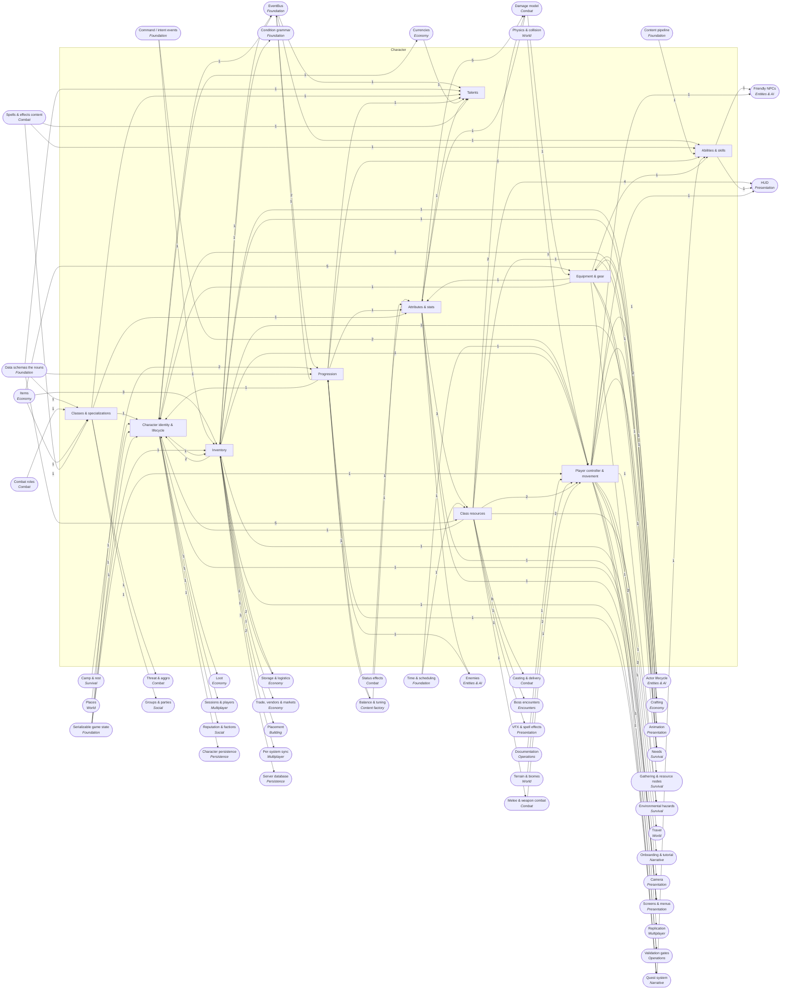

<!-- GENERATED by scripts/lib/systems-map.mjs render — do not edit; edit systems/registry/*.md and re-run. registry-hash: 949cf432b712 -->
# Character `character`

[← Atlas index](../ATLAS.md) · source: [`registry/`](../registry/) · decision: [ADR-0065](../../adr/0065-systems-atlas-and-impact-map.md) · ask: `scripts/systems-map.sh impact <id>`

[P1][implied][orchestrator] · The player avatar: controller, stats, progression, resources, inventory, equipment, identity

> **Analogy:** The character sheet in a tabletop RPG

| Where | Spec |
|---|---|
| `actors/player/`, `core/stats/`, `core/inventory/`, `core/progression/` | §1, §6.1, §6.3, §6.5 |

## Systems and parts

Badge = `[phase][status][owner]`. Indentation = containment.

- `player_controller` **Player controller & movement** [P1][spec][orchestrator] — Third-person movement, jumping, interaction; the first thing Phase 1 must make feel good · `actors/player/`
  - `locomotion` **Locomotion** [P1][spec][orchestrator] — Walk, run, sprint, jump; moves on the fixed tick from move intents · `actors/player/locomotion.gd`
  - `interaction_system` **Interaction** [P1][implied][orchestrator] — Use, pick up, talk, harvest: one interact intent resolved against the nearest interactable id · `actors/player/interact.gd`
  - `character_capsule` **Character capsule** [P1][spec][orchestrator] — 1.8 m capsule, 1 unit = 1 m; doorways at least 2.2 m · `actors/player/player.tscn`
  - `swimming` **Swimming** [P—][candidate][orchestrator] — Movement in water bodies; needs water to exist first · `actors/player/`
  - `climbing` **Climbing** [P—][candidate][orchestrator] — Ledge and cliff climbing · `actors/player/`
  - `dodge_roll` **Dodge roll** [P—][candidate][orchestrator] — Stamina-costing evade with i-frames; a DIRECTOR feel decision for Phase 1 · `actors/player/`
- `attributes_stats` **Attributes & stats** [P1][implied][orchestrator] — The numbers: derived stats from gear and effects, resistances, level scaling · `core/stats/`
  - `derived_stats` **Derived stats** [P1][implied][orchestrator] — Damage, armor, attack speed, max health and mana computed from gear, effects and level · `core/stats/derived.gd`
  - `stat_modifiers_stack` **Stat modifier stack** [P2][implied][orchestrator] — Ordered additive and multiplicative modifiers with sources, so removal is exact · `core/stats/modifiers.gd`
  - `resistances` **Resistances** [P2][implied][orchestrator] — Per-element resistance values that the damage model applies · `core/stats/resist.gd`
  - `stat_formulas` **Stat formulas** [P1][implied][orchestrator] — The pure functions that turn inputs into stats; property-tested · `core/stats/formulas.gd`
  - `level_scaling` **Level scaling** [P2][implied][orchestrator] — How base stats grow with level for players and enemies · `core/stats/scaling.gd`
  - `primary_attributes` **Primary attributes** [P—][candidate][director] — Strength, agility, intellect, stamina, spirit as the roots of derived stats; not in the spec · `core/stats/`
- `progression` **Progression** [P2][implied][orchestrator] — XP, levels, and the rewards for reaching them · `core/progression/`
  - `xp_award` **XP award** [P2][implied][orchestrator] — XP from kills and quests credited to the right actor · `core/progression/xp.gd`
  - `level_curve` **Level curve** [P2][implied][orchestrator] — XP thresholds per level; emits level up · `core/progression/levels.gd`
  - `level_up_rewards` **Level-up rewards** [P2][implied][orchestrator] — Stat growth, ability unlocks and points granted per level · `core/progression/rewards.gd`
  - `achievements` **Achievements** [P—][candidate][director] — Trackable feats with rewards; not in the spec · `data/achievements/`
  - `titles` **Titles** [P—][candidate][director] — Displayed honorifics earned from achievements · `data/titles/`
  - `prestige` **Prestige / paragon** [P—][candidate][director] — Post-cap progression; likely never for a co-op survival game · `core/progression/`
- `classes_specs` **Classes & specializations** [P—][candidate][director] — Class definitions, role specs, starting kits; WoW-style but absent from the spec · `data/classes/`
  - `class_defs` **Class definitions** [P—][candidate][director] — Data-defined classes with resource type, spell list and armor proficiency · `data/classes/`
  - `role_specs` **Role specializations** [P—][candidate][director] — Tank, healer, DPS, support specs inside a class · `data/classes/`
  - `class_starting_kit` **Class starting kit** [P—][candidate][content-smith] — Items and spells a new character of the class begins with · `data/classes/`
  - `multiclass_rules` **Multiclass rules** [P—][candidate][director] — Whether and how a character mixes classes · `core/progression/`
- `talents` **Talents** [P—][candidate][director] — Trees of choices that modify stats and spells; absent from the spec · `data/talents/`
  - `talent_trees` **Talent trees** [P—][candidate][director] — Node graphs with prerequisites per class or role · `data/talents/`
  - `talent_points` **Talent points** [P—][candidate][orchestrator] — Points granted per level and spent on nodes · `core/progression/talents.gd`
  - `respec` **Respec** [P—][candidate][director] — Refunding talent points, possibly for a cost · `core/progression/talents.gd`
  - `talent_modifiers` **Talent modifiers** [P—][candidate][orchestrator] — How chosen talents change stats and spell fields · `core/progression/talents.gd`
- `abilities_skills` **Abilities & skills** [P2][spec][orchestrator] — The spells a character knows and how they unlock · `core/combat/casting/` +1
  - `spellbook` **Spellbook** [P2][implied][orchestrator] — The set of spell ids a character can cast · `core/progression/spellbook.gd`
  - `ability_unlocks` **Ability unlocks** [P2][implied][orchestrator] — Spells granted by level, quest or item, mirroring the recipe unlock pattern · `core/progression/unlocks.gd`
  - `skill_ranks` **Skill ranks** [P—][candidate][director] — Numbered ranks of the same spell with growing magnitude · `data/spells/`
  - `weapon_skills` **Weapon skills** [P—][candidate][director] — Proficiency that grows by using a weapon type · `core/progression/`
- `class_resources` **Class resources** [P1][spec][orchestrator] — Health, mana, stamina pools and their regeneration; other pools are candidates · `core/stats/resources.gd`
  - `health_pool` **Health pool** [P1][spec][orchestrator] — Current and max health; the pool death watches · `core/stats/resources.gd`
  - `mana_pool` **Mana pool** [P2][spec][orchestrator] — Current and max mana for casters · `core/stats/resources.gd`
  - `stamina_pool` **Stamina pool** [P1][spec][orchestrator] — Shared by sprinting, dodging, melee and survival drain · `core/stats/resources.gd`
  - `resource_regen` **Resource regeneration** [P2][implied][orchestrator] — Per-tick regen rules with in-combat and resting modifiers · `core/stats/resources.gd`
  - `energy_pool` **Energy pool** [P—][candidate][director] — Fast-regen rogue-style pool; needs the cost.resource enum extended · `core/stats/resources.gd`
  - `rage_pool` **Rage pool** [P—][candidate][director] — Builds from damage dealt and taken, decays out of combat · `core/stats/resources.gd`
  - `focus_pool` **Focus pool** [P—][candidate][director] — Hunter-style steady pool · `core/stats/resources.gd`
  - `divinity_pool` **Divinity pool** [P—][candidate][director] — Builds from healing and holy actions · `core/stats/resources.gd`
  - `corruption_pool` **Corruption pool** [P—][candidate][director] — A pool that empowers as it fills and punishes when it overflows · `core/stats/resources.gd`
- `inventory` **Inventory** [P2][spec][orchestrator] — Bags, stacks, weight, pickup and drop; the source of item events · `core/inventory/`
  - `bag_slots` **Bag slots** [P2][implied][orchestrator] — Slot grid with capacity; expandable by items · `core/inventory/bags.gd`
  - `stacking_rules` **Stacking rules** [P2][spec][orchestrator] — Merge and split by stack_size · `core/inventory/stacks.gd`
  - `weight_encumbrance` **Weight & encumbrance** [P2][spec][orchestrator] — Total kg carried and the movement penalty past a limit · `core/inventory/weight.gd`
  - `item_pickup_drop` **Pickup & drop** [P2][implied][orchestrator] — World items enter and leave inventories; emits item_acquired · `core/inventory/pickup.gd`
  - `container_storage` **Container access** [P3][implied][orchestrator] — Opening chests and moving items between an inventory and a container · `core/inventory/containers.gd`
  - `bank_storage` **Bank storage** [P—][candidate][director] — Account-wide or town storage; likely just shared chests in co-op · `core/inventory/`
  - `loot_bags_on_death` **Loot bags on death** [P—][candidate][director] — Dropping some or all items on death for a corpse run; a DIRECTOR stakes decision · `core/inventory/deathbag.gd`
- `equipment` **Equipment & gear** [P1][spec][orchestrator] — Equip slots, gear stat application, tiers and comparison · `core/inventory/equipment.gd`
  - `equip_slots` **Equip slots** [P1][spec][orchestrator] — head, chest, legs, hands, feet, main_hand, off_hand, trinket · `core/inventory/equipment.gd`
  - `gear_stats_application` **Gear stat application** [P1][implied][orchestrator] — Equipped item stats feed the modifier stack · `core/inventory/equipment.gd`
  - `gear_tiers` **Gear tiers** [P2][spec][content-smith] — Progression bands of gear power tied to rarity and biome · `data/items/`
  - `weapon_types` **Weapon types** [P1][implied][orchestrator] — Sword, axe, bow and so on as tags that select attack behavior · `data/items/` +1
  - `item_comparison` **Item comparison** [P2][implied][orchestrator] — Stat deltas versus equipped shown in tooltips · `ui/tooltips/`
  - `durability_repair` **Durability** [P—][candidate][director] — Gear wears with use and needs repair; a survival-genre staple absent from the spec · `core/inventory/equipment.gd`
  - `transmog` **Transmog** [P—][candidate][director] — Cosmetic appearance override per slot · `core/inventory/`
  - `set_bonuses` **Set bonuses** [P—][candidate][content-smith] — Bonuses for wearing several pieces of a set · `data/items/`
- `character_identity` **Character identity & lifecycle** [P1][implied][orchestrator] — Creation, appearance, death and respawn, and the saved character record · `core/saving/` +1
  - `character_creation` **Character creation** [P1][implied][orchestrator] — Name and starting choices; a class picker only if classes are approved · `ui/creation/` +1
  - `respawn_rules` **Death & respawn rules** [P1][implied][orchestrator] — Where and when a dead player returns, and what it costs · `core/state/respawn.gd`
  - `character_save_state` **Character save state** [P3][spec][orchestrator] — The per-character record: ids plus state for inventory, equipment, progression, position · `core/saving/character.gd`
  - `appearance_customization` **Appearance customization** [P—][candidate][world-builder] — Body, face, hair and color choices on the player rig · `actors/player/` +1
  - `multiple_characters_per_world` **Multiple characters per world** [P—][candidate][director] — More than one character record per player per world · `core/saving/`

## Wiring at tier 2

Boxes inside the frame are this domain's systems; rounded boxes are the outside systems they wire to. Arrow labels count edges; direction is influence (a change at the tail can affect the head).

## Director decisions in this domain

| Candidate | Tier | Owner | What it would be |
|---|---|---|---|
| `multiple_characters_per_world` Multiple characters per world | 3 | director | More than one character record per player per world |
| `appearance_customization` Appearance customization | 3 | world-builder | Body, face, hair and color choices on the player rig |
| `set_bonuses` Set bonuses | 3 | content-smith | Bonuses for wearing several pieces of a set |
| `transmog` Transmog | 3 | director | Cosmetic appearance override per slot |
| `durability_repair` Durability | 3 | director | Gear wears with use and needs repair; a survival-genre staple absent from the spec |
| `loot_bags_on_death` Loot bags on death | 3 | director | Dropping some or all items on death for a corpse run; a DIRECTOR stakes decision |
| `bank_storage` Bank storage | 3 | director | Account-wide or town storage; likely just shared chests in co-op |
| `corruption_pool` Corruption pool | 3 | director | A pool that empowers as it fills and punishes when it overflows |
| `divinity_pool` Divinity pool | 3 | director | Builds from healing and holy actions |
| `focus_pool` Focus pool | 3 | director | Hunter-style steady pool |
| `rage_pool` Rage pool | 3 | director | Builds from damage dealt and taken, decays out of combat |
| `energy_pool` Energy pool | 3 | director | Fast-regen rogue-style pool; needs the cost.resource enum extended |
| `weapon_skills` Weapon skills | 3 | director | Proficiency that grows by using a weapon type |
| `skill_ranks` Skill ranks | 3 | director | Numbered ranks of the same spell with growing magnitude |
| `talents` Talents | 2 (+4 parts) | director | Trees of choices that modify stats and spells; absent from the spec |
| `talent_modifiers` Talent modifiers | 3 | orchestrator | How chosen talents change stats and spell fields |
| `respec` Respec | 3 | director | Refunding talent points, possibly for a cost |
| `talent_points` Talent points | 3 | orchestrator | Points granted per level and spent on nodes |
| `talent_trees` Talent trees | 3 | director | Node graphs with prerequisites per class or role |
| `classes_specs` Classes & specializations | 2 (+4 parts) | director | Class definitions, role specs, starting kits; WoW-style but absent from the spec |
| `multiclass_rules` Multiclass rules | 3 | director | Whether and how a character mixes classes |
| `class_starting_kit` Class starting kit | 3 | content-smith | Items and spells a new character of the class begins with |
| `role_specs` Role specializations | 3 | director | Tank, healer, DPS, support specs inside a class |
| `class_defs` Class definitions | 3 | director | Data-defined classes with resource type, spell list and armor proficiency |
| `prestige` Prestige / paragon | 3 | director | Post-cap progression; likely never for a co-op survival game |
| `titles` Titles | 3 | director | Displayed honorifics earned from achievements |
| `achievements` Achievements | 3 | director | Trackable feats with rewards; not in the spec |
| `primary_attributes` Primary attributes | 3 | director | Strength, agility, intellect, stamina, spirit as the roots of derived stats; not in the spec |
| `dodge_roll` Dodge roll | 3 | orchestrator | Stamina-costing evade with i-frames; a DIRECTOR feel decision for Phase 1 |
| `climbing` Climbing | 3 | orchestrator | Ledge and cliff climbing |
| `swimming` Swimming | 3 | orchestrator | Movement in water bodies; needs water to exist first |

## Cross-domain edges

72 outbound (a change here reaches out), 57 inbound (a change elsewhere reaches in).

| Direction | Edge | How | Via | Strength | Why |
|---|---|---|---|---|---|
| → out | `inventory` → `condition_evaluator` | reads | `has item checks` | hard | Conditions test inventory contents |
| ← in | `sig_actor_died` → `xp_award` | listens | — | hard | XP is awarded to the killer on death |
| ← in | `sig_actor_died` → `respawn_rules` | listens | — | hard | Player death starts the respawn flow |
| → out | `item_pickup_drop` → `sig_item_acquired` | emits | — | hard | Any inventory gain is announced |
| ← in | `sig_quest_completed` → `xp_award` | listens | — | hard | Quest XP is awarded on completion |
| → out | `level_curve` → `sig_level_up` | emits | — | hard | Reaching a threshold announces the new level (proposed signal) |
| ← in | `sig_level_up` → `ability_unlocks` | listens | — | hard | Abilities unlock at levels |
| ← in | `sig_level_up` → `talent_points` | listens | — | hard | A talent point per level (candidate) |
| ← in | `physics_collision` → `locomotion` | reads | `collision layers, slopes` | hard | Movement is resolved against terrain and prop collision |
| ← in | `intent_dispatch` → `locomotion` | reads | `move intent` | hard | Movement applies queued move intents on the tick (§12) |
| ← in | `fixed_tick_sim` → `locomotion` | reads | `tick` | hard | Position advances per tick so replays and servers agree |
| ← in | `intent_schema` → `interaction_system` | reads | `interact intent` | hard | One interact intent covers pickup, talk, harvest and use |
| ← in | `actor_registry` → `interaction_system` | reads | `target ids` | hard | The nearest interactable is resolved by id, not node path |
| ← in | `game_infra_spec` → `character_capsule` | reads | `§11 units` | hard | 1 unit = 1 m and the 1.8 m capsule are contract values |
| ← in | `water_bodies` → `swimming` | reads | `water volumes` | hard | There is no swimming without water |
| ← in | `terrain_meshes_heightmap` → `climbing` | reads | `climbable surfaces` | soft | Climbing needs surfaces tagged as climbable |
| ← in | `hit_detection` → `dodge_roll` | reads | `i-frames` | hard | The roll must be understood by hit detection to grant invulnerability frames |
| ← in | `effect_kinds_verbs` → `stat_modifiers_stack` | reads | `stat_mod effects` | hard | A stat_mod effect pushes a signed modifier for its duration |
| ← in | `damage_types_elements` → `resistances` | reads | `element enum` | hard | One resistance value per element the damage model knows |
| ← in | `balance_ranges` → `stat_formulas` | reads | `curve constants` | soft | Formula constants are documented as balance ranges |
| ← in | `enemy_defs` → `xp_award` | reads | `EnemyDef.xp` | hard | Kill XP comes from the enemy definition |
| ← in | `quest_defs` → `xp_award` | reads | `QuestDef.rewards.xp` | hard | Quest XP comes from the quest definition |
| ← in | `actor_registry` → `xp_award` | reads | `killer_id` | hard | XP is credited to the actor named in the event |
| ← in | `balance_ranges` → `level_curve` | reads | `curve` | soft | The curve constants are balance data |
| ← in | `world_state_flags` → `achievements` | reads | `counters` | hard | Achievements are predicates over flags and counters |
| ← in | `schema_achievement_def` → `achievements` | reads | `definition` | hard | Achievements would be data like everything else |
| ← in | `schema_class_def` → `class_defs` | reads | `definition` | hard | Classes would be data like everything else |
| ← in | `roles` → `role_specs` | reads | `tank, healer, dps, support kits` | hard | Specs are built from the role kits combat defines |
| ← in | `items` → `class_starting_kit` | references | `item ids` | hard | Starting gear must exist as items |
| ← in | `spell_defs_content` → `class_starting_kit` | references | `spell ids` | hard | Starting spells must exist as spells |
| ← in | `schema_talent_def` → `talent_trees` | reads | `definition` | hard | Talents would be data |
| ← in | `wallet` → `respec` | reads | `cost` | soft | A respec cost needs a currency |
| ← in | `spell_defs_content` → `talent_modifiers` | reads | `field overrides` | soft | Some talents change spell fields such as cooldown or magnitude |
| ← in | `spell_defs_content` → `spellbook` | references | `spell ids` | hard | A spellbook is a list of spell ids |
| ← in | `data_registry_loader` → `spellbook` | reads | `id lookup` | hard | Spell ids resolve through the registry |
| ← in | `quest_defs` → `ability_unlocks` | references | `quest-taught spells` | soft | Some spells are taught by quests, mirroring unlocked_by |
| ← in | `timers_cooldowns` → `resource_regen` | reads | `regen ticks` | hard | Regen advances on ticks |
| ← in | `schema_spell_def` → `energy_pool` | reads | `cost.resource enum` | hard | The enum must grow before a spell can cost energy |
| ← in | `schema_spell_def` → `rage_pool` | reads | `cost.resource enum` | hard | The enum must grow before a spell can cost rage |
| ← in | `schema_spell_def` → `focus_pool` | reads | `cost.resource enum` | hard | The enum must grow before a spell can cost focus |
| ← in | `schema_spell_def` → `divinity_pool` | reads | `cost.resource enum` | hard | The enum must grow before a spell can cost divinity |
| ← in | `schema_spell_def` → `corruption_pool` | reads | `cost.resource enum` | hard | The enum must grow before a spell can cost corruption |
| ← in | `items` → `bag_slots` | reads | `ItemDef` | hard | Slots hold item ids and counts |
| ← in | `items` → `stacking_rules` | reads | `ItemDef.stack_size` | hard | Stack limits come from the item definition |
| ← in | `items` → `weight_encumbrance` | reads | `ItemDef.weight` | hard | Weight totals come from item definitions |
| ← in | `intent_schema` → `item_pickup_drop` | reads | `pickup and drop intents` | hard | Pickup is an intent like any other action |
| ← in | `actor_registry` → `item_pickup_drop` | reads | `actor ids` | hard | Items move between actors named by id |
| ← in | `chests_containers` → `container_storage` | reads | `container inventories` | hard | Opening a chest reads its container inventory |
| ← in | `corpse_handling` → `loot_bags_on_death` | reads | `corpse location` | hard | The bag sits where the corpse is |
| ← in | `items` → `equip_slots` | reads | `ItemDef.slot` | hard | An item equips only to its declared slot |
| ← in | `item_stats_block` → `gear_stats_application` | reads | `ItemDef.stats` | hard | Stats on equipped items become modifiers |
| ← in | `rarity_tiers` → `gear_tiers` | reads | `rarity` | soft | Tiers usually track rarity |
| ← in | `item_levels` → `gear_tiers` | reads | `item level` | soft | If item levels are approved, tiers are bands of them |
| ← in | `item_categories_tags` → `weapon_types` | reads | `tags` | hard | Weapon type is a tag on the item |
| ← in | `damage_model` → `durability_repair` | reads | `wear on hit` | soft | Durability drops on hits taken and dealt |
| ← in | `repair` → `durability_repair` | reads | `repair action` | hard | Worn gear is restored by the repair action |
| ← in | `rigs_skeletons` → `appearance_customization` | reads | `player rig` | hard | Customization is a set of rig and material variants |
| ← in | `bed_spawn_point` → `respawn_rules` | reads | `spawn location` | soft | A claimed bed is the respawn point once beds exist in Phase 3; until then the hub is the only respawn |
| ← in | `spawn_hubs` → `respawn_rules` | reads | `fallback location` | hard | Without a bed, the world's default spawn is used |
| ← in | `state_serialization` → `character_save_state` | reads | `serializer` | hard | The record is written by the state serializer |
| → out | `derived_stats` → `damage_formula` | reads | `attack, armor` | hard | The formula's inputs are derived stats |
| → out | `derived_stats` → `armor_mitigation` | reads | `armor` | hard | Mitigation is a function of the target's armor stat |
| → out | `resistances` → `resistances_application` | reads | `per-element values` | hard | Elemental damage consults the target's resistances |
| → out | `derived_stats` → `crit_hit_tables` | reads | `crit, dodge, parry ratings` | hard | Table chances come from stats |
| → out | `health_pool` → `death_resolution` | reads | `health at zero` | hard | Death is the health pool reaching zero |
| → out | `health_pool` → `healing_model` | reads | `clamp to max` | hard | Heals write to the pool and clamp at max |
| → out | `derived_stats` → `healing_model` | reads | `healing power` | soft | Heal magnitude may scale with a stat |
| → out | `mana_pool` → `resource_cost_check` | reads | `current mana` | hard | Mana costs read the mana pool |
| → out | `stamina_pool` → `resource_cost_check` | reads | `current stamina` | hard | Stamina costs read the stamina pool |
| → out | `health_pool` → `resource_cost_check` | reads | `current health` | hard | Health costs read the health pool |
| → out | `energy_pool` → `resource_cost_check` | reads | `current energy` | soft | Only if energy is approved and the enum extended |
| → out | `rage_pool` → `resource_cost_check` | reads | `current rage` | soft | Only if rage is approved |
| → out | `focus_pool` → `resource_cost_check` | reads | `current focus` | soft | Only if focus is approved |
| → out | `divinity_pool` → `resource_cost_check` | reads | `current divinity` | soft | Only if divinity is approved |
| → out | `corruption_pool` → `resource_cost_check` | reads | `current corruption` | soft | Only if corruption is approved |
| → out | `stamina_pool` → `blocking_parry` | reads | `block cost` | soft | Blocking usually costs stamina |
| → out | `role_specs` → `threat_modifiers` | reads | `role multipliers` | soft | Tank specs would carry a threat multiplier |
| → out | `stamina_pool` → `stamina_drain_regen` | reads | `shared pool` | hard | Survival stamina is the same pool combat spends |
| → out | `locomotion` → `stamina_drain_regen` | reads | `sprint state` | hard | Sprinting drains stamina |
| → out | `inventory` → `consumables_apply` | reads | `remove one` | hard | The consumed item leaves the inventory |
| → out | `equipment` → `temperature_exposure` | reads | `warmth stats` | soft | Clothing would carry warmth |
| → out | `equip_slots` → `gather_tools_tiers` | reads | `equipped tool` | hard | The equipped tool decides what can be gathered |
| → out | `locomotion` → `fall_damage` | reads | `fall height` | hard | Fall height comes from the movement state |
| → out | `health_pool` → `fall_damage` | reads | `apply damage` | hard | Fall damage writes to the health pool |
| → out | `stamina_pool` → `drowning` | reads | `breath as stamina` | hard | Breath drains the stamina pool |
| → out | `character_save_state` → `pity_bad_luck_protection` | reads | `streak counters` | hard | Streaks are saved per character |
| → out | `inventory` → `craft_time_queue` | reads | `consume inputs, add output` | hard | Crafting moves items through the inventory |
| → out | `durability_repair` → `repair` | reads | `durability value` | hard | Repair restores durability |
| → out | `character_save_state` → `wallet` | reads | `saved balances` | hard | Balances are saved with the character |
| → out | `inventory` → `player_trade` | reads | `both inventories` | hard | A trade moves items between inventories |
| → out | `inventory` → `mail_system` | reads | `attachments` | hard | Mail carries items |
| → out | `inventory` → `chests_containers` | reads | `container inventory model` | hard | A container reuses the inventory model |
| → out | `weight_encumbrance` → `carts_transport` | reads | `cart capacity` | hard | Carts have weight limits |
| → out | `level_scaling` → `enemy_stats_scaling` | reads | `shared curves` | hard | Enemies scale on the same curve family as players |
| → out | `ability_unlocks` → `trainers` | reads | `teach spell` | hard | Training is an unlock source |
| → out | `locomotion` → `mounts` | reads | `rider control` | hard | Riding replaces the rider's locomotion |
| → out | `character_capsule` → `actor_prefabs_scenes` | reads | `proportions` | soft | Actors share the 1 m scale and door clearance |
| → out | `health_pool` → `boss_phases` | reads | `health percent` | hard | Most transitions trigger on health |
| → out | `locomotion` → `mounts_travel` | reads | `rider control` | hard | Riding replaces walking |
| → out | `inventory` → `placement_validation` | reads | `material cost` | hard | Placing consumes materials |
| → out | `interaction_system` → `objective_tracking` | reads | `talk completion` | soft | Talk objectives complete through an interaction |
| → out | `inventory` → `quest_rewards` | reads | `grant items` | hard | Reward items are added to the inventory |
| → out | `player_controller` → `tutorial_quests` | reads | `movement lessons` | soft | Early lessons teach movement |
| → out | `interaction_system` → `contextual_hints` | reads | `prompts` | soft | Hints attach to interaction prompts |
| → out | `locomotion` → `animation_state_machines` | renders | `movement state` | hard | Locomotion state selects animations |
| → out | `locomotion` → `locomotion_blending` | renders | `speed and direction` | hard | Blends read movement speed |
| → out | `health_pool` → `screen_effects` | renders | `low health` | soft | A low-health tint reads the pool |
| → out | `locomotion` → `third_person_rig` | reads | `follow target` | hard | The camera follows the player |
| → out | `health_pool` → `health_resource_bars` | renders | `current and max` | hard | Bars show the pools |
| → out | `class_resources` → `health_resource_bars` | renders | `resource pools` | hard | Bars show whichever resource the character uses |
| → out | `spellbook` → `action_bars_hotkeys` | renders | `known spells` | hard | Bars show bound spells |
| → out | `health_pool` → `target_frames` | renders | `target health` | hard | The frame shows the target's health |
| → out | `health_pool` → `boss_frames` | renders | `boss health` | hard | The boss frame shows boss health |
| → out | `interaction_system` → `crosshair_reticle` | renders | `prompt` | hard | The prompt names the nearest interactable |
| → out | `inventory` → `inventory_screen` | renders | `bags` | hard | The screen draws the inventory |
| → out | `equipment` → `equipment_character_sheet` | renders | `slots` | hard | The sheet draws equipped items |
| → out | `derived_stats` → `equipment_character_sheet` | renders | `stats` | hard | The sheet shows derived stats |
| → out | `item_comparison` → `tooltips_item_cards` | renders | `deltas` | hard | Cards show comparison deltas |
| → out | `respawn_rules` → `death_screen` | renders | `options` | hard | The screen offers the respawn options the rules allow |
| → out | `locomotion` → `interpolation_prediction` | reads | `predicted movement` | soft | Prediction usually starts with movement |
| → out | `character_save_state` → `join_leave_flow` | reads | `restore character` | hard | A returning player gets their character back |
| → out | `inventory` → `inventory_sync` | transports | `bags` | hard | Inventories are server-owned |
| → out | `role_specs` → `party_roles` | reads | `declared spec` | soft | If specs exist, roles come from them |
| → out | `character_save_state` → `reputation_sources` | reads | `saved standing` | hard | Standing is saved per character |
| → out | `inventory` → `player_inventory_tables` | persists | `bags per character` | hard | Inventories are rows in Phase 4 |
| → out | `character_save_state` → `character_state_record` | persists | `record` | hard | The stored record is the character's save state |
| → out | `stat_formulas` → `g1_unit_tests_gut` | validates | `property tests` | hard | Stat formulas are property-tested |
| → out | `locomotion` → `g4_bot_playtest` | validates | `walk` | hard | The bot walks |
| → out | `level_curve` → `stat_curves_level_scaling` | reads | `player curve` | hard | Curves describe the level curve |

