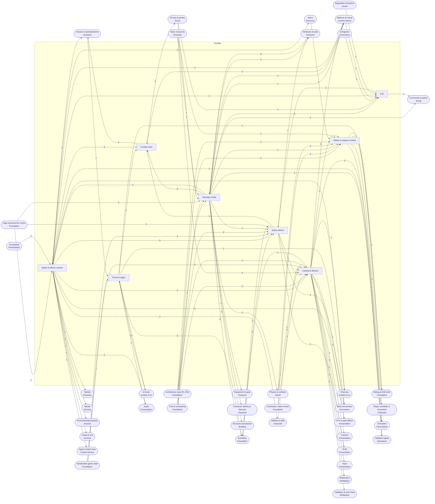

<!-- GENERATED by scripts/lib/systems-map.mjs render — do not edit; edit systems/registry/*.md and re-run. registry-hash: 943cd456f349 -->
# Combat `combat`

[← Atlas index](../ATLAS.md) · source: [`registry/`](../registry/) · decision: [ADR-0065](../../adr/0065-systems-atlas-and-impact-map.md) · ask: `scripts/systems-map.sh impact <id>`

[P1][spec][orchestrator] · Damage, casting, status effects, weapons, threat, roles, and the spell and effect content

> **Analogy:** The referee and rulebook of a fight

| Where | Spec |
|---|---|
| `core/combat/`, `data/spells/`, `data/effects/` | §3, §5, §6.3, §6.4 |

## Systems and parts

Badge = `[phase][status][owner]`. Indentation = containment.

- `damage_model` **Damage model** [P1][spec][orchestrator] — Resolves hits into numbers and deaths; emits the three most-listened signals · `core/combat/damage.gd`
  - `damage_formula` **Damage formula** [P1][implied][orchestrator] — attack stat, weapon or spell magnitude, mitigation and rolls into one number; pure and seeded · `core/combat/damage.gd`
  - `damage_types_elements` **Damage types & elements** [P1][spec][orchestrator] — physical, fire, frost, nature, arcane, shadow · `core/combat/damage.gd`
  - `armor_mitigation` **Armor mitigation** [P1][spec][orchestrator] — Physical damage reduced by armor with a documented curve · `core/combat/damage.gd`
  - `resistances_application` **Resistance application** [P2][implied][orchestrator] — Elemental damage reduced by the target's resistance · `core/combat/damage.gd`
  - `crit_hit_tables` **Crit / hit tables** [P—][candidate][director] — Critical, dodge, parry and block rolls; not in the spec · `core/combat/damage.gd`
  - `friendly_fire_rules` **Friendly fire rules** [P1][implied][orchestrator] — Whether players and their allies can hurt each other · `core/combat/damage.gd`
  - `death_resolution` **Death resolution** [P1][spec][orchestrator] — Health at zero becomes a death event with the killer named · `core/combat/death.gd`
  - `healing_model` **Healing model** [P2][spec][orchestrator] — Heals with overheal clamped to max health; emits actor_healed · `core/combat/heal.gd`
- `casting` **Casting & delivery** [P2][spec][orchestrator] — Cast time, cooldowns, cost, range, targeting and the five delivery verbs · `core/combat/casting/`
  - `cast_timing` **Cast timing** [P2][spec][orchestrator] — Instant or timed casts resolved on the tick; emits spell_cast and applies effects · `core/combat/casting/cast.gd`
  - `cooldown_manager` **Cooldown manager** [P2][spec][orchestrator] — Per-actor per-spell cooldown timers · `core/combat/casting/cooldowns.gd`
  - `resource_cost_check` **Resource cost check** [P2][spec][orchestrator] — Refuses a cast the actor cannot pay for, then deducts · `core/combat/casting/cost.gd`
  - `range_los_check` **Range & line of sight** [P2][spec][orchestrator] — Range and LoS validated before a cast starts · `core/combat/casting/range.gd`
  - `targeting_modes` **Targeting modes** [P2][spec][orchestrator] — target, self, ground point, or none, chosen by delivery · `core/combat/casting/targeting.gd`
  - `projectile_delivery` **Projectile delivery** [P2][spec][orchestrator] — Simulated projectile on the tick with deterministic hit resolution · `core/combat/casting/projectile.gd`
  - `beam_delivery` **Beam delivery** [P2][spec][orchestrator] — Instant line hit within range and LoS · `core/combat/casting/beam.gd`
  - `ground_aoe_delivery` **Ground AoE delivery** [P2][spec][orchestrator] — Radius around a ground point; also the shape bosses telegraph · `core/combat/casting/aoe.gd`
  - `self_target_delivery` **Self / target delivery** [P2][spec][orchestrator] — Direct application to self or the current target · `core/combat/casting/direct.gd`
  - `interrupts` **Interrupts** [P—][candidate][director] — Cancelling another actor's cast and locking the school · `core/combat/casting/`
  - `global_cooldown` **Global cooldown** [P—][candidate][director] — A shared short cooldown after any cast; a feel decision · `core/combat/casting/`
  - `spell_queueing` **Spell queueing** [P—][candidate][orchestrator] — Buffering the next cast before the current one ends · `core/combat/casting/`
  - `channeling` **Channeling** [P—][candidate][orchestrator] — Casts that apply repeatedly while held · `core/combat/casting/`
- `status_effects` **Status effects** [P2][spec][orchestrator] — Buffs and debuffs: the six verbs, stacking, ticking, expiry · `core/combat/effects/`
  - `effect_kinds_verbs` **Effect verbs** [P2][spec][orchestrator] — dot, hot, stat_mod, stun, slow, shield; applying one emits effect_applied · `core/combat/effects/apply.gd`
  - `effect_stacking` **Effect stacking** [P2][spec][orchestrator] — none, refresh, stack_count · `core/combat/effects/stacking.gd`
  - `effect_ticking` **Effect ticking** [P2][spec][orchestrator] — dot and hot pulses on tick intervals · `core/combat/effects/tick.gd`
  - `effect_duration_expiry` **Duration & expiry** [P2][spec][orchestrator] — Tick-counted durations; emits effect_expired · `core/combat/effects/expiry.gd`
  - `dispel_cleanse` **Dispel / cleanse** [P—][candidate][director] — Removing effects by element or kind · `core/combat/effects/`
  - `immunities` **Immunities** [P—][candidate][director] — Actors immune to certain kinds or elements, for bosses especially · `core/combat/effects/`
  - `crowd_control_dr` **Crowd-control diminishing returns** [P—][candidate][director] — Shorter repeated stuns; mostly a PvP concern · `core/combat/effects/`
  - `auras_area_effects` **Auras** [P—][candidate][orchestrator] — Effects applied to everyone inside a radius while a source lives · `core/combat/effects/`
- `melee_weapons` **Melee & weapon combat** [P1][spec][orchestrator] — Swings, hit detection, blocking; the Phase 1 feel target · `core/combat/melee/`
  - `auto_attack_swing` **Attack swing** [P1][implied][orchestrator] — Attack intent becomes a timed swing with an active window · `core/combat/melee/swing.gd`
  - `hit_detection` **Hit detection** [P1][implied][director] — Hitbox sweep versus tab-target is a DIRECTOR decision that sets the whole feel · `core/combat/melee/hit.gd`
  - `weapon_attack_speed` **Weapon attack speed** [P1][spec][orchestrator] — Swing cadence from the weapon's stats · `core/combat/melee/swing.gd`
  - `blocking_parry` **Blocking & parry** [P—][candidate][director] — Timed defense that reduces or negates a hit · `core/combat/melee/`
  - `combos` **Combos** [P—][candidate][director] — Chained swings with different windows and damage · `core/combat/melee/`
  - `ranged_weapons` **Ranged weapons** [P—][candidate][orchestrator] — Bows and throwables reusing projectile delivery · `core/combat/melee/`
- `threat_aggro` **Threat & aggro** [P2][implied][orchestrator] — The per-enemy list of who deserves attention; what makes tanking possible · `core/combat/threat/`
  - `threat_table` **Threat table** [P2][implied][orchestrator] — Per-enemy threat per actor, built from damage, healing and taunts · `core/combat/threat/table.gd`
  - `taunt` **Taunt** [P—][candidate][orchestrator] — Forces the target's attention to the taunter · `core/combat/threat/`
  - `threat_modifiers` **Threat modifiers** [P—][candidate][orchestrator] — Role-based threat multipliers · `core/combat/threat/`
  - `leash_reset` **Leash & reset** [P2][implied][orchestrator] — Enemies drop threat and reset when dragged too far · `core/combat/threat/leash.gd`
- `roles` **Combat roles** [P2][implied][orchestrator] — The tank, healer, DPS and support kits expressed as spell and stat patterns · `core/combat/` +1
  - `tanking_kit` **Tanking kit** [P2][implied][content-smith] — Threat generation and mitigation tools · `data/spells/`
  - `healing_kit` **Healing kit** [P2][implied][content-smith] — Direct heals, hots, shields · `data/spells/`
  - `dps_kit` **DPS kit** [P2][implied][content-smith] — Damage rotations by element · `data/spells/`
  - `support_enhance_kit` **Support / enhance kit** [P—][candidate][director] — Buffs and utility as a fourth role · `data/spells/`
  - `role_balance_targets` **Role balance targets** [P—][candidate][director] — Target numbers per role so tuning has a goal · `docs/balance_ranges.md`
- `pvp` **PvP** [P—][candidate][director] — Player-versus-player rules; the spec is co-op only, so this is a scope decision · `core/combat/pvp/`
  - `pvp_flagging` **PvP flagging** [P—][candidate][director] — Opting into being attackable · `core/combat/pvp/`
  - `dueling` **Dueling** [P—][candidate][director] — Consensual one-on-one fights · `core/combat/pvp/`
  - `arenas` **Arenas** [P—][candidate][director] — Dedicated fight spaces · `scenes/arenas/`
  - `pvp_balance_split` **PvP balance split** [P—][candidate][director] — Separate numbers for spells against players · `data/spells/`
  - `faction_warfare` **Faction warfare** [P—][candidate][director] — Faction-based hostility between players · `core/combat/pvp/`
- `spell_effect_content` **Spells & effects content** [P0][spec][content-smith] — The SpellDef and StatusEffectDef files the casting and effect systems execute · `data/spells/` +1
  - `spell_defs_content` **Spell definitions** [P0][spec][content-smith] — One .tres per spell; Fireball is the worked example · `data/spells/`
  - `effect_defs_content` **Effect definitions** [P0][spec][content-smith] — One .tres per status effect · `data/effects/`
  - `element_matrix` **Element matrix** [P—][candidate][director/content-smith] — Which element beats which, as data · `docs/balance_ranges.md`

## Wiring at tier 2

Boxes inside the frame are this domain's systems; rounded boxes are the outside systems they wire to. Arrow labels count edges; direction is influence (a change at the tail can affect the head).

## Director decisions in this domain

| Candidate | Tier | Owner | What it would be |
|---|---|---|---|
| `element_matrix` Element matrix | 3 | director/content-smith | Which element beats which, as data |
| `pvp` PvP | 2 (+5 parts) | director | Player-versus-player rules; the spec is co-op only, so this is a scope decision |
| `faction_warfare` Faction warfare | 3 | director | Faction-based hostility between players |
| `pvp_balance_split` PvP balance split | 3 | director | Separate numbers for spells against players |
| `arenas` Arenas | 3 | director | Dedicated fight spaces |
| `dueling` Dueling | 3 | director | Consensual one-on-one fights |
| `pvp_flagging` PvP flagging | 3 | director | Opting into being attackable |
| `role_balance_targets` Role balance targets | 3 | director | Target numbers per role so tuning has a goal |
| `support_enhance_kit` Support / enhance kit | 3 | director | Buffs and utility as a fourth role |
| `threat_modifiers` Threat modifiers | 3 | orchestrator | Role-based threat multipliers |
| `taunt` Taunt | 3 | orchestrator | Forces the target's attention to the taunter |
| `ranged_weapons` Ranged weapons | 3 | orchestrator | Bows and throwables reusing projectile delivery |
| `combos` Combos | 3 | director | Chained swings with different windows and damage |
| `blocking_parry` Blocking & parry | 3 | director | Timed defense that reduces or negates a hit |
| `auras_area_effects` Auras | 3 | orchestrator | Effects applied to everyone inside a radius while a source lives |
| `crowd_control_dr` Crowd-control diminishing returns | 3 | director | Shorter repeated stuns; mostly a PvP concern |
| `immunities` Immunities | 3 | director | Actors immune to certain kinds or elements, for bosses especially |
| `dispel_cleanse` Dispel / cleanse | 3 | director | Removing effects by element or kind |
| `channeling` Channeling | 3 | orchestrator | Casts that apply repeatedly while held |
| `spell_queueing` Spell queueing | 3 | orchestrator | Buffering the next cast before the current one ends |
| `global_cooldown` Global cooldown | 3 | director | A shared short cooldown after any cast; a feel decision |
| `interrupts` Interrupts | 3 | director | Cancelling another actor's cast and locking the school |
| `crit_hit_tables` Crit / hit tables | 3 | director | Critical, dodge, parry and block rolls; not in the spec |

## Cross-domain edges

57 outbound (a change here reaches out), 54 inbound (a change elsewhere reaches in).

| Direction | Edge | How | Via | Strength | Why |
|---|---|---|---|---|---|
| → out | `threat_aggro` → `debug_overlays` | renders | `threat table` | soft | The threat overlay reads the threat table for the selected enemy |
| → out | `damage_model` → `sig_actor_damaged` | emits | — | hard | Every resolved hit is published for UI, VFX and AI |
| ← in | `sig_actor_damaged` → `threat_table` | listens | — | hard | Damage dealt adds threat against the target |
| → out | `healing_model` → `sig_actor_healed` | emits | — | hard | Every resolved heal is published |
| → out | `death_resolution` → `sig_actor_died` | emits | — | hard | Death is the most listened-to moment in the game |
| ← in | `sig_actor_died` → `threat_table` | listens | — | hard | Threat entries are dropped when either side dies |
| → out | `cast_timing` → `sig_spell_cast` | emits | — | hard | Casting announces a completed cast |
| → out | `effect_kinds_verbs` → `sig_effect_applied` | emits | — | hard | Applying an effect is announced with its duration |
| → out | `effect_duration_expiry` → `sig_effect_expired` | emits | — | hard | Expiry is announced so UI and VFX can detach |
| ← in | `sig_need_threshold_crossed` → `effect_kinds_verbs` | listens | — | hard | The effects system applies the matching debuff instead of survival calling it (R2) |
| ← in | `sig_item_consumed` → `effect_kinds_verbs` | listens | — | hard | The effects system applies ItemDef.on_use_effect on the existing §5 signal instead of survival calling combat (R2) |
| ← in | `sig_actor_healed` → `threat_table` | listens | — | soft | Healing adds threat against the healer |
| → out | `hit_detection` → `debug_overlays` | renders | — | soft | The hitbox overlay draws the sim's shapes |
| → out | `hit_detection` → `dodge_roll` | reads | `i-frames` | hard | The roll must be understood by hit detection to grant invulnerability frames |
| → out | `effect_kinds_verbs` → `stat_modifiers_stack` | reads | `stat_mod effects` | hard | A stat_mod effect pushes a signed modifier for its duration |
| → out | `damage_types_elements` → `resistances` | reads | `element enum` | hard | One resistance value per element the damage model knows |
| → out | `roles` → `role_specs` | reads | `tank, healer, dps, support kits` | hard | Specs are built from the role kits combat defines |
| → out | `spell_defs_content` → `class_starting_kit` | references | `spell ids` | hard | Starting spells must exist as spells |
| → out | `spell_defs_content` → `talent_modifiers` | reads | `field overrides` | soft | Some talents change spell fields such as cooldown or magnitude |
| → out | `spell_defs_content` → `spellbook` | references | `spell ids` | hard | A spellbook is a list of spell ids |
| → out | `damage_model` → `durability_repair` | reads | `wear on hit` | soft | Durability drops on hits taken and dealt |
| → out | `death_resolution` → `revive_downed_state` | reads | — | hard | Downed sits between zero health and death |
| ← in | `derived_stats` → `damage_formula` | reads | `attack, armor` | hard | The formula's inputs are derived stats |
| ← in | `deterministic_sim` → `damage_formula` | reads | `seeded rolls` | hard | Variance and crits roll on the seeded RNG (R4) |
| ← in | `balance_ranges` → `damage_formula` | reads | `curve constants` | soft | Mitigation curves are balance data |
| ← in | `fixed_tick_sim` → `damage_formula` | reads | `resolve on tick` | hard | Hits resolve on the tick, never on animation frames |
| ← in | `schema_spell_def` → `damage_types_elements` | reads | `element enum` | hard | The element list is the schema's enum |
| ← in | `derived_stats` → `armor_mitigation` | reads | `armor` | hard | Mitigation is a function of the target's armor stat |
| ← in | `resistances` → `resistances_application` | reads | `per-element values` | hard | Elemental damage consults the target's resistances |
| ← in | `deterministic_sim` → `crit_hit_tables` | reads | `seeded rolls` | hard | Hit tables roll on the seeded RNG |
| ← in | `derived_stats` → `crit_hit_tables` | reads | `crit, dodge, parry ratings` | hard | Table chances come from stats |
| ← in | `party_membership` → `friendly_fire_rules` | reads | `ally check` | soft | In co-op, party members are usually immune to each other |
| ← in | `health_pool` → `death_resolution` | reads | `health at zero` | hard | Death is the health pool reaching zero |
| ← in | `health_pool` → `healing_model` | reads | `clamp to max` | hard | Heals write to the pool and clamp at max |
| ← in | `derived_stats` → `healing_model` | reads | `healing power` | soft | Heal magnitude may scale with a stat |
| ← in | `fixed_tick_sim` → `cast_timing` | reads | `tick` | hard | Cast time counts ticks |
| ← in | `intent_dispatch` → `cast_timing` | reads | `cast intent` | hard | A cast begins from a dispatched intent (§12) |
| ← in | `timers_cooldowns` → `cooldown_manager` | reads | `tick timers` | hard | Cooldowns are shared tick timers |
| ← in | `mana_pool` → `resource_cost_check` | reads | `current mana` | hard | Mana costs read the mana pool |
| ← in | `stamina_pool` → `resource_cost_check` | reads | `current stamina` | hard | Stamina costs read the stamina pool |
| ← in | `health_pool` → `resource_cost_check` | reads | `current health` | hard | Health costs read the health pool |
| ← in | `collision_layers` → `range_los_check` | reads | `LoS raycast` | hard | Line of sight is a physics query against the right layers |
| ← in | `actor_registry` → `targeting_modes` | reads | `target ids` | hard | Targets are actor ids |
| ← in | `physics_collision` → `projectile_delivery` | reads | `projectile collision` | hard | Projectiles collide with the world and actors |
| ← in | `deterministic_sim` → `projectile_delivery` | reads | `tick-stepped flight` | hard | Flight is stepped on the tick so all clients agree |
| ← in | `actor_registry` → `ground_aoe_delivery` | reads | `actors in radius` | hard | AoE finds targets by id |
| ← in | `actor_registry` → `effect_kinds_verbs` | reads | `target ids` | hard | Effects attach to actors by id |
| ← in | `fixed_tick_sim` → `effect_ticking` | reads | `tick` | hard | Pulses happen on ticks |
| ← in | `timers_cooldowns` → `effect_duration_expiry` | reads | `tick timers` | hard | Durations are tick timers |
| ← in | `fixed_tick_sim` → `auto_attack_swing` | reads | `tick` | hard | Swing windows count ticks |
| ← in | `intent_dispatch` → `auto_attack_swing` | reads | `attack intent` | hard | A swing starts from an attack intent |
| ← in | `collision_layers` → `hit_detection` | reads | `hitbox layers` | hard | Sweeps and overlaps use the physics layers |
| ← in | `deterministic_sim` → `hit_detection` | reads | `tick-stepped sweeps` | hard | Hit tests run on the tick so results replay |
| ← in | `item_stats_block` → `weapon_attack_speed` | reads | `ItemDef.stats.attack_speed` | hard | Cadence is a stat on the equipped weapon |
| ← in | `stamina_pool` → `blocking_parry` | reads | `block cost` | soft | Blocking usually costs stamina |
| ← in | `actor_registry` → `threat_table` | reads | `actor ids` | hard | Threat is kept per actor id |
| ← in | `role_specs` → `threat_modifiers` | reads | `role multipliers` | soft | Tank specs would carry a threat multiplier |
| ← in | `leashing_evade` → `leash_reset` | reads | `leash distance` | hard | The AI's leash decides when combat resets |
| ← in | `balance_ranges` → `role_balance_targets` | reads | `targets` | hard | Role targets live with the other balance numbers |
| ← in | `party_membership` → `pvp_flagging` | reads | `party exception` | hard | Party members stay unflagged to each other |
| ← in | `instancing` → `arenas` | reads | `isolated space` | soft | Arenas want instanced space if instancing exists |
| ← in | `balance_ranges` → `pvp_balance_split` | reads | `pvp ranges` | hard | PvP numbers are a second column of balance data |
| ← in | `faction_defs` → `faction_warfare` | reads | `hostile factions` | hard | Warfare needs factions to exist |
| ← in | `schema_spell_def` → `spell_defs_content` | reads | `SpellDef` | hard | Every spell file must match the schema |
| ← in | `icon_conventions` → `spell_defs_content` | references | `SpellDef.icon` | hard | The icon path must follow the id-named convention |
| ← in | `balance_ranges` → `spell_defs_content` | reads | `number ranges` | soft | Spell numbers are anchored to balance ranges |
| ← in | `schema_status_effect_def` → `effect_defs_content` | reads | `StatusEffectDef` | hard | Every effect file must match the schema |
| ← in | `additional_class_resources` → `resource_cost_check` | reads | — | soft | The cost check would read the new pools |
| ← in | `spellbook` → `cast_timing` | reads | `known spell ids` | hard | Only known spells cast |
| ← in | `icon_conventions` → `effect_defs_content` | references | `icon` | hard | StatusEffectDef.icon is required (§6.4) and named by id |
| ← in | `schema_status_effect_def` → `effect_kinds_verbs` | reads | `kind enum` | hard | Every kind enum value is a verb here (R1) |
| → out | `effect_defs_content` → `consumables_apply` | reads | `effect id` | hard | The effect applied must exist |
| → out | `effect_defs_content` → `need_thresholds_effects` | reads | `starving, freezing effect ids` | hard | The debuffs to request must exist as effects |
| → out | `effect_defs_content` → `fire_burning_env` | reads | `burning effect` | hard | Standing in fire applies the burning effect |
| → out | `effect_defs_content` → `rested_bonus` | reads | `rested effect` | hard | The bonus is a status effect |
| → out | `effect_defs_content` → `consumables` | references | `ItemDef.on_use_effect` | hard | A consumable names the effect it applies |
| → out | `spell_defs_content` → `enemy_abilities` | references | `spell ids` | hard | Enemy abilities are spells |
| → out | `casting` → `enemy_abilities` | reads | `same casting system` | hard | Enemies cast through the same verbs as players |
| → out | `threat_table` → `target_selection` | reads | `highest threat` | soft | Aggressive enemies attack the top of their threat table once it exists in Phase 2; Phase 1 targets the nearest perceived hostile |
| → out | `casting` → `boss_mechanics_library` | reads | `boss spells` | hard | Mechanics fire spells through the casting verbs |
| → out | `status_effects` → `boss_mechanics_library` | reads | `applied debuffs` | hard | Mechanics apply effects |
| → out | `threat_table` → `boss_mechanics_library` | reads | `tank swap` | hard | Tank swaps manipulate threat |
| → out | `ground_aoe_delivery` → `telegraph_decals` | reads | `radius and point` | hard | A telegraph shows the AoE that is coming |
| → out | `damage_model` → `destructibles` | reads | `damage taken` | soft | Props take damage |
| → out | `damage_model` → `structure_damage_repair` | reads | `damage numbers` | soft | Structure damage reuses the damage formula |
| → out | `cast_timing` → `combat_animations` | renders | `cast progress` | hard | Cast animations follow cast timing |
| → out | `auto_attack_swing` → `combat_animations` | renders | `swing window` | hard | Swing animations follow the swing window |
| → out | `spell_defs_content` → `element_default_vfx` | reads | `SpellDef.vfx, element` | hard | A spell's vfx override or its element picks the visual |
| → out | `projectile_delivery` → `projectile_visuals` | renders | `position per tick` | hard | The visual follows the simulated projectile |
| → out | `effect_defs_content` → `buff_debuff_visuals` | reads | `StatusEffectDef.element` | hard | Persistent visuals vary by element |
| → out | `spell_defs_content` → `sfx_events` | reads | `SpellDef.sfx` | hard | Spell sound overrides are spell fields |
| → out | `threat_table` → `music_system` | reads | `in combat` | soft | Combat music reads whether anything has threat on the player |
| → out | `targeting_modes` → `target_lock_camera` | reads | `locked target` | hard | Lock-on frames the current target |
| → out | `effect_duration_expiry` → `buff_bars` | renders | `remaining time` | soft | Timers on icons read remaining duration |
| → out | `cooldown_manager` → `action_bars_hotkeys` | renders | `cooldown sweep` | hard | Sweeps show cooldowns |
| → out | `targeting_modes` → `target_frames` | renders | `current target` | hard | The frame shows the resolved target |
| → out | `targeting_modes` → `crosshair_reticle` | renders | `aim` | hard | The reticle shows the aim mode |
| → out | `spell_queueing` → `input_buffering` | reads | `queued cast` | soft | Buffering feeds the spell queue |
| → out | `casting` → `interpolation_prediction` | reads | `predicted casts` | soft | Casts may be predicted for feel |
| → out | `combat` → `combat_sync` | transports | `hits, casts, effects` | hard | Combat outcomes are server-owned |
| → out | `cooldown_manager` → `command_validation` | reads | `cooldown check` | hard | The server refuses casts on cooldown |
| → out | `range_los_check` → `command_validation` | reads | `range check` | hard | The server refuses out-of-range casts |
| → out | `friendly_fire_rules` → `server_rules_config` | reads | `friendly fire default` | hard | The host sets friendly fire |
| → out | `pvp_flagging` → `server_rules_config` | reads | `pvp default` | soft | If PvP exists, the host can disable it |
| → out | `roles` → `party_roles` | reads | — | soft | A party role is a combat role |
| → out | `damage_formula` → `g1_unit_tests_gut` | validates | `property tests` | hard | Damage math is property-tested |
| → out | `spell_effect_content` → `g2_data_integrity` | validates | `spells and effects` | hard | G2 checks every spell and effect |
| → out | `melee_weapons` → `g4_bot_playtest` | validates | `fight` | hard | The bot fights one enemy |
| → out | `spell_defs_content` → `balance_anchoring` | reads | `comparable spells` | hard | Anchoring reads existing spells |
| → out | `damage_model` → `combat_sim_harness` | reads | `real formula` | hard | The harness uses the real damage model |
| → out | `casting` → `combat_sim_harness` | reads | `real casting` | hard | The harness uses the real casting verbs |

