<!-- GENERATED by scripts/lib/systems-map.mjs render — do not edit; edit systems/registry/*.md and re-run. registry-hash: 943cd456f349 -->
# Survival `survival`

[← Atlas index](../ATLAS.md) · source: [`registry/`](../registry/) · decision: [ADR-0065](../../adr/0065-systems-atlas-and-impact-map.md) · ask: `scripts/systems-map.sh impact <id>`

[P3][spec][orchestrator] · Needs, the day/night clock, gathering, hazards, camp and rest

> **Analogy:** A camping trip

| Where | Spec |
|---|---|
| `core/survival/` | §3 survival, §13 Phase 3 |

## Systems and parts

Badge = `[phase][status][owner]`. Indentation = containment.

- `needs` **Needs** [P3][spec][orchestrator] — Hunger and stamina in the spec; thirst, temperature, rest and sickness as candidates · `core/survival/needs.gd`
  - `hunger` **Hunger** [P3][spec][orchestrator] — Drains per tick, restored by food, punishes at thresholds · `core/survival/needs.gd`
  - `stamina_drain_regen` **Stamina drain & regen** [P3][spec][orchestrator] — Sprint, swim and heavy actions drain the shared stamina pool · `core/survival/needs.gd`
  - `consumables_apply` **Consumable application** [P3][spec][orchestrator] — Using food or a potion removes the item, applies its effect, emits item_consumed · `core/survival/consume.gd`
  - `need_thresholds_effects` **Need thresholds** [P3][implied][orchestrator] — Starving or freezing crosses a threshold that should apply a debuff via the bus, not a call · `core/survival/thresholds.gd`
  - `thirst` **Thirst** [P—][candidate][director] — A second consumable-driven gauge · `core/survival/needs.gd`
  - `temperature_exposure` **Temperature & exposure** [P—][candidate][director] — Cold and heat by biome, weather, fire and clothing · `core/survival/exposure.gd`
  - `rest_sleep` **Rest & sleep** [P—][candidate][director] — A fatigue gauge restored in beds · `core/survival/needs.gd`
  - `disease_sanity` **Disease / sanity** [P—][candidate][director] — Long-tail afflictions; probably never · `core/survival/`
- `day_night_cycle` **Day / night cycle** [P3][spec][orchestrator] — The world clock and its four phases; night is when the world gets dangerous · `core/survival/day_night.gd`
  - `world_clock_ticks` **World clock** [P3][spec][orchestrator] — Tick-driven clock, saved with the world; emits day_phase_changed · `core/survival/day_night.gd`
  - `phase_transitions` **Phase transitions** [P3][spec][orchestrator] — dawn, day, dusk, night thresholds on the clock · `core/survival/day_night.gd`
  - `night_danger_scaling` **Night danger scaling** [P3][implied][orchestrator] — What night changes: spawn sets and enemy stats · `core/survival/day_night.gd`
  - `time_skip_sleep` **Sleep to skip time** [P—][candidate][director] — Sleeping in a bed advances the clock; needs a party vote in multiplayer · `core/survival/day_night.gd`
- `gathering` **Gathering & resource nodes** [P3][spec][orchestrator/world-builder] — Trees, rocks and plants that yield materials and regrow · `core/survival/gather.gd` +1
  - `resource_nodes` **Resource nodes** [P3][implied][orchestrator/world-builder] — Harvestable world objects with a yield table and a respawn timer · `scenes/prefabs/nodes/`
  - `gather_tools_tiers` **Gather tool tiers** [P3][implied][content-smith] — Axe and pickaxe tiers gating which nodes can be harvested · `data/items/`
  - `node_respawn` **Node respawn** [P3][implied][orchestrator] — Depleted nodes return after a timer, saved with the world · `core/survival/gather.gd`
  - `harvest_yield_tables` **Harvest yield tables** [P3][implied][content-smith] — Node yields reuse loot tables · `data/loot_tables/`
  - `fishing` **Fishing** [P—][candidate][director] — A timing minigame over water · `core/survival/`
  - `farming` **Farming** [P—][candidate][director] — Planted crops that grow with the clock · `core/survival/farm.gd`
  - `animal_husbandry` **Animal husbandry** [P—][candidate][director] — Taming and breeding animals · `core/survival/`
- `hazards` **Environmental hazards** [P3][implied][orchestrator] — Falling, drowning, hazardous zones and fire · `core/survival/hazards.gd`
  - `fall_damage` **Fall damage** [P3][implied][orchestrator] — Damage from fall height; a second emitter of actor_damaged · `core/survival/hazards.gd`
  - `drowning` **Drowning** [P—][candidate][orchestrator] — Damage once submerged stamina runs out · `core/survival/hazards.gd`
  - `biome_hazard_zones` **Biome hazard zones** [P—][candidate][world-builder] — Poison, cold or dark zones inside a biome · `scenes/` +1
  - `fire_burning_env` **Environmental fire** [P—][candidate][orchestrator] — Standing in fire applies the burning effect · `core/survival/hazards.gd`
- `camp_rest` **Camp & rest** [P3][implied][orchestrator] — Fire, bed and cooking: the loop that makes survival a home · `core/survival/` +1
  - `bed_spawn_point` **Bed as spawn point** [P3][implied][orchestrator] — Claiming a bed sets the player's respawn location · `core/survival/bed.gd`
  - `rested_bonus` **Rested bonus** [P—][candidate][director] — A buff for resting near fire and bed · `core/survival/`

## Wiring at tier 2

Boxes inside the frame are this domain's systems; rounded boxes are the outside systems they wire to. Arrow labels count edges; direction is influence (a change at the tail can affect the head).

```mermaid
flowchart LR
  subgraph survival["Survival"]
    camp_rest["Camp & rest"]
    hazards["Environmental hazards"]
    gathering["Gathering & resource nodes"]
    day_night_cycle["Day / night cycle"]
    needs["Needs"]
  end
  event_bus(["EventBus<br/><i>Foundation</i>"])
  debug_tools(["Debug & GM tools<br/><i>Foundation</i>"])
  character_identity(["Character identity & lifecycle<br/><i>Character</i>"])
  time_and_tick(["Time & scheduling<br/><i>Foundation</i>"])
  balance_tuning(["Balance & tuning<br/><i>Content factory</i>"])
  class_resources(["Class resources<br/><i>Character</i>"])
  player_controller(["Player controller & movement<br/><i>Character</i>"])
  items(["Items<br/><i>Economy</i>"])
  command_intents(["Command / intent events<br/><i>Foundation</i>"])
  inventory(["Inventory<br/><i>Character</i>"])
  spell_effect_content(["Spells & effects content<br/><i>Combat</i>"])
  terrain_biomes(["Terrain & biomes<br/><i>World</i>"])
  equipment(["Equipment & gear<br/><i>Character</i>"])
  state_model(["Serializable game state<br/><i>Foundation</i>"])
  enemies(["Enemies<br/><i>Entities & AI</i>"])
  groups_parties(["Groups & parties<br/><i>Social</i>"])
  loot(["Loot<br/><i>Economy</i>"])
  architecture_rules(["Architecture rules R1–R10<br/><i>Foundation</i>"])
  structures(["Structures<br/><i>Building</i>"])
  spawning(["Spawn system<br/><i>Entities & AI</i>"])
  travel(["Travel<br/><i>World</i>"])
  professions(["Professions<br/><i>Economy</i>"])
  trade_vendors(["Trade, vendors & markets<br/><i>Economy</i>"])
  npcs(["Friendly NPCs<br/><i>Entities & AI</i>"])
  raids(["Raids<br/><i>Encounters</i>"])
  world_events(["World events<br/><i>Encounters</i>"])
  world_generation(["World generation<br/><i>World</i>"])
  environment(["Environment<br/><i>World</i>"])
  ownership_permissions(["Ownership & permissions<br/><i>Building</i>"])
  quests(["Quest system<br/><i>Narrative</i>"])
  dialogue(["Dialogue system<br/><i>Narrative</i>"])
  live_events(["Live events & holidays<br/><i>Narrative</i>"])
  sync_domains(["Per-system sync<br/><i>Multiplayer</i>"])
  validation_gates(["Validation gates<br/><i>Operations</i>"])
  hazards -- "1" --> event_bus
  needs -- "2" --> event_bus
  event_bus -- "3" --> needs
  day_night_cycle -- "1" --> event_bus
  day_night_cycle -- "1" --> debug_tools
  camp_rest -- "1" --> character_identity
  needs -- "1" --> character_identity
  time_and_tick -- "1" --> needs
  balance_tuning -- "1" --> needs
  class_resources -- "1" --> needs
  player_controller -- "1" --> needs
  items -- "1" --> needs
  command_intents -- "1" --> needs
  inventory -- "1" --> needs
  spell_effect_content -- "2" --> needs
  terrain_biomes -- "1" --> needs
  equipment -- "1" --> needs
  camp_rest -- "1" --> needs
  time_and_tick -- "1" --> day_night_cycle
  state_model -- "1" --> day_night_cycle
  balance_tuning -- "1" --> day_night_cycle
  enemies -- "1" --> day_night_cycle
  camp_rest -- "1" --> day_night_cycle
  groups_parties -- "1" --> day_night_cycle
  terrain_biomes -- "2" --> gathering
  command_intents -- "1" --> gathering
  items -- "1" --> gathering
  equipment -- "1" --> gathering
  time_and_tick -- "1" --> gathering
  state_model -- "1" --> gathering
  loot -- "1" --> gathering
  architecture_rules -- "2" --> gathering
  structures -- "2" --> gathering
  day_night_cycle -- "1" --> gathering
  spawning -- "1" --> gathering
  player_controller -- "1" --> hazards
  class_resources -- "2" --> hazards
  balance_tuning -- "1" --> hazards
  terrain_biomes -- "2" --> hazards
  travel -- "1" --> hazards
  spell_effect_content -- "1" --> hazards
  structures -- "1" --> camp_rest
  state_model -- "1" --> camp_rest
  spell_effect_content -- "1" --> camp_rest
  structures -- "1" --> needs
  player_controller -- "1" --> gathering
  gathering -- "1" --> professions
  day_night_cycle -- "1" --> trade_vendors
  day_night_cycle -- "1" --> npcs
  day_night_cycle -- "1" --> raids
  day_night_cycle -- "1" --> world_events
  gathering -- "1" --> world_generation
  day_night_cycle -- "2" --> environment
  day_night_cycle -- "1" --> ownership_permissions
  day_night_cycle -- "1" --> quests
  day_night_cycle -- "1" --> dialogue
  day_night_cycle -- "1" --> live_events
  day_night_cycle -- "1" --> sync_domains
  needs -- "1" --> sync_domains
  gathering -- "1" --> sync_domains
  gathering -- "1" --> validation_gates
```

## Director decisions in this domain

| Candidate | Tier | Owner | What it would be |
|---|---|---|---|
| `rested_bonus` Rested bonus | 3 | director | A buff for resting near fire and bed |
| `fire_burning_env` Environmental fire | 3 | orchestrator | Standing in fire applies the burning effect |
| `biome_hazard_zones` Biome hazard zones | 3 | world-builder | Poison, cold or dark zones inside a biome |
| `drowning` Drowning | 3 | orchestrator | Damage once submerged stamina runs out |
| `animal_husbandry` Animal husbandry | 3 | director | Taming and breeding animals |
| `farming` Farming | 3 | director | Planted crops that grow with the clock |
| `fishing` Fishing | 3 | director | A timing minigame over water |
| `time_skip_sleep` Sleep to skip time | 3 | director | Sleeping in a bed advances the clock; needs a party vote in multiplayer |
| `disease_sanity` Disease / sanity | 3 | director | Long-tail afflictions; probably never |
| `rest_sleep` Rest & sleep | 3 | director | A fatigue gauge restored in beds |
| `temperature_exposure` Temperature & exposure | 3 | director | Cold and heat by biome, weather, fire and clothing |
| `thirst` Thirst | 3 | director | A second consumable-driven gauge |

## Cross-domain edges

23 outbound (a change here reaches out), 45 inbound (a change elsewhere reaches in).

| Direction | Edge | How | Via | Strength | Why |
|---|---|---|---|---|---|
| → out | `fall_damage` → `sig_actor_damaged` | emits | — | hard | Environmental damage is a second emitter; §5 lists only combat, so the Emitted-by column needs updating (R-EB1) |
| → out | `consumables_apply` → `sig_item_consumed` | emits | — | hard | Using a consumable announces it |
| ← in | `sig_item_consumed` → `needs` | listens | — | hard | Food and drink restore needs on the event |
| → out | `world_clock_ticks` → `sig_day_phase_changed` | emits | — | hard | The clock announces dawn, day, dusk and night |
| ← in | `sig_weather_changed` → `temperature_exposure` | listens | — | hard | Cold snaps and storms change exposure |
| → out | `need_thresholds_effects` → `sig_need_threshold_crossed` | emits | — | hard | Survival announces starving, freezing, exhausted (proposed signal) |
| → out | `day_night_cycle` → `gm_console` | reads | `time <phase>` | hard | `time <phase>` sets the clock; §13 puts the command in Phase 0 and the clock in Phase 3 — DIRECTOR: stub the clock in P0 or move the command |
| ← in | `sig_day_phase_changed` → `temperature_exposure` | listens | — | soft | Nights are colder |
| → out | `bed_spawn_point` → `respawn_rules` | reads | `spawn location` | soft | A claimed bed is the respawn point once beds exist in Phase 3; until then the hub is the only respawn |
| → out | `needs` → `character_save_state` | persists | — | hard | Hunger and the other needs are saved per character |
| ← in | `fixed_tick_sim` → `hunger` | reads | `drain per tick` | hard | Hunger drains on ticks |
| ← in | `balance_ranges` → `hunger` | reads | `drain rate` | soft | Drain rates are balance data |
| ← in | `stamina_pool` → `stamina_drain_regen` | reads | `shared pool` | hard | Survival stamina is the same pool combat spends |
| ← in | `locomotion` → `stamina_drain_regen` | reads | `sprint state` | hard | Sprinting drains stamina |
| ← in | `consumables` → `consumables_apply` | reads | `ItemDef.on_use_effect` | hard | The item names the effect to apply |
| ← in | `intent_schema` → `consumables_apply` | reads | `use-item intent` | hard | Using an item is an intent |
| ← in | `inventory` → `consumables_apply` | reads | `remove one` | hard | The consumed item leaves the inventory |
| ← in | `effect_defs_content` → `consumables_apply` | reads | `effect id` | hard | The effect applied must exist |
| ← in | `effect_defs_content` → `need_thresholds_effects` | reads | `starving, freezing effect ids` | hard | The debuffs to request must exist as effects |
| ← in | `biome_defs` → `temperature_exposure` | reads | `climate` | hard | Biomes carry a base temperature |
| ← in | `equipment` → `temperature_exposure` | reads | `warmth stats` | soft | Clothing would carry warmth |
| ← in | `fixed_tick_sim` → `world_clock_ticks` | reads | `tick` | hard | The clock counts ticks |
| ← in | `state_serialization` → `world_clock_ticks` | reads | `saved time` | hard | The time of day is saved and restored |
| ← in | `balance_ranges` → `phase_transitions` | reads | `day length` | soft | Day and night lengths are tunable |
| ← in | `enemy_stats_scaling` → `night_danger_scaling` | reads | `night multiplier` | soft | Night can scale enemy stats |
| ← in | `party_membership` → `time_skip_sleep` | reads | `everyone sleeping` | soft | In multiplayer the whole party must agree |
| ← in | `biome_defs` → `resource_nodes` | reads | `node placement per biome` | hard | Which nodes appear where is biome data |
| ← in | `intent_schema` → `resource_nodes` | reads | `gather intent` | hard | Harvesting is an intent |
| ← in | `items` → `gather_tools_tiers` | references | `tool tags` | hard | Tools are items tagged with a tier |
| ← in | `equip_slots` → `gather_tools_tiers` | reads | `equipped tool` | hard | The equipped tool decides what can be gathered |
| ← in | `timers_cooldowns` → `node_respawn` | reads | `respawn timer` | hard | Regrowth is a timer |
| ← in | `state_serialization` → `node_respawn` | reads | `depleted set` | hard | Depleted nodes are saved so they do not reset on load |
| ← in | `loot_table_defs` → `harvest_yield_tables` | references | `table ids` | hard | Yields reuse loot tables |
| ← in | `deterministic_sim` → `harvest_yield_tables` | reads | `seeded roll` | hard | Yield rolls on the seeded RNG |
| ← in | `water_bodies` → `fishing` | reads | `fishable water` | hard | Fishing needs water |
| ← in | `deterministic_sim` → `fishing` | reads | `seeded catch roll` | hard | Catches roll on the seeded RNG |
| ← in | `farm_plots` → `farming` | reads | `plot structures` | hard | Crops grow in placed plots |
| ← in | `farm_plots` → `animal_husbandry` | reads | `pens` | hard | Animals live in placed pens |
| ← in | `spawning` → `animal_husbandry` | reads | `tamed actors` | soft | Tamed animals are spawned actors with an owner |
| ← in | `locomotion` → `fall_damage` | reads | `fall height` | hard | Fall height comes from the movement state |
| ← in | `health_pool` → `fall_damage` | reads | `apply damage` | hard | Fall damage writes to the health pool |
| ← in | `balance_ranges` → `fall_damage` | reads | `height curve` | soft | The damage curve is balance data |
| ← in | `water_bodies` → `drowning` | reads | `submerged` | hard | Drowning needs water |
| ← in | `stamina_pool` → `drowning` | reads | `breath as stamina` | hard | Breath drains the stamina pool |
| ← in | `biome_defs` → `biome_hazard_zones` | reads | `zone definitions` | hard | Hazard zones are part of biome data |
| ← in | `zone_triggers` → `biome_hazard_zones` | reads | `enter and exit` | hard | Zones are entered through the zone trigger system |
| ← in | `effect_defs_content` → `fire_burning_env` | reads | `burning effect` | hard | Standing in fire applies the burning effect |
| ← in | `bed_respawn_structure` → `bed_spawn_point` | reads | `placed bed` | hard | A claimable bed is a placed structure |
| ← in | `state_serialization` → `bed_spawn_point` | reads | `claimed bed id` | hard | The claim is saved |
| ← in | `effect_defs_content` → `rested_bonus` | reads | `rested effect` | hard | The bonus is a status effect |
| ← in | `crafting_station_structures` → `temperature_exposure` | reads | — | soft | A campfire (a station piece) is a heat source |
| ← in | `interaction_system` → `resource_nodes` | reads | `interact target id` | hard | Harvesting is an interact on a node |
| → out | `resource_nodes` → `gathering_professions` | reads | `node harvests` | hard | Gathering skill grows by harvesting |
| → out | `world_clock_ticks` → `vendor_inventories_restock` | reads | `over days` | hard | Restock advances with the clock |
| → out | `world_clock_ticks` → `npc_schedules_routines` | reads | `phase` | hard | Routines follow the clock |
| → out | `world_clock_ticks` → `raid_lockouts` | reads | `reset time` | hard | Lockouts reset on the clock |
| → out | `world_clock_ticks` → `event_scheduler` | reads | `clock` | hard | Events are timed on the clock |
| → out | `resource_nodes` → `resource_distribution` | reads | `node prefabs` | hard | Distribution places resource nodes |
| → out | `world_clock_ticks` → `weather` | reads | `time` | hard | Weather changes over time |
| → out | `world_clock_ticks` → `seasons_calendar` | reads | `days` | hard | Seasons count days |
| → out | `world_clock_ticks` → `decay_inactive` | reads | `time since visit` | hard | Decay counts game time |
| → out | `world_clock_ticks` → `repeatable_daily_quests` | reads | `reset` | hard | Resets happen on the clock |
| → out | `world_clock_ticks` → `barks_ambient_lines` | reads | `time-of-day lines` | soft | Some barks depend on the phase |
| → out | `world_clock_ticks` → `event_calendar` | reads | `game time` | hard | Game-time events read the clock |
| → out | `day_night_cycle` → `world_time_sync` | transports | `clock` | hard | The clock is server-owned |
| → out | `needs` → `survival_sync` | transports | `needs` | hard | Needs are server-owned |
| → out | `gathering` → `sync_domains` | transports | — | hard | Node depletion and yields are server-owned; no dedicated sync part yet |
| → out | `gathering` → `g4_bot_playtest` | validates | — | soft | §8 lists gather in G4 from Phase 1 while §13 lands gathering in Phase 3 — soft until the §8/§13 inconsistency is resolved by a spec PR |

