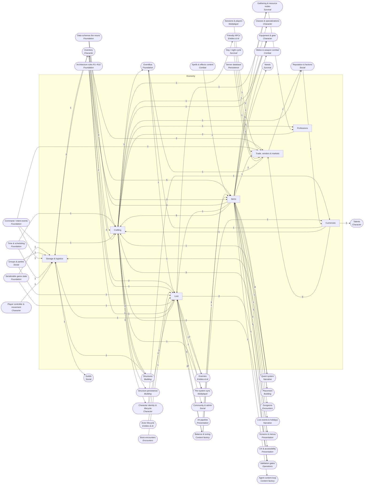

<!-- GENERATED by scripts/lib/systems-map.mjs render — do not edit; edit systems/registry/*.md and re-run. registry-hash: 943cd456f349 -->
# Economy `economy`

[← Atlas index](../ATLAS.md) · source: [`registry/`](../registry/) · decision: [ADR-0065](../../adr/0065-systems-atlas-and-impact-map.md) · ask: `scripts/systems-map.sh impact <id>`

[P2][spec][content-smith/orchestrator] · Items, loot, crafting, professions, currencies, trade, storage

> **Analogy:** The town's supply chain

| Where | Spec |
|---|---|
| `data/items/`, `data/loot_tables/`, `data/recipes/`, `core/crafting/`, `core/economy/` | §6.1, §6.2, §6.6 |

## Systems and parts

Badge = `[phase][status][owner]`. Indentation = containment.

- `items` **Items** [P0][spec][content-smith] — ItemDef content: categories, rarity, consumables, equipment, materials, stats, icons · `data/items/`
  - `item_categories_tags` **Categories & tags** [P0][spec][content-smith] — weapon, food, ore and other tags that systems filter on · `data/items/`
  - `rarity_tiers` **Rarity tiers** [P0][spec][content-smith] — common, uncommon, rare, epic; drives UI color · `data/items/`
  - `consumables` **Consumables** [P0][spec][content-smith] — Items whose use applies an effect · `data/items/`
  - `equipment_items` **Equipment items** [P0][spec][content-smith] — Items with a slot other than none · `data/items/`
  - `materials_ingredients` **Materials & ingredients** [P2][implied][content-smith] — Ore, wood, hide and the other recipe inputs · `data/items/`
  - `quest_items` **Quest items** [P2][implied][content-smith] — Items that exist to be collected or delivered · `data/items/`
  - `item_stats_block` **Item stats block** [P0][spec][content-smith] — damage, armor, attack_speed and any other stat key · `data/items/`
  - `item_icons_models` **Item icons & models** [P0][spec][world-builder] — Icon named by id; model optional · `art/icons/items/` +1
  - `random_affixes` **Random affixes** [P—][candidate][director] — Rolled prefixes and suffixes on drops; a big economy decision · `core/economy/affixes.gd`
  - `item_levels` **Item levels** [P—][candidate][director] — A single power number per item · `data/items/`
- `loot` **Loot** [P2][spec][content-smith/orchestrator] — Weighted tables, guaranteed drops, rolls on death, chests, group rules · `data/loot_tables/` +1
  - `loot_table_defs` **Loot table definitions** [P0][spec][content-smith] — entries with relative weights and min/max, plus guaranteed · `data/loot_tables/`
  - `weighted_rolls` **Weighted rolls** [P2][spec][orchestrator] — Seeded weighted selection; property-tested · `core/loot/roll.gd`
  - `guaranteed_drops` **Guaranteed drops** [P2][spec][orchestrator] — Always-drop entries alongside the roll · `core/loot/roll.gd`
  - `loot_rolls_on_death` **Loot on death** [P2][implied][orchestrator] — Listens for deaths and rolls the enemy's table · `core/loot/on_death.gd`
  - `group_loot_rules` **Group loot rules** [P4][implied][orchestrator] — Free-for-all, round-robin or need/greed among a party · `core/loot/group.gd`
  - `boss_loot_lockouts` **Boss loot lockouts** [P—][candidate][director] — One roll per boss per reset · `core/loot/lockouts.gd`
  - `pity_bad_luck_protection` **Bad-luck protection** [P—][candidate][director] — Rising odds after dry streaks, saved per character · `core/loot/pity.gd`
  - `loot_economy_tuning` **Loot economy tuning** [P2][implied][director/content-smith] — Drop rates and material flow as balance numbers · `docs/balance_ranges.md`
- `crafting` **Crafting** [P3][spec][orchestrator/content-smith] — Recipes, stations, timed crafts, unlocks · `core/crafting/` +1
  - `recipe_defs` **Recipe definitions** [P0][spec][content-smith] — output, station, inputs, craft time, unlocked_by · `data/recipes/`
  - `crafting_stations` **Crafting stations** [P3][spec][orchestrator] — hands, workbench, forge and the rest; the station must exist near the crafter · `core/crafting/stations.gd`
  - `craft_time_queue` **Craft queue** [P3][spec][orchestrator] — Timed crafts that consume inputs and emit item_crafted · `core/crafting/queue.gd`
  - `recipe_unlocks` **Recipe unlocks** [P2][spec][orchestrator] — Known from start, or unlocked by a quest or item · `core/crafting/unlocks.gd`
  - `salvage_disassembly` **Salvage** [P—][candidate][director] — Breaking items back into materials · `core/crafting/salvage.gd`
  - `item_upgrades_enchanting` **Upgrades & enchanting** [P—][candidate][director] — Improving existing gear · `core/crafting/upgrade.gd`
  - `crafting_quality_rolls` **Crafting quality rolls** [P—][candidate][director] — Variable outcome quality · `core/crafting/quality.gd`
  - `repair` **Repair** [P—][candidate][director] — Restoring durability at a station · `core/crafting/repair.gd`
  - `station_defs` **Station definitions** [P3][implied][content-smith] — One def per crafting station id (hands, workbench, forge, campfire): display name, the piece that provides it, the recipes it hosts · `data/stations/`
- `professions` **Professions** [P—][candidate][director] — Named trades with skill levels gating recipes; absent from the spec · `data/professions/` +1
  - `profession_defs` **Profession definitions** [P—][candidate][director] — Data-defined trades · `data/professions/`
  - `profession_skill_levels` **Profession skill levels** [P—][candidate][orchestrator] — Skill-ups from crafting · `core/crafting/professions.gd`
  - `profession_specializations` **Profession specializations** [P—][candidate][director] — Branches inside a trade · `data/professions/`
  - `profession_recipe_gating` **Recipe gating by skill** [P—][candidate][orchestrator] — Recipes require a skill level · `core/crafting/professions.gd`
  - `gathering_professions` **Gathering professions** [P—][candidate][director] — Mining and herbalism as skills · `core/crafting/professions.gd`
- `currencies` **Currencies** [P—][candidate][director] — Coins and tokens; the spec rewards only xp and items · `data/currencies/` +1
  - `currency_defs` **Currency definitions** [P—][candidate][director] — Data-defined currencies · `data/currencies/`
  - `wallet` **Wallet** [P—][candidate][orchestrator] — Per-character balances; emits currency_changed · `core/economy/wallet.gd`
  - `sinks_faucets` **Sinks & faucets** [P—][candidate][director] — Where currency enters and leaves; inflation control · `docs/balance_ranges.md`
  - `faction_currencies` **Faction currencies** [P—][candidate][director] — Tokens tied to reputation · `data/currencies/`
- `trade_vendors` **Trade, vendors & markets** [P—][candidate][director] — Player trade, NPC shops, a market board, pricing and mail · `core/economy/` +1
  - `player_trade` **Player trade** [P—][candidate][orchestrator] — Direct exchange between two players; emits trade_completed · `core/economy/trade.gd`
  - `npc_vendors_stores` **NPC vendors & stores** [P—][candidate][director] — Buy and sell with NPC inventories · `data/vendors/` +1
  - `vendor_inventories_restock` **Vendor restock** [P—][candidate][orchestrator] — Stock that refills over game time · `core/economy/vendor.gd`
  - `market_board_auction` **Market board** [P—][candidate][director] — Server-wide listings; an MMO feature at co-op scale · `core/economy/market.gd`
  - `commodity_pricing` **Commodity pricing** [P—][candidate][director] — Dynamic prices from supply and demand · `core/economy/pricing.gd`
  - `mail_system` **Mail** [P—][candidate][director] — Sending items to offline players · `core/economy/mail.gd`
- `storage_logistics` **Storage & logistics** [P3][implied][orchestrator] — Chests, shared storage, transfer rules, carts · `core/inventory/containers.gd` +1
  - `chests_containers` **Chests & containers** [P3][implied][orchestrator] — Placed containers with an inventory, an optional loot table and a respawn timer · `core/inventory/containers.gd`
  - `shared_storage` **Shared storage** [P4][implied][orchestrator] — Containers any party member can use · `core/inventory/containers.gd`
  - `item_transfer_rules` **Item transfer rules** [P3][implied][orchestrator] — Move, split and merge between inventories and containers · `core/inventory/transfer.gd`
  - `carts_transport` **Carts & transport** [P—][candidate][director] — Movable bulk storage · `core/inventory/`

## Wiring at tier 2

Boxes inside the frame are this domain's systems; rounded boxes are the outside systems they wire to. Arrow labels count edges; direction is influence (a change at the tail can affect the head).

## Director decisions in this domain

| Candidate | Tier | Owner | What it would be |
|---|---|---|---|
| `carts_transport` Carts & transport | 3 | director | Movable bulk storage |
| `trade_vendors` Trade, vendors & markets | 2 (+6 parts) | director | Player trade, NPC shops, a market board, pricing and mail |
| `mail_system` Mail | 3 | director | Sending items to offline players |
| `commodity_pricing` Commodity pricing | 3 | director | Dynamic prices from supply and demand |
| `market_board_auction` Market board | 3 | director | Server-wide listings; an MMO feature at co-op scale |
| `vendor_inventories_restock` Vendor restock | 3 | orchestrator | Stock that refills over game time |
| `npc_vendors_stores` NPC vendors & stores | 3 | director | Buy and sell with NPC inventories |
| `player_trade` Player trade | 3 | orchestrator | Direct exchange between two players; emits trade_completed |
| `currencies` Currencies | 2 (+4 parts) | director | Coins and tokens; the spec rewards only xp and items |
| `faction_currencies` Faction currencies | 3 | director | Tokens tied to reputation |
| `sinks_faucets` Sinks & faucets | 3 | director | Where currency enters and leaves; inflation control |
| `wallet` Wallet | 3 | orchestrator | Per-character balances; emits currency_changed |
| `currency_defs` Currency definitions | 3 | director | Data-defined currencies |
| `professions` Professions | 2 (+5 parts) | director | Named trades with skill levels gating recipes; absent from the spec |
| `gathering_professions` Gathering professions | 3 | director | Mining and herbalism as skills |
| `profession_recipe_gating` Recipe gating by skill | 3 | orchestrator | Recipes require a skill level |
| `profession_specializations` Profession specializations | 3 | director | Branches inside a trade |
| `profession_skill_levels` Profession skill levels | 3 | orchestrator | Skill-ups from crafting |
| `profession_defs` Profession definitions | 3 | director | Data-defined trades |
| `repair` Repair | 3 | director | Restoring durability at a station |
| `crafting_quality_rolls` Crafting quality rolls | 3 | director | Variable outcome quality |
| `item_upgrades_enchanting` Upgrades & enchanting | 3 | director | Improving existing gear |
| `salvage_disassembly` Salvage | 3 | director | Breaking items back into materials |
| `pity_bad_luck_protection` Bad-luck protection | 3 | director | Rising odds after dry streaks, saved per character |
| `boss_loot_lockouts` Boss loot lockouts | 3 | director | One roll per boss per reset |
| `item_levels` Item levels | 3 | director | A single power number per item |
| `random_affixes` Random affixes | 3 | director | Rolled prefixes and suffixes on drops; a big economy decision |

## Cross-domain edges

54 outbound (a change here reaches out), 57 inbound (a change elsewhere reaches in).

| Direction | Edge | How | Via | Strength | Why |
|---|---|---|---|---|---|
| ← in | `sig_actor_died` → `loot_rolls_on_death` | listens | — | hard | Loot rolls when something dies |
| → out | `craft_time_queue` → `sig_item_crafted` | emits | — | hard | A finished craft announces the output and its station |
| → out | `wallet` → `sig_currency_changed` | emits | — | hard | Any currency delta is announced (proposed signal) |
| → out | `player_trade` → `sig_trade_completed` | emits | — | hard | A completed trade is announced (proposed signal) |
| → out | `items` → `class_starting_kit` | references | `item ids` | hard | Starting gear must exist as items |
| → out | `wallet` → `respec` | reads | `cost` | soft | A respec cost needs a currency |
| → out | `items` → `bag_slots` | reads | `ItemDef` | hard | Slots hold item ids and counts |
| → out | `items` → `stacking_rules` | reads | `ItemDef.stack_size` | hard | Stack limits come from the item definition |
| → out | `items` → `weight_encumbrance` | reads | `ItemDef.weight` | hard | Weight totals come from item definitions |
| → out | `chests_containers` → `container_storage` | reads | `container inventories` | hard | Opening a chest reads its container inventory |
| → out | `items` → `equip_slots` | reads | `ItemDef.slot` | hard | An item equips only to its declared slot |
| → out | `item_stats_block` → `gear_stats_application` | reads | `ItemDef.stats` | hard | Stats on equipped items become modifiers |
| → out | `rarity_tiers` → `gear_tiers` | reads | `rarity` | soft | Tiers usually track rarity |
| → out | `item_levels` → `gear_tiers` | reads | `item level` | soft | If item levels are approved, tiers are bands of them |
| → out | `item_categories_tags` → `weapon_types` | reads | `tags` | hard | Weapon type is a tag on the item |
| → out | `repair` → `durability_repair` | reads | `repair action` | hard | Worn gear is restored by the repair action |
| → out | `loot_rolls_on_death` → `item_pickup_drop` | reads | `dropped stacks` | hard | Rolled drops become pickups at the corpse |
| → out | `equipment_items` → `equip_slots` | reads | `slot != none` | hard | Only items with a slot other than none equip |
| → out | `recipe_unlocks` → `character_save_state` | persists | — | hard | Known recipes are saved per character |
| → out | `item_stats_block` → `weapon_attack_speed` | reads | `ItemDef.stats.attack_speed` | hard | Cadence is a stat on the equipped weapon |
| → out | `consumables` → `consumables_apply` | reads | `ItemDef.on_use_effect` | hard | The item names the effect to apply |
| → out | `items` → `gather_tools_tiers` | references | `tool tags` | hard | Tools are items tagged with a tier |
| → out | `loot_table_defs` → `harvest_yield_tables` | references | `table ids` | hard | Yields reuse loot tables |
| ← in | `schema_item_def` → `items` | reads | `ItemDef` | hard | Every item file must match the schema |
| ← in | `schema_item_def` → `item_categories_tags` | reads | `ItemDef.tags` | hard | Tags are a schema field |
| ← in | `schema_item_def` → `rarity_tiers` | reads | `ItemDef.rarity enum` | hard | Rarity values are the schema's enum |
| ← in | `effect_defs_content` → `consumables` | references | `ItemDef.on_use_effect` | hard | A consumable names the effect it applies |
| ← in | `schema_item_def` → `equipment_items` | reads | `ItemDef.slot enum` | hard | Slot values are the schema's enum |
| ← in | `quest_defs` → `quest_items` | reads | `objectives.collect` | soft | Quest items exist because a quest collects them |
| ← in | `schema_item_def` → `item_stats_block` | reads | `ItemDef.stats` | hard | Stats are a schema dictionary |
| ← in | `balance_ranges` → `item_stats_block` | reads | `stat ranges` | hard | G2 rejects stats outside the documented ranges |
| ← in | `icon_conventions` → `item_icons_models` | reads | `icon path by id` | hard | Icons must be named by the item id |
| ← in | `model_naming` → `item_icons_models` | reads | `model path by id` | hard | Models must be named by the item id |
| ← in | `deterministic_sim` → `random_affixes` | reads | `seeded roll` | hard | Affix rolls are seeded |
| ← in | `schema_loot_table_def` → `loot_table_defs` | reads | `LootTableDef` | hard | Every table file must match the schema |
| ← in | `deterministic_sim` → `weighted_rolls` | reads | `seeded RNG` | hard | Loot rolls on the seeded RNG so replays and servers agree |
| ← in | `enemy_defs` → `loot_rolls_on_death` | reads | `EnemyDef.loot_table` | hard | The dead enemy names its table |
| ← in | `corpse_handling` → `loot_rolls_on_death` | reads | `drop location` | soft | Loot appears at the corpse |
| ← in | `party_membership` → `group_loot_rules` | reads | `who rolls` | hard | Rules are applied among party members |
| ← in | `encounter_defs` → `boss_loot_lockouts` | reads | `boss id` | hard | Lockouts are per encounter |
| ← in | `world_state_flags` → `boss_loot_lockouts` | reads | `lockout flags` | hard | A lockout is a saved flag |
| ← in | `character_save_state` → `pity_bad_luck_protection` | reads | `streak counters` | hard | Streaks are saved per character |
| ← in | `balance_ranges` → `loot_economy_tuning` | reads | `drop rates` | hard | Drop rates are balance numbers |
| ← in | `loot_economy_sim` → `loot_economy_tuning` | reads | `simulated outcomes` | soft | A simulation would inform the numbers |
| ← in | `schema_recipe_def` → `recipe_defs` | reads | `RecipeDef` | hard | Every recipe file must match the schema |
| ← in | `schema_station_def` → `crafting_stations` | reads | `StationDef` | hard | Stations need a definition |
| ← in | `crafting_station_structures` → `crafting_stations` | reads | `placed station` | hard | A station must be built and nearby |
| ← in | `timers_cooldowns` → `craft_time_queue` | reads | `craft timer` | hard | Crafts are timers |
| ← in | `inventory` → `craft_time_queue` | reads | `consume inputs, add output` | hard | Crafting moves items through the inventory |
| ← in | `intent_schema` → `craft_time_queue` | reads | `craft intent` | hard | Crafting is an intent |
| ← in | `quest_defs` → `recipe_unlocks` | references | `quest id` | soft | Some recipes unlock by quest |
| ← in | `deterministic_sim` → `salvage_disassembly` | reads | `seeded return` | soft | Partial returns roll |
| ← in | `deterministic_sim` → `crafting_quality_rolls` | reads | `seeded roll` | hard | Quality rolls on the seeded RNG |
| ← in | `durability_repair` → `repair` | reads | `durability value` | hard | Repair restores durability |
| ← in | `resource_nodes` → `gathering_professions` | reads | `node harvests` | hard | Gathering skill grows by harvesting |
| ← in | `character_save_state` → `wallet` | reads | `saved balances` | hard | Balances are saved with the character |
| ← in | `balance_ranges` → `sinks_faucets` | reads | `inflation targets` | soft | Targets are balance data |
| ← in | `reputation_tiers` → `faction_currencies` | reads | `earn rate` | hard | Earned through faction standing |
| ← in | `inventory` → `player_trade` | reads | `both inventories` | hard | A trade moves items between inventories |
| ← in | `sessions_players` → `player_trade` | reads | `both players online` | hard | Trades need two connected players |
| ← in | `intent_schema` → `player_trade` | reads | `trade intents` | soft | Offers and accepts are intents |
| ← in | `npc_defs` → `npc_vendors_stores` | reads | `vendor npc` | hard | A vendor is an NPC |
| ← in | `world_clock_ticks` → `vendor_inventories_restock` | reads | `over days` | hard | Restock advances with the clock |
| ← in | `server_database` → `market_board_auction` | reads | `listings` | hard | Listings need server persistence |
| ← in | `server_database` → `mail_system` | reads | `mailboxes` | hard | Mail needs server persistence |
| ← in | `inventory` → `mail_system` | reads | `attachments` | hard | Mail carries items |
| ← in | `storage_structures` → `chests_containers` | reads | `placed chest` | hard | A container inventory belongs to a placed structure |
| ← in | `inventory` → `chests_containers` | reads | `container inventory model` | hard | A container reuses the inventory model |
| ← in | `state_serialization` → `chests_containers` | reads | `saved contents` | hard | Contents are saved with the world |
| ← in | `party_membership` → `shared_storage` | reads | `who may open` | hard | Access follows the party |
| ← in | `intent_schema` → `item_transfer_rules` | reads | `transfer intent` | hard | A transfer is an intent |
| ← in | `placement` → `carts_transport` | reads | `placed cart` | soft | A cart is a placed, movable structure |
| ← in | `weight_encumbrance` → `carts_transport` | reads | `cart capacity` | hard | Carts have weight limits |
| ← in | `timers_cooldowns` → `chests_containers` | reads | — | soft | Loot chests respawn their contents on a timer |
| ← in | `interaction_system` → `chests_containers` | reads | `interact target id` | hard | Opening a container is an interact |
| ← in | `placeholder_assets` → `item_icons_models` | reads | — | soft | An item without art points at the placeholder |
| ← in | `schema_recipe_def` → `crafting_stations` | reads | `station` | soft | RecipeDef.station names a station |
| ← in | `schema_loot_table_def` → `weighted_rolls` | reads | `entries shape` | soft | The roll reads entries and weights |
| ← in | `schema_station_def` → `station_defs` | reads | — | hard | Every station file must match the schema |
| → out | `loot_table_defs` → `enemy_defs` | references | `EnemyDef.loot_table` | hard | The enemy names its loot table |
| → out | `loot_table_defs` → `elite_rare_variants` | references | `better table` | hard | Variants name a richer table |
| → out | `recipe_unlocks` → `trainers` | reads | `teach recipe` | hard | Training is an unlock source |
| → out | `items` → `keys_gates` | references | `key item ids` | hard | Keys are items |
| → out | `items` → `piece_defs` | references | `material cost` | hard | A piece names the items it costs |
| → out | `repair` → `structure_damage_repair` | reads | `repair action` | soft | Repair restores structure health |
| → out | `station_defs` → `crafting_station_structures` | references | `station id` | hard | A station piece names the station it provides |
| → out | `items` → `objective_types` | references | `collect target_id` | hard | A collect objective names an item |
| → out | `items` → `objective_types` | references | `craft target_id` | hard | A craft objective names the item crafted |
| → out | `items` → `quest_rewards` | references | `rewards.items` | hard | Reward items must exist |
| → out | `items` → `seasonal_rewards` | references | `reward items` | hard | Rewards are items |
| → out | `quest_items` → `objective_types` | references | — | soft | Collect objectives usually name quest items |
| → out | `recipe_defs` → `crafting_screen` | renders | `recipes` | hard | The screen lists recipes |
| → out | `craft_time_queue` → `crafting_screen` | renders | `queue` | hard | The screen shows the queue |
| → out | `recipe_unlocks` → `crafting_screen` | renders | `known recipes` | hard | Only unlocked recipes are shown |
| → out | `items` → `tooltips_item_cards` | renders | `item fields` | hard | Cards show item data |
| → out | `rarity_tiers` → `tooltips_item_cards` | reads | `color` | hard | Rarity drives the card color |
| → out | `rarity_tiers` → `colorblind_modes` | reads | `rarity colors` | hard | Rarity colors need alternates |
| → out | `loot` → `sync_domains` | transports | — | hard | Loot rolls are server-owned; clients never roll; no dedicated sync part yet |
| → out | `crafting` → `sync_domains` | transports | — | hard | Craft timers and outputs are server-owned; no dedicated sync part yet |
| → out | `shared_storage` → `guild_bank` | reads | `storage` | hard | A guild bank is shared storage |
| → out | `npc_vendors_stores` → `faction_unlocks_vendors` | reads | `gated stock` | hard | Unlocks gate vendor stock |
| → out | `recipe_unlocks` → `faction_unlocks_vendors` | reads | `gated recipes` | soft | Unlocks can gate recipes |
| → out | `group_loot_rules` → `server_rules_config` | reads | — | hard | The server's loot rule is the party's default |
| → out | `weighted_rolls` → `g1_unit_tests_gut` | validates | `property tests` | hard | Loot weights are property-tested |
| → out | `items` → `g2_data_integrity` | validates | `item files` | hard | G2 checks every item |
| → out | `loot_table_defs` → `g2_data_integrity` | validates | `loot table files` | hard | G2 checks every loot table file: item ids, weights |
| → out | `recipe_defs` → `g2_data_integrity` | validates | `recipe files` | hard | G2 checks every recipe file: output, inputs, station, unlock |
| → out | `crafting` → `g4_bot_playtest` | validates | — | soft | §8 lists craft in G4 from Phase 1 while §13 lands crafting in Phase 3 — soft until the spec PR |
| → out | `items` → `balance_anchoring` | reads | `comparable items` | hard | Anchoring reads existing items |
| → out | `weighted_rolls` → `loot_economy_sim` | reads | `roll function` | hard | The sim calls the real roll |
| → out | `loot_table_defs` → `loot_economy_sim` | reads | `tables` | hard | The sim rolls the real tables |

