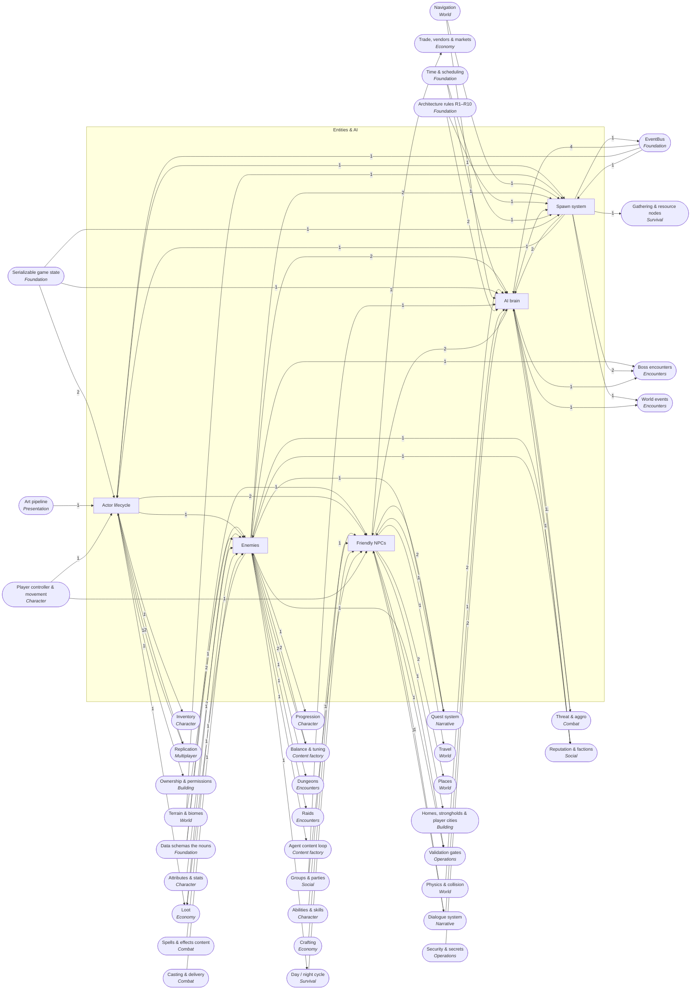

<!-- GENERATED by scripts/lib/systems-map.mjs render — do not edit; edit systems/registry/*.md and re-run. registry-hash: 949cf432b712 -->
# Entities & AI `ai_entities`

[← Atlas index](../ATLAS.md) · source: [`registry/`](../registry/) · decision: [ADR-0065](../../adr/0065-systems-atlas-and-impact-map.md) · ask: `scripts/systems-map.sh impact <id>`

[P1][spec][orchestrator] · Enemies, spawning, AI brains, friendly NPCs, actor lifecycle

> **Analogy:** The cast of the play and the brains that move them

| Where | Spec |
|---|---|
| `actors/`, `core/ai/`, `core/spawn/`, `data/enemies/`, `data/npcs/` | §6.5 |

## Systems and parts

Badge = `[phase][status][owner]`. Indentation = containment.

- `enemies` **Enemies** [P0][spec][content-smith] — EnemyDef content: stats, behavior, loot, biomes, families, abilities · `data/enemies/`
  - `enemy_defs` **Enemy definitions** [P0][spec][content-smith] — One .tres per enemy: scene, health, damage, armor, move_speed, behavior, loot_table, xp, biomes, day_phases · `data/enemies/`
  - `enemy_stats_scaling` **Enemy stat scaling** [P2][implied][content-smith] — Stat bands by biome tier, night and player count · `data/enemies/` +1
  - `enemy_families` **Enemy families** [P1][implied][content-smith] — Groups per biome that share art, sounds and behavior · `data/enemies/`
  - `enemy_abilities` **Enemy abilities** [P2][implied][content-smith] — Enemies cast the same SpellDefs players do · `data/enemies/` +1
  - `enemy_factions_hostility` **Enemy factions** [P—][candidate][director] — Which enemies fight each other and which ignore players · `data/enemies/`
  - `elite_rare_variants` **Elite and rare variants** [P—][candidate][content-smith] — Named or elite versions with better loot · `data/enemies/`
- `spawning` **Spawn system** [P1][spec][orchestrator/world-builder] — Where, when and how many actors appear; emits actor_spawned · `core/spawn/` +1
  - `spawn_points_zones` **Spawn points and zones** [P1][implied][world-builder] — Placed spawn markers and zone volumes · `scenes/`
  - `spawn_rules_biome_phase` **Spawn rules by biome and phase** [P2][spec][orchestrator] — Which enemies may spawn where and at which clock phase · `core/spawn/rules.gd`
  - `spawn_density_caps` **Density caps** [P2][implied][orchestrator] — Population limits per zone; the AI director nudges them · `core/spawn/density.gd`
  - `respawn_timers` **Respawn timers** [P2][implied][orchestrator] — Killed spawns return after a timer · `core/spawn/respawn.gd`
  - `despawn_cleanup` **Despawn and cleanup** [P2][implied][orchestrator] — Far or stale actors are removed to protect the budget · `core/spawn/cleanup.gd`
  - `pack_spawning` **Pack spawning** [P2][spec][orchestrator] — Packs spawn and move together · `core/spawn/pack.gd`
- `ai_brain` **AI brain** [P1][spec][orchestrator] — The behavior verbs plus the senses, movement and targeting under them · `core/ai/`
  - `behavior_verbs` **Behavior verbs** [P1][spec][orchestrator] — passive, territorial, aggressive, pack; each is a verb in core/ · `core/ai/behaviors/`
  - `perception` **Perception** [P1][implied][orchestrator] — Aggro radius, line of sight, reaction to damage and casts · `core/ai/perception.gd`
  - `pathfinding_navmesh` **Pathfinding** [P1][implied][orchestrator] — Navigation queries on the baked navmesh · `core/ai/path.gd`
  - `steering_locomotion` **Steering and locomotion** [P1][implied][orchestrator] — Movement along the path on the tick at the enemy's speed · `core/ai/steer.gd`
  - `target_selection` **Target selection** [P1][implied][orchestrator] — Picks a target from threat and perception · `core/ai/target.gd`
  - `leashing_evade` **Leashing and evade** [P2][implied][orchestrator] — Returns home and resets when dragged too far · `core/ai/leash.gd`
  - `ai_director` **AI director** [P2][implied][orchestrator] — Paces pressure by nudging spawn caps and firing events · `core/ai/director.gd`
  - `behavior_trees_utility` **Behavior trees / utility AI** [P—][candidate][orchestrator] — A data-driven decision layer beneath the four verbs · `core/ai/`
  - `group_tactics` **Group tactics** [P—][candidate][orchestrator] — Flanking, focus fire, retreat for packs · `core/ai/tactics.gd`
  - `llm_npc_intelligence` **LLM-enhanced NPC intelligence** [P—][candidate][director] — Model-driven NPC talk or planning; must run outside the fixed tick because it is nondeterministic · `tools/ai/` +1
- `npcs` **Friendly NPCs** [P3][spec][quest-writer/orchestrator] — Characters with jobs: quest givers now, vendors and trainers if approved · `actors/npc/` +1
  - `npc_defs` **NPC definitions** [P3][implied][quest-writer] — Scene, name, role and dialogue per NPC · `data/npcs/`
  - `quest_givers` **Quest givers** [P3][spec][quest-writer] — NPCs that offer and complete quests · `data/npcs/` +1
  - `trainers` **Trainers** [P—][candidate][director] — NPCs that teach spells or recipes · `data/npcs/`
  - `npc_schedules_routines` **Schedules and routines** [P—][candidate][director] — Daily routines by clock phase · `core/ai/schedule.gd`
  - `companions_pets` **Companions and pets** [P—][candidate][director] — Player-owned followers with their own brain · `core/ai/companion.gd`
  - `mounts` **Mounts** [P—][candidate][director] — Rideable actors · `actors/mounts/`
- `actor_lifecycle` **Actor lifecycle** [P1][spec][orchestrator] — Ids, prefabs, corpses and the sync hooks every actor shares · `core/state/actors.gd` +1
  - `actor_ids` **Actor ids** [P1][spec][orchestrator] — Every actor has an id; logic never uses node paths · `core/state/actors.gd`
  - `actor_prefabs_scenes` **Actor prefabs** [P1][spec][world-builder] — The .tscn per enemy and NPC referenced by EnemyDef.scene · `actors/`
  - `corpse_handling` **Corpse handling** [P2][implied][orchestrator] — A corpse replaces the actor, holds loot, is cleaned up later · `core/state/corpse.gd`
  - `actor_state_sync_hooks` **Actor state sync hooks** [P4][implied][orchestrator] — Serializable actor state ready for replication · `core/net/`

## Wiring at tier 2

Boxes inside the frame are this domain's systems; rounded boxes are the outside systems they wire to. Arrow labels count edges; direction is influence (a change at the tail can affect the head).

## Director decisions in this domain

| Candidate | Tier | Owner | What it would be |
|---|---|---|---|
| `mounts` Mounts | 3 | director | Rideable actors |
| `companions_pets` Companions and pets | 3 | director | Player-owned followers with their own brain |
| `npc_schedules_routines` Schedules and routines | 3 | director | Daily routines by clock phase |
| `trainers` Trainers | 3 | director | NPCs that teach spells or recipes |
| `llm_npc_intelligence` LLM-enhanced NPC intelligence | 3 | director | Model-driven NPC talk or planning; must run outside the fixed tick because it is nondeterministic |
| `group_tactics` Group tactics | 3 | orchestrator | Flanking, focus fire, retreat for packs |
| `behavior_trees_utility` Behavior trees / utility AI | 3 | orchestrator | A data-driven decision layer beneath the four verbs |
| `elite_rare_variants` Elite and rare variants | 3 | content-smith | Named or elite versions with better loot |
| `enemy_factions_hostility` Enemy factions | 3 | director | Which enemies fight each other and which ignore players |

## Cross-domain edges

35 outbound (a change here reaches out), 47 inbound (a change elsewhere reaches in).

| Direction | Edge | How | Via | Strength | Why |
|---|---|---|---|---|---|
| → out | `spawning` → `sig_actor_spawned` | emits | — | hard | The spawn system announces every actor it creates |
| ← in | `sig_actor_spawned` → `ai_director` | listens | — | soft | The director counts live actors to pace pressure |
| ← in | `sig_actor_damaged` → `perception` | listens | — | soft | Being hit wakes up a passive or territorial AI |
| ← in | `sig_actor_died` → `corpse_handling` | listens | — | hard | A corpse replaces the actor on death |
| ← in | `sig_spell_cast` → `perception` | listens | — | soft | AI reacts to casts (interrupt or dodge behaviors) |
| ← in | `sig_day_phase_changed` → `spawn_rules_biome_phase` | listens | — | hard | Night spawns switch on |
| ← in | `sig_day_phase_changed` → `ai_brain` | listens | — | soft | Some behaviors change at night |
| → out | `enemy_defs` → `xp_award` | reads | `EnemyDef.xp` | hard | Kill XP comes from the enemy definition |
| → out | `corpse_handling` → `loot_bags_on_death` | reads | `corpse location` | hard | The bag sits where the corpse is |
| → out | `leashing_evade` → `leash_reset` | reads | `leash distance` | hard | The AI's leash decides when combat resets |
| → out | `enemy_stats_scaling` → `night_danger_scaling` | reads | `night multiplier` | soft | Night can scale enemy stats |
| → out | `spawning` → `animal_husbandry` | reads | `tamed actors` | soft | Tamed animals are spawned actors with an owner |
| → out | `enemy_defs` → `loot_rolls_on_death` | reads | `EnemyDef.loot_table` | hard | The dead enemy names its table |
| → out | `corpse_handling` → `loot_rolls_on_death` | reads | `drop location` | soft | Loot appears at the corpse |
| → out | `npc_defs` → `npc_vendors_stores` | reads | `vendor npc` | hard | A vendor is an NPC |
| ← in | `schema_enemy_def` → `enemy_defs` | reads | `EnemyDef` | hard | Every enemy file must match the schema |
| ← in | `loot_table_defs` → `enemy_defs` | references | `EnemyDef.loot_table` | hard | The enemy names its loot table |
| ← in | `biome_defs` → `enemy_defs` | references | `EnemyDef.biomes` | hard | The enemy names the biomes it spawns in |
| ← in | `balance_ranges` → `enemy_defs` | reads | `stat ranges` | soft | Enemy numbers are anchored to balance ranges |
| ← in | `level_scaling` → `enemy_stats_scaling` | reads | `shared curves` | hard | Enemies scale on the same curve family as players |
| ← in | `balance_ranges` → `enemy_stats_scaling` | reads | `bands` | hard | Scaling bands are balance data |
| ← in | `biome_defs` → `enemy_families` | reads | `family per biome` | hard | Families are grouped by biome |
| ← in | `spell_defs_content` → `enemy_abilities` | references | `spell ids` | hard | Enemy abilities are spells |
| ← in | `casting` → `enemy_abilities` | reads | `same casting system` | hard | Enemies cast through the same verbs as players |
| ← in | `faction_defs` → `enemy_factions_hostility` | reads | `faction ids` | soft | If factions are approved, enemies belong to them |
| ← in | `loot_table_defs` → `elite_rare_variants` | references | `better table` | hard | Variants name a richer table |
| ← in | `biome_defs` → `spawn_points_zones` | reads | `zone biome` | hard | A spawn zone belongs to a biome |
| ← in | `navmesh_baking` → `spawn_points_zones` | reads | `valid ground` | soft | Spawns are placed on navigable ground |
| ← in | `deterministic_sim` → `spawn_rules_biome_phase` | reads | `seeded choice` | hard | Which enemy spawns is a seeded roll |
| ← in | `timers_cooldowns` → `respawn_timers` | reads | `tick timers` | hard | Respawn is a timer |
| ← in | `actor_registry` → `despawn_cleanup` | reads | `distance and age` | hard | Cleanup walks the registry |
| ← in | `fixed_tick_sim` → `behavior_verbs` | reads | `think on tick` | hard | AI decides on the tick so replays agree |
| ← in | `collision_layers` → `perception` | reads | `LoS raycasts` | hard | Line of sight is a physics query |
| ← in | `actor_registry` → `perception` | reads | `nearby actors` | hard | Perception scans actors by id |
| ← in | `navmesh_baking` → `pathfinding_navmesh` | reads | `navigation regions` | hard | Paths are found on the baked mesh |
| ← in | `physics_collision` → `steering_locomotion` | reads | `collision` | hard | Enemies collide with the world |
| ← in | `threat_table` → `target_selection` | reads | `highest threat` | soft | Aggressive enemies attack the top of their threat table once it exists in Phase 2; Phase 1 targets the nearest perceived hostile |
| ← in | `party_membership` → `ai_director` | reads | `player count` | soft | Pressure scales with players present |
| ← in | `deterministic_sim` → `ai_director` | reads | `seeded decisions` | hard | Director choices are seeded |
| ← in | `deterministic_sim` → `llm_npc_intelligence` | reads | `outside the tick only` | hard | Model output is nondeterministic; it may feed dialogue or planning, never the simulation tick (R4) |
| ← in | `dialogue` → `llm_npc_intelligence` | reads | `generated lines` | soft | The most plausible use is dialogue variation |
| ← in | `env_secrets` → `llm_npc_intelligence` | reads | `API key` | hard | Any model call needs a key from the environment (R-SEC1) |
| ← in | `dependency_policy_r10` → `llm_npc_intelligence` | gated_by | `new external service` | hard | A model API is a new dependency and needs a spec change |
| ← in | `schema_npc_def` → `npc_defs` | reads | `NpcDef` | hard | NPCs need a schema |
| ← in | `dialogue_nodes_choices` → `npc_defs` | references | `dialogue id` | hard | The NPC names its dialogue |
| ← in | `quest_defs` → `quest_givers` | references | `quest ids` | hard | A giver names the quests it offers |
| ← in | `ability_unlocks` → `trainers` | reads | `teach spell` | hard | Training is an unlock source |
| ← in | `recipe_unlocks` → `trainers` | reads | `teach recipe` | hard | Training is an unlock source |
| ← in | `world_clock_ticks` → `npc_schedules_routines` | reads | `phase` | hard | Routines follow the clock |
| ← in | `party_membership` → `companions_pets` | reads | `owner` | soft | Ownership follows the party |
| ← in | `locomotion` → `mounts` | reads | `rider control` | hard | Riding replaces the rider's locomotion |
| ← in | `actor_registry` → `actor_ids` | extends | `id space` | hard | Actor ids are entries in the registry |
| ← in | `import_hook` → `actor_prefabs_scenes` | reads | `meshes and collision` | hard | Prefab meshes pass through the import hook |
| ← in | `character_capsule` → `actor_prefabs_scenes` | reads | `proportions` | soft | Actors share the 1 m scale and door clearance |
| ← in | `state_serialization` → `actor_state_sync_hooks` | reads | `serializable state` | hard | Sync hooks expose the same state the save uses |
| ← in | `replication` → `actor_state_sync_hooks` | reads | `replication api` | hard | Hooks are consumed by replication |
| → out | `enemy_defs` → `encounter_defs` | references | `boss enemy id` | hard | The boss is an enemy |
| → out | `spawning` → `boss_mechanics_library` | reads | `add waves` | hard | Add waves are spawns |
| → out | `leashing_evade` → `boss_arena_rules` | reads | `reset on leave` | hard | Leaving the arena resets the boss |
| → out | `spawn_rules_biome_phase` → `world_bosses` | reads | `spawn rules` | hard | World bosses spawn by rule |
| → out | `enemy_stats_scaling` → `difficulty_tiers` | reads | `tier multipliers` | hard | Tiers scale enemy stats |
| → out | `enemy_stats_scaling` → `raid_size_scaling` | reads | `multipliers` | hard | Scaling reuses the stat bands |
| → out | `spawning` → `invasion_events` | reads | `waves` | hard | Waves are spawns |
| → out | `ai_director` → `dynamic_events_ai_director` | reads | `pacing` | hard | The director decides when to fire |
| → out | `mounts` → `mounts_travel` | reads | `mount actors` | hard | Mounted travel needs mounts |
| → out | `npc_defs` → `villages_settlements` | reads | `residents` | hard | A village is NPCs and their homes |
| → out | `npc_schedules_routines` → `cities` | reads | `living city` | soft | Cities want routines to feel alive |
| → out | `npc_defs` → `npc_settlers` | reads | `settlers` | hard | Settlers are NPCs |
| → out | `actor_ids` → `build_permissions` | reads | `owner id` | hard | Pieces record an owner id |
| → out | `npc_defs` → `quest_defs` | references | `QuestDef.giver_npc` | hard | A quest names its giver |
| → out | `enemy_defs` → `objective_types` | references | `kill target_id` | hard | A kill objective names an enemy |
| → out | `npc_defs` → `objective_types` | references | `talk target_id` | hard | A talk objective names an NPC |
| → out | `npc_defs` → `barks_ambient_lines` | reads | `speaker` | hard | Barks belong to NPCs |
| → out | `actor_state_sync_hooks` → `state_snapshots_sync` | reads | `actor state` | hard | Snapshots read the actor sync hooks |
| → out | `actor_lifecycle` → `spawn_replication` | transports | `spawns` | hard | Spawns are mirrored |
| → out | `enemy_factions_hostility` → `mob_faction_hostility` | reads | `mob factions` | hard | Mobs need factions first |
| → out | `perception` → `mob_faction_hostility` | reads | `attack decision` | hard | The AI's perception consults hostility |
| → out | `enemies` → `g2_data_integrity` | validates | `enemy files` | hard | G2 checks every enemy |
| → out | `npc_defs` → `g2_data_integrity` | validates | `npc files` | soft | G2 will check NPCs once they have a schema |
| → out | `enemy_defs` → `balance_anchoring` | reads | `comparable enemies` | hard | Anchoring reads existing enemies |
| → out | `enemy_stats_scaling` → `stat_curves_level_scaling` | reads | `enemy bands` | hard | Curves describe enemy bands |
| → out | `enemy_stats_scaling` → `difficulty_curve` | reads | `bands` | hard | Difficulty is expressed through stat bands |

