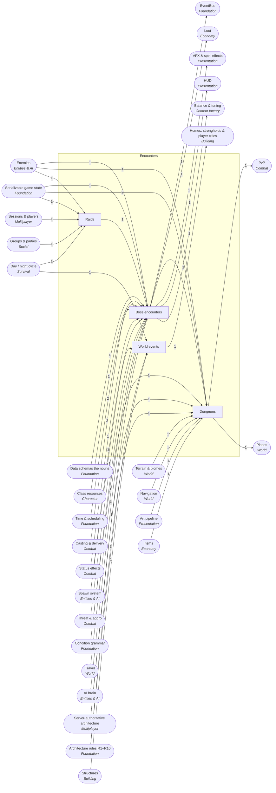

<!-- GENERATED by scripts/lib/systems-map.mjs render — do not edit; edit systems/registry/*.md and re-run. registry-hash: 95b296a15be1 -->
# Encounters `encounters`

[← Atlas index](../ATLAS.md) · source: [`registry/`](../registry/) · decision: [ADR-0065](../../adr/0065-systems-atlas-and-impact-map.md) · ask: `scripts/systems-map.sh impact <id>`

[P2][spec][orchestrator] · Boss fights, dungeons, raids and world events

> **Analogy:** The set-piece scenes of the play

| Where | Spec |
|---|---|
| `core/encounters/`, `data/encounters/`, `scenes/dungeons/` | §1 boss gates |

## Systems and parts

Badge = `[phase][status][owner]`. Indentation = containment.

- `boss_encounters` **Boss encounters** [P2][spec][orchestrator/content-smith] — Data-defined fights with phases and mechanics; beating one opens a gate · `core/encounters/` +1
  - `encounter_defs` **Encounter definitions** [P2][implied][content-smith] — Boss enemy, phases, mechanics list, arena, gate flag · `data/encounters/`
  - `boss_phases` **Boss phases** [P2][implied][orchestrator] — Health-percent or timer transitions; emits boss_phase_changed · `core/encounters/phases.gd`
  - `boss_mechanics_library` **Boss mechanics library** [P2][implied][orchestrator] — Reusable verbs: telegraph, add wave, enrage, stack, spread, interrupt, tank swap · `core/encounters/mechanics/`
  - `telegraph_decals` **Telegraphs** [P2][implied][orchestrator] — Danger shapes announced before an AoE lands · `core/encounters/mechanics/telegraph.gd`
  - `boss_gates_progression` **Boss gates** [P2][spec][orchestrator] — A defeated boss sets a world flag that unlocks the next region · `core/encounters/gates.gd`
  - `boss_arena_rules` **Boss arena rules** [P2][implied][world-builder] — Arena bounds, entry conditions, reset on wipe · `scenes/arenas/`
  - `raid_bosses` **Raid bosses** [P—][candidate][orchestrator] — Bosses tuned for the whole server · `core/encounters/`
  - `enrage_timers` **Enrage timers** [P—][candidate][director] — Soft or hard enrage after a time limit · `core/encounters/mechanics/`
  - `world_bosses` **World bosses** [P—][candidate][director] — Roaming open-world bosses · `core/encounters/`
- `dungeons` **Dungeons** [P2][implied][world-builder] — Built places with scripted doors, traps, puzzles and a boss at the end · `scenes/dungeons/` +1
  - `dungeon_layouts` **Dungeon layouts** [P2][implied][world-builder] — Hand-built dungeon scenes · `scenes/dungeons/`
  - `dungeon_scripting` **Dungeon scripting** [P3][implied][orchestrator] — Doors, traps and puzzles driven by conditions and flags · `core/encounters/dungeon.gd`
  - `keys_gates` **Keys and gates** [P2][implied][orchestrator] — Key items and boss flags that open doors · `core/encounters/gates.gd`
  - `difficulty_tiers` **Difficulty tiers** [P—][candidate][director] — Scaled versions of the same dungeon · `data/dungeons/`
  - `instancing` **Instancing** [P—][candidate][director] — Private copies per group versus one shared world; a Phase 4 architecture decision · `core/net/`
  - `procedural_dungeons` **Procedural dungeons** [P—][candidate][director] — Layouts generated from room pieces and a seed · `core/world/gen/`
- `raids` **Raids** [P—][candidate][orchestrator] — Encounters sized for 6–10 players with their own bosses; asked for by the Director, not in the spec (§1 names boss gates only) · `core/encounters/raid.gd`
  - `raid_size_scaling` **Raid size scaling** [P—][candidate][orchestrator] — Health and mechanics scale with player count · `core/encounters/raid.gd`
  - `raid_roles_check` **Raid roles check** [P—][candidate][orchestrator] — Warns when the group lacks a role · `core/encounters/raid.gd`
  - `raid_lockouts` **Raid lockouts** [P—][candidate][director] — Weekly resets on rewards · `core/encounters/raid.gd`
- `world_events` **World events** [P—][candidate][director] — Invasions and timed events that change the world for a while · `core/events_world/`
  - `invasion_events` **Invasion events** [P—][candidate][director] — Waves that attack a player base · `core/events_world/invasion.gd`
  - `event_scheduler` **Event scheduler** [P—][candidate][orchestrator] — Clock-driven, seeded event timing · `core/events_world/schedule.gd`

## Wiring at tier 2

Boxes inside the frame are this domain's systems; rounded boxes are the outside systems they wire to. Arrow labels count edges; direction is influence (a change at the tail can affect the head).

## Director decisions in this domain

| Candidate | Tier | Owner | What it would be |
|---|---|---|---|
| `world_events` World events | 2 (+2 parts) | director | Invasions and timed events that change the world for a while |
| `event_scheduler` Event scheduler | 3 | orchestrator | Clock-driven, seeded event timing |
| `invasion_events` Invasion events | 3 | director | Waves that attack a player base |
| `raids` Raids | 2 (+3 parts) | orchestrator | Encounters sized for 6–10 players with their own bosses; asked for by the Director, not in the spec (§1 names boss gates only) |
| `raid_lockouts` Raid lockouts | 3 | director | Weekly resets on rewards |
| `raid_roles_check` Raid roles check | 3 | orchestrator | Warns when the group lacks a role |
| `raid_size_scaling` Raid size scaling | 3 | orchestrator | Health and mechanics scale with player count |
| `procedural_dungeons` Procedural dungeons | 3 | director | Layouts generated from room pieces and a seed |
| `instancing` Instancing | 3 | director | Private copies per group versus one shared world; a Phase 4 architecture decision |
| `difficulty_tiers` Difficulty tiers | 3 | director | Scaled versions of the same dungeon |
| `world_bosses` World bosses | 3 | director | Roaming open-world bosses |
| `enrage_timers` Enrage timers | 3 | director | Soft or hard enrage after a time limit |
| `raid_bosses` Raid bosses | 3 | orchestrator | Bosses tuned for the whole server |

## Cross-domain edges

8 outbound (a change here reaches out), 35 inbound (a change elsewhere reaches in).

| Direction | Edge | How | Via | Strength | Why |
|---|---|---|---|---|---|
| → out | `boss_phases` → `sig_boss_phase_changed` | emits | — | hard | A phase transition is announced (proposed signal) |
| → out | `instancing` → `arenas` | reads | `isolated space` | soft | Arenas want instanced space if instancing exists |
| → out | `encounter_defs` → `boss_loot_lockouts` | reads | `boss id` | hard | Lockouts are per encounter |
| ← in | `schema_encounter_def` → `encounter_defs` | reads | `EncounterDef` | hard | Encounters need a schema |
| ← in | `enemy_defs` → `encounter_defs` | references | `boss enemy id` | hard | The boss is an enemy |
| ← in | `health_pool` → `boss_phases` | reads | `health percent` | hard | Most transitions trigger on health |
| ← in | `fixed_tick_sim` → `boss_phases` | reads | `timer phases` | hard | Timer transitions count ticks |
| ← in | `casting` → `boss_mechanics_library` | reads | `boss spells` | hard | Mechanics fire spells through the casting verbs |
| ← in | `status_effects` → `boss_mechanics_library` | reads | `applied debuffs` | hard | Mechanics apply effects |
| ← in | `spawning` → `boss_mechanics_library` | reads | `add waves` | hard | Add waves are spawns |
| ← in | `threat_table` → `boss_mechanics_library` | reads | `tank swap` | hard | Tank swaps manipulate threat |
| ← in | `condition_grammar` → `boss_mechanics_library` | reads | `trigger conditions` | soft | Mechanic triggers can be conditions |
| ← in | `ground_aoe_delivery` → `telegraph_decals` | reads | `radius and point` | hard | A telegraph shows the AoE that is coming |
| ← in | `timers_cooldowns` → `telegraph_decals` | reads | `warning time` | hard | The warning is a timer |
| ← in | `world_state_flags` → `boss_gates_progression` | reads | `gate flags` | hard | A gate is a flag set on victory |
| ← in | `zone_triggers` → `boss_arena_rules` | reads | `arena bounds` | hard | The arena is a zone |
| ← in | `leashing_evade` → `boss_arena_rules` | reads | `reset on leave` | hard | Leaving the arena resets the boss |
| ← in | `spawn_rules_biome_phase` → `world_bosses` | reads | `spawn rules` | hard | World bosses spawn by rule |
| ← in | `terrain_biomes` → `dungeon_layouts` | reads | `biome context` | soft | Dungeons belong to a biome |
| ← in | `navmesh_baking` → `dungeon_layouts` | reads | `navigation` | hard | Enemies must navigate the dungeon |
| ← in | `import_hook` → `dungeon_layouts` | reads | `meshes` | hard | Dungeon geometry passes through the import hook |
| ← in | `condition_evaluator` → `dungeon_scripting` | reads | `conditions` | hard | Doors and traps evaluate conditions |
| ← in | `world_state_flags` → `dungeon_scripting` | reads | `flags` | hard | Puzzle state is flags |
| ← in | `items` → `keys_gates` | references | `key item ids` | hard | Keys are items |
| ← in | `enemy_stats_scaling` → `difficulty_tiers` | reads | `tier multipliers` | hard | Tiers scale enemy stats |
| ← in | `net_architecture` → `instancing` | reads | `server model` | hard | Instancing is a server-side architecture choice |
| ← in | `state_serialization` → `instancing` | reads | `per-instance state` | hard | Each instance has its own state |
| ← in | `deterministic_sim` → `procedural_dungeons` | reads | `seeded layout` | hard | Generated layouts are seeded |
| ← in | `player_slots_cap` → `raid_size_scaling` | reads | `player count` | hard | Scaling reads the live player count |
| ← in | `enemy_stats_scaling` → `raid_size_scaling` | reads | `multipliers` | hard | Scaling reuses the stat bands |
| ← in | `party_roles` → `raid_roles_check` | reads | `roles present` | soft | The check reads party roles if they exist |
| ← in | `world_state_flags` → `raid_lockouts` | reads | `lockout flags` | hard | A lockout is a flag |
| ← in | `world_clock_ticks` → `raid_lockouts` | reads | `reset time` | hard | Lockouts reset on the clock |
| ← in | `spawning` → `invasion_events` | reads | `waves` | hard | Waves are spawns |
| ← in | `structures` → `invasion_events` | reads | `target base` | soft | Invasions target player structures |
| ← in | `world_clock_ticks` → `event_scheduler` | reads | `clock` | hard | Events are timed on the clock |
| ← in | `deterministic_sim` → `event_scheduler` | reads | `seeded timing` | hard | Event timing is seeded |
| ← in | `client_server_roles` → `boss_phases` | reads | — | soft | Boss phases advance only on the server from Phase 4; until then the local authority runs them |
| → out | `dungeon_layouts` → `dungeon_entrances` | reads | `destination` | hard | An entrance leads to a dungeon |
| → out | `invasion_events` → `base_defense_sieges` | reads | `attackers` | hard | A siege is an invasion aimed at a base |
| → out | `telegraph_decals` → `telegraph_visuals` | renders | `shape and timer` | hard | The visual draws the announced shape |
| → out | `boss_phases` → `boss_frames` | renders | `phase` | hard | The boss frame shows the phase |
| → out | `boss_encounters` → `difficulty_curve` | reads | `boss tuning` | hard | Bosses are the difficulty milestones |

