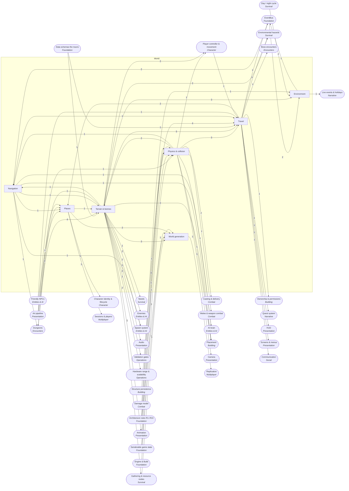

<!-- GENERATED by scripts/lib/systems-map.mjs render — do not edit; edit systems/registry/*.md and re-run. registry-hash: 949cf432b712 -->
# World `world`

[← Atlas index](../ATLAS.md) · source: [`registry/`](../registry/) · decision: [ADR-0065](../../adr/0065-systems-atlas-and-impact-map.md) · ask: `scripts/systems-map.sh impact <id>`

[P1][spec][world-builder] · Terrain and biomes, generation, environment, travel, places, physics, navigation

> **Analogy:** The stage everything happens on

| Where | Spec |
|---|---|
| `scenes/`, `data/biomes/`, `core/world/` | §1, §3, §11 |

## Systems and parts

Badge = `[phase][status][owner]`. Indentation = containment.

- `terrain_biomes` **Terrain & biomes** [P1][spec][world-builder] — Biomes and the terrain, vegetation and water that make them · `scenes/` +1
  - `biome_defs` **Biome definitions** [P1][spec][world-builder] — One def per biome: palette slice, climate, enemy families, node sets · `data/biomes/`
  - `terrain_meshes_heightmap` **Terrain meshes** [P1][implied][world-builder] — Terrain geometry with trimesh collision from the import hook · `scenes/terrain/`
  - `gray_box_island` **Gray-box island** [P1][spec][world-builder] — The Phase 1 island: blockout geometry to test feel · `scenes/main.tscn`
  - `vegetation_placement` **Vegetation placement** [P1][implied][world-builder] — Trees and grass placed per biome · `scenes/`
  - `biome_palette_lighting` **Biome palette & light rig** [P1][implied][world-builder] — Each biome's palette slice and light rig · `art/` +1
  - `water_bodies` **Water bodies** [P—][candidate][world-builder] — Lakes, rivers and sea with swim and drown volumes · `scenes/`
  - `caves` **Caves** [P—][candidate][world-builder] — Underground spaces · `scenes/`
- `world_generation` **World generation** [P—][candidate][director] — Procedural terrain from a seed versus the hand-built world the spec starts with · `core/world/gen/`
  - `handmade_world` **Hand-built world** [P1][implied][world-builder] — The current path: authored scenes · `scenes/`
  - `world_seed` **World seed** [P—][candidate][orchestrator] — One seed drives all generation · `core/world/gen/seed.gd`
  - `procedural_terrain` **Procedural terrain** [P—][candidate][director] — Noise-based terrain and biome placement · `core/world/gen/terrain.gd`
  - `chunk_streaming` **Chunk streaming** [P—][candidate][orchestrator] — Load and unload terrain around players · `core/world/gen/chunks.gd`
  - `poi_placement` **Point-of-interest placement** [P—][candidate][orchestrator] — Placing dungeons, villages and landmarks by rule · `core/world/gen/poi.gd`
  - `resource_distribution` **Resource distribution** [P—][candidate][orchestrator] — Placing resource nodes by biome · `core/world/gen/resources.gd`
- `environment` **Environment** [P1][implied][world-builder] — Lighting, fog, weather and seasons · `scenes/env/` +1
  - `lighting_day_night` **Day/night lighting** [P3][spec][world-builder] — The light rig follows the clock phase · `scenes/env/`
  - `fog_atmosphere` **Fog & atmosphere** [P1][implied][world-builder] — Fog and sky per biome · `scenes/env/`
  - `weather` **Weather** [P—][candidate][director] — Rain, storms and snow with gameplay effects; emits weather_changed · `core/world/weather.gd`
  - `seasons_calendar` **Seasons & calendar** [P—][candidate][director] — Long cycles layered over the clock · `core/world/calendar.gd`
- `travel` **Travel** [P1][implied][orchestrator] — Terrain rules, zones, markers, maps, and the candidate fast travel, roads, mounts, boats · `core/world/` +1
  - `movement_terrain_rules` **Movement terrain rules** [P1][implied][orchestrator] — Slope limits, surface types, speed modifiers · `core/world/terrain_rules.gd`
  - `zone_triggers` **Zone triggers** [P2][implied][world-builder] — Volumes that announce entry; emits zone_entered · `scenes/zones/`
  - `markers_waypoints` **Markers & waypoints** [P1][spec][world-builder] — Named positions quests can target · `scenes/markers/` +1
  - `map_minimap` **Map data** [P2][implied][orchestrator] — Discovered areas, markers and positions the map screens render · `core/world/map.gd`
  - `fast_travel_portals` **Fast travel** [P—][candidate][director] — Portals or waypoints unlocked by discovery · `core/world/travel.gd`
  - `roads` **Roads** [P—][candidate][world-builder] — Paths that speed travel and guide players · `scenes/`
  - `mounts_travel` **Mounted travel** [P—][candidate][director] — Riding for speed · `core/world/travel.gd`
  - `boats_ships` **Boats & ships** [P—][candidate][director] — Water travel · `core/world/vehicles.gd`
  - `fog_of_war_discovery` **Map discovery** [P—][candidate][orchestrator] — The map reveals as explored · `core/world/map.gd`
- `places` **Places** [P1][implied][world-builder] — Villages, dungeon entrances, hubs, landmarks, and candidate cities · `scenes/` +1
  - `villages_settlements` **Villages & settlements** [P3][implied][world-builder] — NPC settlements with quest givers · `scenes/villages/`
  - `dungeon_entrances` **Dungeon entrances** [P2][implied][world-builder] — Where dungeons connect to the world · `scenes/`
  - `spawn_hubs` **Spawn hubs** [P1][implied][world-builder] — Default player spawn locations · `scenes/`
  - `landmarks_poi` **Landmarks** [P1][implied][world-builder] — Visual anchors for navigation · `scenes/`
  - `cities` **Cities** [P—][candidate][director] — Large NPC cities beyond village scale · `scenes/cities/`
- `physics_collision` **Physics & collision** [P1][spec][orchestrator] — Collision generation, layers and tick settings · `tools/import_post.gd` +1
  - `collision_generation_import` **Collision on import** [P1][spec][orchestrator] — Convex for props, trimesh for terrain, generated automatically · `tools/import_post.gd`
  - `collision_layers` **Collision layers** [P1][implied][orchestrator] — Layer and mask conventions for actors, terrain, projectiles, triggers · `project.godot`
  - `physics_tick_settings` **Physics tick settings** [P1][spec][orchestrator] — The fixed physics rate the sim runs on · `project.godot`
  - `ragdoll` **Ragdoll** [P—][candidate][world-builder] — Physics death poses; presentation only · `actors/`
  - `destructibles` **Destructibles** [P—][candidate][director] — Breakable props · `scenes/`
- `navigation` **Navigation** [P1][implied][world-builder/orchestrator] — Navmesh and links the AI walks on · `scenes/`
  - `navmesh_baking` **Navmesh baking** [P1][implied][world-builder] — Baked navigation regions, rebaked when geometry changes · `scenes/`
  - `nav_regions_links` **Nav regions & links** [P1][implied][world-builder] — Regions and links across gaps · `scenes/`

## Wiring at tier 2

Boxes inside the frame are this domain's systems; rounded boxes are the outside systems they wire to. Arrow labels count edges; direction is influence (a change at the tail can affect the head).

## Director decisions in this domain

| Candidate | Tier | Owner | What it would be |
|---|---|---|---|
| `destructibles` Destructibles | 3 | director | Breakable props |
| `ragdoll` Ragdoll | 3 | world-builder | Physics death poses; presentation only |
| `cities` Cities | 3 | director | Large NPC cities beyond village scale |
| `fog_of_war_discovery` Map discovery | 3 | orchestrator | The map reveals as explored |
| `boats_ships` Boats & ships | 3 | director | Water travel |
| `mounts_travel` Mounted travel | 3 | director | Riding for speed |
| `roads` Roads | 3 | world-builder | Paths that speed travel and guide players |
| `fast_travel_portals` Fast travel | 3 | director | Portals or waypoints unlocked by discovery |
| `seasons_calendar` Seasons & calendar | 3 | director | Long cycles layered over the clock |
| `weather` Weather | 3 | director | Rain, storms and snow with gameplay effects; emits weather_changed |
| `world_generation` World generation | 2 (+6 parts) | director | Procedural terrain from a seed versus the hand-built world the spec starts with |
| `resource_distribution` Resource distribution | 3 | orchestrator | Placing resource nodes by biome |
| `poi_placement` Point-of-interest placement | 3 | orchestrator | Placing dungeons, villages and landmarks by rule |
| `chunk_streaming` Chunk streaming | 3 | orchestrator | Load and unload terrain around players |
| `procedural_terrain` Procedural terrain | 3 | director | Noise-based terrain and biome placement |
| `world_seed` World seed | 3 | orchestrator | One seed drives all generation |
| `caves` Caves | 3 | world-builder | Underground spaces |
| `water_bodies` Water bodies | 3 | world-builder | Lakes, rivers and sea with swim and drown volumes |

## Cross-domain edges

43 outbound (a change here reaches out), 33 inbound (a change elsewhere reaches in).

| Direction | Edge | How | Via | Strength | Why |
|---|---|---|---|---|---|
| ← in | `sig_day_phase_changed` → `lighting_day_night` | listens | — | hard | Lighting shifts per phase |
| ← in | `sig_structure_placed` → `navmesh_baking` | listens | — | hard | Navigation must rebake around new geometry |
| ← in | `sig_structure_destroyed` → `navmesh_baking` | listens | — | hard | Navigation rebakes when geometry is removed |
| → out | `weather` → `sig_weather_changed` | emits | — | hard | Weather transitions are announced (proposed signal) |
| ← in | `sig_weather_changed` → `lighting_day_night` | listens | — | soft | Overcast dims the light rig |
| → out | `zone_triggers` → `sig_zone_entered` | emits | — | hard | Crossing a zone boundary is announced (proposed signal) |
| → out | `physics_collision` → `locomotion` | reads | `collision layers, slopes` | hard | Movement is resolved against terrain and prop collision |
| → out | `water_bodies` → `swimming` | reads | `water volumes` | hard | There is no swimming without water |
| → out | `terrain_meshes_heightmap` → `climbing` | reads | `climbable surfaces` | soft | Climbing needs surfaces tagged as climbable |
| → out | `spawn_hubs` → `respawn_rules` | reads | `fallback location` | hard | Without a bed, the world's default spawn is used |
| → out | `collision_layers` → `range_los_check` | reads | `LoS raycast` | hard | Line of sight is a physics query against the right layers |
| → out | `physics_collision` → `projectile_delivery` | reads | `projectile collision` | hard | Projectiles collide with the world and actors |
| → out | `collision_layers` → `hit_detection` | reads | `hitbox layers` | hard | Sweeps and overlaps use the physics layers |
| → out | `biome_defs` → `temperature_exposure` | reads | `climate` | hard | Biomes carry a base temperature |
| → out | `biome_defs` → `resource_nodes` | reads | `node placement per biome` | hard | Which nodes appear where is biome data |
| → out | `water_bodies` → `fishing` | reads | `fishable water` | hard | Fishing needs water |
| → out | `water_bodies` → `drowning` | reads | `submerged` | hard | Drowning needs water |
| → out | `biome_defs` → `biome_hazard_zones` | reads | `zone definitions` | hard | Hazard zones are part of biome data |
| → out | `zone_triggers` → `biome_hazard_zones` | reads | `enter and exit` | hard | Zones are entered through the zone trigger system |
| → out | `biome_defs` → `enemy_defs` | references | `EnemyDef.biomes` | hard | The enemy names the biomes it spawns in |
| → out | `biome_defs` → `enemy_families` | reads | `family per biome` | hard | Families are grouped by biome |
| → out | `biome_defs` → `spawn_points_zones` | reads | `zone biome` | hard | A spawn zone belongs to a biome |
| → out | `navmesh_baking` → `spawn_points_zones` | reads | `valid ground` | soft | Spawns are placed on navigable ground |
| → out | `collision_layers` → `perception` | reads | `LoS raycasts` | hard | Line of sight is a physics query |
| → out | `navmesh_baking` → `pathfinding_navmesh` | reads | `navigation regions` | hard | Paths are found on the baked mesh |
| → out | `physics_collision` → `steering_locomotion` | reads | `collision` | hard | Enemies collide with the world |
| → out | `zone_triggers` → `boss_arena_rules` | reads | `arena bounds` | hard | The arena is a zone |
| → out | `terrain_biomes` → `dungeon_layouts` | reads | `biome context` | soft | Dungeons belong to a biome |
| → out | `navmesh_baking` → `dungeon_layouts` | reads | `navigation` | hard | Enemies must navigate the dungeon |
| ← in | `schema_biome_def` → `biome_defs` | reads | `BiomeDef` | hard | Biomes need a schema |
| ← in | `art_bible_palette` → `biome_defs` | reads | `palette slice` | hard | Each biome takes its colors from the art bible |
| ← in | `import_hook` → `terrain_meshes_heightmap` | reads | `scale and material` | hard | Terrain meshes pass through the import hook |
| ← in | `import_hook` → `vegetation_placement` | reads | `meshes` | hard | Plant meshes pass through the import hook |
| ← in | `art_bible_palette` → `biome_palette_lighting` | reads | `palette` | hard | Biome light rigs use art bible colors |
| ← in | `deterministic_sim` → `world_seed` | reads | `seeded generation` | hard | The seed is the root of deterministic generation |
| ← in | `actor_registry` → `chunk_streaming` | reads | `player positions` | hard | Chunks load around players |
| ← in | `resource_nodes` → `resource_distribution` | reads | `node prefabs` | hard | Distribution places resource nodes |
| ← in | `world_clock_ticks` → `weather` | reads | `time` | hard | Weather changes over time |
| ← in | `deterministic_sim` → `weather` | reads | `seeded transitions` | hard | Weather rolls are seeded |
| ← in | `world_clock_ticks` → `seasons_calendar` | reads | `days` | hard | Seasons count days |
| ← in | `schema_marker_def` → `markers_waypoints` | reads | `MarkerDef` | hard | Markers need a schema |
| ← in | `state_serialization` → `markers_waypoints` | reads | `discovered set` | soft | Discovered markers are saved |
| ← in | `actor_registry` → `map_minimap` | reads | `positions` | hard | The map shows player positions |
| ← in | `world_state_flags` → `fast_travel_portals` | reads | `unlocked portals` | hard | Portals unlock by flag |
| ← in | `mounts` → `mounts_travel` | reads | `mount actors` | hard | Mounted travel needs mounts |
| ← in | `locomotion` → `mounts_travel` | reads | `rider control` | hard | Riding replaces walking |
| ← in | `state_serialization` → `fog_of_war_discovery` | reads | `saved reveal` | hard | Revealed areas are saved |
| ← in | `npc_defs` → `villages_settlements` | reads | `residents` | hard | A village is NPCs and their homes |
| ← in | `dungeon_layouts` → `dungeon_entrances` | reads | `destination` | hard | An entrance leads to a dungeon |
| ← in | `import_hook` → `landmarks_poi` | reads | `meshes` | hard | Landmark meshes pass through the import hook |
| ← in | `npc_schedules_routines` → `cities` | reads | `living city` | soft | Cities want routines to feel alive |
| ← in | `import_hook` → `collision_generation_import` | extends | `collision step` | hard | Collision generation is one step of the import hook |
| ← in | `project_settings` → `collision_layers` | reads | `layer names` | hard | Layers are project settings |
| ← in | `project_settings` → `physics_tick_settings` | extends | `tick rate` | hard | The tick rate is a project setting |
| ← in | `rigs_skeletons` → `ragdoll` | reads | `rig` | hard | Ragdolls are built on the rig |
| ← in | `sim_presentation_split` → `ragdoll` | reads | `never affects sim` | hard | A ragdoll is presentation; it must not move gameplay state (R5) |
| ← in | `damage_model` → `destructibles` | reads | `damage taken` | soft | Props take damage |
| ← in | `structure_damage_repair` → `destructibles` | reads | `shared health model` | soft | Props and structures share a damage model |
| → out | `collision_layers` → `placement_validation` | reads | `overlap test` | hard | Overlap is a physics query |
| → out | `terrain_meshes_heightmap` → `placement_validation` | reads | `ground test` | hard | Pieces must sit on terrain or other pieces |
| → out | `terrain_meshes_heightmap` → `terrain_modification` | reads | `edits` | hard | Modification edits terrain |
| → out | `navmesh_baking` → `terrain_modification` | reads | `rebake` | hard | Changed terrain rebakes navigation |
| → out | `zone_triggers` → `land_claims` | reads | `claim bounds` | soft | A claim is a zone |
| → out | `markers_waypoints` → `objective_types` | references | `reach target_id` | hard | A reach objective names a marker |
| → out | `seasons_calendar` → `event_calendar` | reads | `seasons` | soft | Seasonal events read the season |
| → out | `terrain_meshes_heightmap` → `ik_procedural` | reads | `foot placement` | soft | Foot IK reads terrain |
| → out | `biome_defs` → `ambience_zones` | reads | `beds per biome` | hard | Ambience is chosen per biome |
| → out | `collision_layers` → `camera_collision` | reads | `camera layer` | hard | The camera probes the world |
| → out | `map_minimap` → `minimap_compass_hud` | renders | `map data` | hard | The minimap draws map data |
| → out | `map_minimap` → `map_screen` | renders | `map data` | hard | The map screen draws map data |
| → out | `chunk_streaming` → `interest_management` | reads | `relevance by area` | soft | Relevance can follow streaming chunks |
| → out | `spawn_hubs` → `join_leave_flow` | reads | `where to spawn` | hard | New players spawn at a hub |
| → out | `markers_waypoints` → `pings_markers` | reads | `marker model` | hard | A ping is a temporary marker |
| → out | `biome_defs` → `g2_data_integrity` | validates | `biome files` | hard | G2 checks every biome |
| → out | `gray_box_island` → `g3_smoke_boot` | validates | `main scene` | hard | Smoke boots the main scene |
| → out | `gray_box_island` → `benchmark_scene` | reads | `scene` | soft | The benchmark can be the island |

