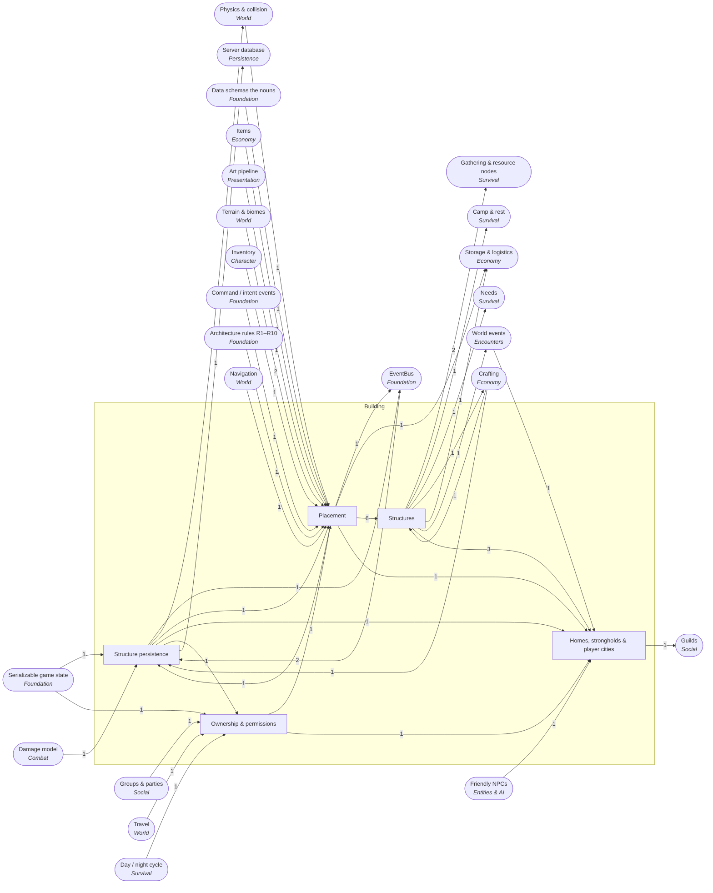

<!-- GENERATED by scripts/lib/systems-map.mjs render — do not edit; edit systems/registry/*.md and re-run. registry-hash: 943cd456f349 -->
# Building `building`

[← Atlas index](../ATLAS.md) · source: [`registry/`](../registry/) · decision: [ADR-0065](../../adr/0065-systems-atlas-and-impact-map.md) · ask: `scripts/systems-map.sh impact <id>`

[P3][spec][orchestrator] · Placement, structures, homes and strongholds, ownership, persistence

> **Analogy:** LEGO on a grid: pieces snap, some hold weight

| Where | Spec |
|---|---|
| `core/building/`, `data/building/`, `scenes/prefabs/` | §13 Phase 3 build, §10 placed structures |

## Systems and parts

Badge = `[phase][status][owner]`. Indentation = containment.

- `placement` **Placement** [P3][spec][orchestrator] — Snapping, validation, preview and material cost; emits structure_placed · `core/building/placement.gd`
  - `piece_defs` **Building piece definitions** [P3][implied][content-smith] — Walls, floors, roofs, doors and stairs as data with cost, sockets and health · `data/building/`
  - `snap_grid_rules` **Snap and socket rules** [P3][implied][orchestrator] — Grid size and which sockets connect · `core/building/snap.gd`
  - `placement_validation` **Placement validation** [P3][implied][orchestrator] — Overlap, terrain, permission and cost checks · `core/building/validate.gd`
  - `build_preview_ghost` **Build preview** [P3][implied][orchestrator] — The translucent preview; presentation only · `ui/build/` +1
  - `structural_integrity` **Structural integrity** [P—][candidate][director] — Support propagation that makes unsupported builds collapse · `core/building/integrity.gd`
  - `terrain_modification` **Terrain modification** [P—][candidate][director] — Flattening and digging · `core/building/terrain.gd`
- `structures` **Structures** [P3][spec][orchestrator/content-smith] — Stations, storage, beds, walls, decorations and farm plots as placeable pieces · `data/building/` +1
  - `crafting_station_structures` **Crafting station structures** [P3][spec][content-smith] — Workbench, forge and campfire as placeable pieces; the campfire also gives warmth and light and hosts cooking recipes · `data/building/`
  - `storage_structures` **Storage structures** [P3][implied][content-smith] — Chests and racks · `data/building/`
  - `bed_respawn_structure` **Bed** [P3][implied][content-smith] — The claimable bed · `data/building/`
  - `defensive_structures_walls` **Walls and defenses** [P3][implied][content-smith] — Walls, gates and palisades · `data/building/`
  - `decorations` **Decorations** [P—][candidate][content-smith] — Cosmetic pieces · `data/building/`
  - `farm_plots` **Farm plots and pens** [P—][candidate][director] — Plots and pens for farming and animals · `data/building/`
- `homes_strongholds` **Homes, strongholds & player cities** [P—][candidate][director] — Designated homes, fortifications, sieges, player towns and settlers · `core/building/`
  - `player_home` **Player home** [P—][candidate][director] — A designated home with bonuses · `core/building/home.gd`
  - `stronghold_walls_gates` **Stronghold walls and gates** [P—][candidate][director] — Fortifications with gates and towers · `core/building/`
  - `base_defense_sieges` **Base defense and sieges** [P—][candidate][director] — Invasions target the base and structures take damage · `core/building/siege.gd`
  - `player_cities` **Player cities** [P—][candidate][director] — Many homes forming a settlement · `core/building/`
  - `npc_settlers` **NPC settlers** [P—][candidate][director] — NPCs that move into player towns · `core/building/`
- `ownership_permissions` **Ownership & permissions** [P4][implied][orchestrator] — Who may build, open and destroy · `core/building/permissions.gd`
  - `build_permissions` **Build permissions** [P4][implied][orchestrator] — Party-based build and destroy rights · `core/building/permissions.gd`
  - `land_claims` **Land claims** [P—][candidate][director] — Claimed areas with exclusive rights · `core/building/claims.gd`
  - `decay_inactive` **Decay** [P—][candidate][director] — Abandoned builds decay over game time · `core/building/decay.gd`
- `structure_persistence` **Structure persistence** [P3][spec][orchestrator] — Placed pieces and their state saved with the world · `core/saving/structures.gd`
  - `placed_structure_state` **Placed structure state** [P3][spec][orchestrator] — Piece id, transform, owner and health per placed piece · `core/saving/structures.gd`
  - `structure_damage_repair` **Structure damage and repair** [P—][candidate][director] — Structures take damage and can be repaired; emits structure_destroyed · `core/building/damage.gd`

## Wiring at tier 2

Boxes inside the frame are this domain's systems; rounded boxes are the outside systems they wire to. Arrow labels count edges; direction is influence (a change at the tail can affect the head).

## Director decisions in this domain

| Candidate | Tier | Owner | What it would be |
|---|---|---|---|
| `structure_damage_repair` Structure damage and repair | 3 | director | Structures take damage and can be repaired; emits structure_destroyed |
| `decay_inactive` Decay | 3 | director | Abandoned builds decay over game time |
| `land_claims` Land claims | 3 | director | Claimed areas with exclusive rights |
| `homes_strongholds` Homes, strongholds & player cities | 2 (+5 parts) | director | Designated homes, fortifications, sieges, player towns and settlers |
| `npc_settlers` NPC settlers | 3 | director | NPCs that move into player towns |
| `player_cities` Player cities | 3 | director | Many homes forming a settlement |
| `base_defense_sieges` Base defense and sieges | 3 | director | Invasions target the base and structures take damage |
| `stronghold_walls_gates` Stronghold walls and gates | 3 | director | Fortifications with gates and towers |
| `player_home` Player home | 3 | director | A designated home with bonuses |
| `farm_plots` Farm plots and pens | 3 | director | Plots and pens for farming and animals |
| `decorations` Decorations | 3 | content-smith | Cosmetic pieces |
| `terrain_modification` Terrain modification | 3 | director | Flattening and digging |
| `structural_integrity` Structural integrity | 3 | director | Support propagation that makes unsupported builds collapse |

## Cross-domain edges

14 outbound (a change here reaches out), 22 inbound (a change elsewhere reaches in).

| Direction | Edge | How | Via | Strength | Why |
|---|---|---|---|---|---|
| → out | `placement` → `sig_structure_placed` | emits | — | hard | Building announces a placed piece (proposed signal) |
| ← in | `sig_structure_placed` → `structure_persistence` | listens | — | hard | Placed pieces are recorded for saving |
| → out | `structure_damage_repair` → `sig_structure_destroyed` | emits | — | hard | Destruction is announced (proposed signal) |
| ← in | `sig_structure_destroyed` → `structure_persistence` | listens | — | hard | Destroyed pieces are removed from the record |
| → out | `farm_plots` → `farming` | reads | `plot structures` | hard | Crops grow in placed plots |
| → out | `farm_plots` → `animal_husbandry` | reads | `pens` | hard | Animals live in placed pens |
| → out | `bed_respawn_structure` → `bed_spawn_point` | reads | `placed bed` | hard | A claimable bed is a placed structure |
| → out | `crafting_station_structures` → `temperature_exposure` | reads | — | soft | A campfire (a station piece) is a heat source |
| → out | `crafting_station_structures` → `crafting_stations` | reads | `placed station` | hard | A station must be built and nearby |
| → out | `storage_structures` → `chests_containers` | reads | `placed chest` | hard | A container inventory belongs to a placed structure |
| → out | `placement` → `carts_transport` | reads | `placed cart` | soft | A cart is a placed, movable structure |
| → out | `structures` → `invasion_events` | reads | `target base` | soft | Invasions target player structures |
| → out | `structure_damage_repair` → `destructibles` | reads | `shared health model` | soft | Props and structures share a damage model |
| ← in | `schema_building_piece_def` → `piece_defs` | reads | `BuildingPieceDef` | hard | Pieces need a schema |
| ← in | `items` → `piece_defs` | references | `material cost` | hard | A piece names the items it costs |
| ← in | `import_hook` → `piece_defs` | reads | `piece meshes` | hard | Piece meshes pass through the import hook |
| ← in | `collision_layers` → `placement_validation` | reads | `overlap test` | hard | Overlap is a physics query |
| ← in | `terrain_meshes_heightmap` → `placement_validation` | reads | `ground test` | hard | Pieces must sit on terrain or other pieces |
| ← in | `inventory` → `placement_validation` | reads | `material cost` | hard | Placing consumes materials |
| ← in | `intent_schema` → `placement` | reads | `build intent` | hard | Placing is an intent |
| ← in | `sim_presentation_split` → `build_preview_ghost` | reads | `presentation only` | hard | The ghost never writes state (R5) |
| ← in | `terrain_meshes_heightmap` → `terrain_modification` | reads | `edits` | hard | Modification edits terrain |
| ← in | `navmesh_baking` → `terrain_modification` | reads | `rebake` | hard | Changed terrain rebakes navigation |
| ← in | `invasion_events` → `base_defense_sieges` | reads | `attackers` | hard | A siege is an invasion aimed at a base |
| ← in | `npc_defs` → `npc_settlers` | reads | `settlers` | hard | Settlers are NPCs |
| ← in | `party_membership` → `build_permissions` | reads | `party rights` | hard | Rights follow the party |
| ← in | `zone_triggers` → `land_claims` | reads | `claim bounds` | soft | A claim is a zone |
| ← in | `world_clock_ticks` → `decay_inactive` | reads | `time since visit` | hard | Decay counts game time |
| ← in | `state_serialization` → `placed_structure_state` | reads | `serializer` | hard | Placed pieces are saved by the serializer |
| ← in | `damage_model` → `structure_damage_repair` | reads | `damage numbers` | soft | Structure damage reuses the damage formula |
| ← in | `repair` → `structure_damage_repair` | reads | `repair action` | soft | Repair restores structure health |
| ← in | `actor_registry` → `build_permissions` | reads | — | hard | Ownership is by actor id |
| ← in | `station_defs` → `crafting_station_structures` | references | `station id` | hard | A station piece names the station it provides |
| → out | `building` → `building_sync` | transports | `placed pieces` | hard | Placement is server-owned |
| → out | `player_home` → `guild_halls` | reads | `building` | hard | A hall is a home owned by the guild |
| → out | `structure_persistence` → `placed_structures_tables` | persists | `placed pieces` | hard | Placed pieces are rows in Phase 4 |

