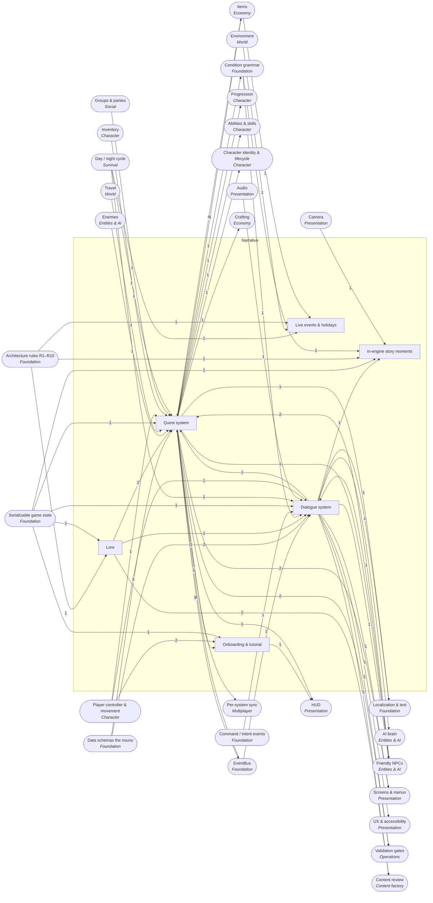

<!-- GENERATED by scripts/lib/systems-map.mjs render — do not edit; edit systems/registry/*.md and re-run. registry-hash: 95b296a15be1 -->
# Narrative `narrative`

[← Atlas index](../ATLAS.md) · source: [`registry/`](../registry/) · decision: [ADR-0065](../../adr/0065-systems-atlas-and-impact-map.md) · ask: `scripts/systems-map.sh impact <id>`

[P2][spec][quest-writer/orchestrator] · Quests, dialogue, lore, onboarding, live events, in-engine story moments

> **Analogy:** The storyteller's notebook and the town notice board

| Where | Spec |
|---|---|
| `core/quests/`, `core/dialogue/`, `data/quests/`, `data/dialogue/`, `docs/lore_bible.md` | §6.7, §6.8 |

## Systems and parts

Badge = `[phase][status][owner]`. Indentation = containment.

- `quests` **Quest system** [P2][spec][orchestrator/quest-writer] — Definitions, objective types, tracking, prerequisites, rewards, journal · `core/quests/` +1
  - `quest_defs` **Quest definitions** [P0][spec][quest-writer] — giver_npc, prereqs, objectives, rewards, dialogue, journal_text · `data/quests/`
  - `objective_types` **Objective types** [P2][spec][orchestrator] — kill, collect, reach, talk, craft; each resolves its target_id against a different content type · `core/quests/objectives.gd`
  - `objective_tracking` **Objective tracking** [P2][spec][orchestrator] — Listens to the world, counts progress, emits progress events · `core/quests/tracker.gd`
  - `prereq_dag` **Prerequisite graph** [P2][spec][orchestrator] — Prerequisite chains must form a DAG; cycles are a G2 failure · `core/quests/prereqs.gd`
  - `quest_rewards` **Quest rewards** [P2][spec][orchestrator] — XP and items granted on completion · `core/quests/rewards.gd`
  - `quest_journal_text` **Journal text** [P0][spec][quest-writer] — What the player reads; under 60 words in the lore voice · `data/quests/`
  - `quest_chains` **Quest chains** [P2][implied][quest-writer] — Multi-quest arcs expressed through prerequisites · `data/quests/`
  - `shared_group_quests` **Shared group quests** [P4][implied][orchestrator] — Whether progress is shared or per player in a party · `core/quests/shared.gd`
  - `repeatable_daily_quests` **Repeatable quests** [P—][candidate][director] — Quests that reset on the clock · `core/quests/`
- `dialogue` **Dialogue system** [P3][spec][quest-writer/orchestrator] — Trees with conditional choices, run from intents · `core/dialogue/` +1
  - `dialogue_nodes_choices` **Dialogue trees** [P0][spec][quest-writer] — nodes with speaker, text and choices; goto end terminates · `data/dialogue/`
  - `dialogue_conditions` **Dialogue conditions** [P3][spec][orchestrator] — Choices gated by conditions over quest and item state · `core/dialogue/conditions.gd`
  - `dialogue_runner` **Dialogue runner** [P3][implied][orchestrator] — Walks the tree from choice intents; sets flags through quests, never directly · `core/dialogue/runner.gd`
  - `barks_ambient_lines` **Barks** [P—][candidate][quest-writer] — One-liners NPCs say in passing · `data/dialogue/`
  - `voice_acting` **Voice acting** [P—][candidate][director] — Recorded lines · `audio/voice/`
- `lore` **Lore** [P0][spec][quest-writer/director] — The bible, its proposed additions, naming, and a candidate codex · `docs/lore_bible.md` +1
  - `lore_bible` **Lore bible** [P0][spec][director] — The Director writes the first pass; agents polish, never contradict · `docs/lore_bible.md`
  - `lore_additions` **Lore additions** [P0][spec][quest-writer] — Proposed additions filed for approval instead of contradicting the bible · `docs/lore/`
  - `naming_conventions_lore` **Naming conventions** [P0][implied][quest-writer] — Names of places, factions and people that ids and display names follow · `docs/lore_bible.md`
  - `lore_entries_codex` **Codex entries** [P—][candidate][quest-writer] — Discoverable in-game lore entries · `data/lore/`
- `onboarding_tutorial` **Onboarding & tutorial** [P—][candidate][quest-writer/orchestrator] — The first hour: tutorial quests and just-in-time hints · `data/quests/` +1
  - `tutorial_quests` **Tutorial quests** [P—][candidate][quest-writer] — Guided first quests that teach the loop · `data/quests/`
  - `contextual_hints` **Contextual hints** [P—][candidate][orchestrator] — Tips shown the first time a situation occurs · `ui/hints/`
- `live_events` **Live events & holidays** [P—][candidate][director] — Holidays and seasonal events on a calendar · `data/events/` +1
  - `holiday_defs` **Holiday definitions** [P—][candidate][director] — Data-defined holidays with date ranges and content · `data/events/`
  - `event_calendar` **Event calendar** [P—][candidate][orchestrator] — What is active now; real dates must be fed in from outside the sim · `core/events_calendar/`
  - `seasonal_rewards` **Seasonal rewards** [P—][candidate][content-smith] — Items available only during an event · `data/events/`
- `cinematics_in_engine` **In-engine story moments** [P3][implied][world-builder] — Story beats staged live in the engine · `scenes/story/`
  - `prerendered_cutscenes` **Prerendered video cutscenes** [P—][non-goal][director] — Story moments are in-engine, never video
  - `scripted_sequences` **Scripted sequences** [P3][implied][world-builder] — Timed sequences of actor moves and lines · `scenes/story/`
  - `camera_cues` **Camera cues** [P3][implied][world-builder] — Camera moves inside sequences · `scenes/story/`

## Wiring at tier 2

Boxes inside the frame are this domain's systems; rounded boxes are the outside systems they wire to. Arrow labels count edges; direction is influence (a change at the tail can affect the head).

## Director decisions in this domain

| Candidate | Tier | Owner | What it would be |
|---|---|---|---|
| `live_events` Live events & holidays | 2 (+3 parts) | director | Holidays and seasonal events on a calendar |
| `seasonal_rewards` Seasonal rewards | 3 | content-smith | Items available only during an event |
| `event_calendar` Event calendar | 3 | orchestrator | What is active now; real dates must be fed in from outside the sim |
| `holiday_defs` Holiday definitions | 3 | director | Data-defined holidays with date ranges and content |
| `onboarding_tutorial` Onboarding & tutorial | 2 (+2 parts) | quest-writer/orchestrator | The first hour: tutorial quests and just-in-time hints |
| `contextual_hints` Contextual hints | 3 | orchestrator | Tips shown the first time a situation occurs |
| `tutorial_quests` Tutorial quests | 3 | quest-writer | Guided first quests that teach the loop |
| `lore_entries_codex` Codex entries | 3 | quest-writer | Discoverable in-game lore entries |
| `voice_acting` Voice acting | 3 | director | Recorded lines |
| `barks_ambient_lines` Barks | 3 | quest-writer | One-liners NPCs say in passing |
| `repeatable_daily_quests` Repeatable quests | 3 | director | Quests that reset on the clock |

**Non-goals (spec §1):** `prerendered_cutscenes` Prerendered video cutscenes

## Cross-domain edges

27 outbound (a change here reaches out), 47 inbound (a change elsewhere reaches in).

| Direction | Edge | How | Via | Strength | Why |
|---|---|---|---|---|---|
| → out | `quests` → `condition_evaluator` | reads | `quest state` | hard | Conditions test quest started or completed |
| ← in | `sig_actor_spawned` → `objective_tracking` | listens | — | soft | Escort and spawn-based objectives watch spawns |
| ← in | `sig_actor_died` → `objective_tracking` | listens | — | hard | Kill objectives count deaths by enemy id |
| ← in | `sig_item_acquired` → `objective_tracking` | listens | — | hard | Collect objectives count acquisitions |
| ← in | `sig_item_crafted` → `objective_tracking` | listens | — | hard | Craft objectives count crafts |
| → out | `quests` → `sig_quest_started` | emits | — | hard | Starting a quest is announced |
| ← in | `sig_quest_started` → `dialogue` | listens | — | soft | Dialogue can branch on active quests |
| → out | `objective_tracking` → `sig_quest_objective_progressed` | emits | — | hard | Progress ticks are announced with progress and required |
| → out | `quests` → `sig_quest_completed` | emits | — | hard | Completion is announced |
| ← in | `sig_quest_completed` → `quest_rewards` | listens | — | hard | Rewards are granted on completion |
| ← in | `sig_structure_placed` → `objective_tracking` | listens | — | soft | A build objective type would count placements (candidate objective type) |
| ← in | `sig_zone_entered` → `objective_tracking` | listens | — | hard | reach objectives complete on zone entry |
| ← in | `sig_trade_completed` → `objective_tracking` | listens | — | soft | A trade objective type could count trades |
| → out | `dialogue_nodes_choices` → `string_tables` | reads | — | soft | Dialogue text would be string keys |
| → out | `quest_journal_text` → `string_tables` | reads | — | soft | Journal text would be string keys |
| → out | `quest_defs` → `xp_award` | reads | `QuestDef.rewards.xp` | hard | Quest XP comes from the quest definition |
| → out | `quest_defs` → `ability_unlocks` | references | `quest-taught spells` | soft | Some spells are taught by quests, mirroring unlocked_by |
| → out | `quests` → `character_save_state` | persists | `quest state` | hard | Started, completed and objective progress per character |
| → out | `quest_defs` → `quest_items` | reads | `objectives.collect` | soft | Quest items exist because a quest collects them |
| → out | `quest_defs` → `recipe_unlocks` | references | `quest id` | soft | Some recipes unlock by quest |
| → out | `dialogue` → `llm_npc_intelligence` | reads | `generated lines` | soft | The most plausible use is dialogue variation |
| → out | `dialogue_nodes_choices` → `npc_defs` | references | `dialogue id` | hard | The NPC names its dialogue |
| → out | `quest_defs` → `quest_givers` | references | `quest ids` | hard | A giver names the quests it offers |
| ← in | `schema_quest_def` → `quest_defs` | reads | `QuestDef` | hard | Every quest file must match the schema |
| ← in | `schema_quest_def` → `objective_types` | reads | `objectives.type enum` | hard | The five types are the schema's enum |
| ← in | `enemy_defs` → `objective_types` | references | `kill target_id` | hard | A kill objective names an enemy |
| ← in | `items` → `objective_types` | references | `collect target_id` | hard | A collect objective names an item |
| ← in | `markers_waypoints` → `objective_types` | references | `reach target_id` | hard | A reach objective names a marker |
| ← in | `items` → `objective_types` | references | `craft target_id` | hard | A craft objective names the item crafted |
| ← in | `world_state_flags` → `objective_tracking` | reads | `progress counters` | hard | Progress is saved as counters |
| ← in | `interaction_system` → `objective_tracking` | reads | `talk completion` | soft | Talk objectives complete through an interaction |
| ← in | `items` → `quest_rewards` | references | `rewards.items` | hard | Reward items must exist |
| ← in | `inventory` → `quest_rewards` | reads | `grant items` | hard | Reward items are added to the inventory |
| ← in | `schema_quest_def` → `quest_journal_text` | reads | `journal_text` | hard | Journal text is a schema field |
| ← in | `party_membership` → `shared_group_quests` | reads | `who shares` | hard | Sharing follows the party |
| ← in | `world_clock_ticks` → `repeatable_daily_quests` | reads | `reset` | hard | Resets happen on the clock |
| ← in | `schema_dialogue_def` → `dialogue_nodes_choices` | reads | `DialogueDef` | hard | Every dialogue file must match the schema |
| ← in | `condition_evaluator` → `dialogue_conditions` | reads | `evaluate` | hard | Conditions are evaluated by the shared grammar |
| ← in | `intent_schema` → `dialogue_runner` | reads | `choice intent` | hard | Picking a choice is an intent |
| ← in | `world_state_flags` → `dialogue_runner` | reads | `choice flags` | soft | Choices can set flags |
| ← in | `npc_defs` → `barks_ambient_lines` | reads | `speaker` | hard | Barks belong to NPCs |
| ← in | `world_clock_ticks` → `barks_ambient_lines` | reads | `time-of-day lines` | soft | Some barks depend on the phase |
| ← in | `sfx_events` → `voice_acting` | reads | `playback` | soft | Playback uses the audio system |
| ← in | `id_convention` → `naming_conventions_lore` | reads | `ids from names` | hard | Ids are derived from lore names |
| ← in | `world_state_flags` → `lore_entries_codex` | reads | `discovered` | hard | Discovery is a flag |
| ← in | `player_controller` → `tutorial_quests` | reads | `movement lessons` | soft | Early lessons teach movement |
| ← in | `world_state_flags` → `contextual_hints` | reads | `shown once` | hard | Hints track whether they have been shown |
| ← in | `interaction_system` → `contextual_hints` | reads | `prompts` | soft | Hints attach to interaction prompts |
| ← in | `world_clock_ticks` → `event_calendar` | reads | `game time` | hard | Game-time events read the clock |
| ← in | `seasons_calendar` → `event_calendar` | reads | `seasons` | soft | Seasonal events read the season |
| ← in | `deterministic_sim` → `event_calendar` | reads | `no wall-clock in core` | hard | Real-date holidays need wall-clock time, which R4 bans inside core/; the date must be injected from outside the sim |
| ← in | `items` → `seasonal_rewards` | references | `reward items` | hard | Rewards are items |
| ← in | `actor_registry` → `scripted_sequences` | reads | `actors moved` | hard | Sequences move actors by id |
| ← in | `sim_presentation_split` → `scripted_sequences` | reads | `presentation only` | hard | A sequence must not mutate gameplay state except through intents and flags (R5) |
| ← in | `condition_evaluator` → `scripted_sequences` | reads | `trigger` | soft | Sequences trigger on conditions |
| ← in | `camera` → `camera_cues` | reads | `rig control` | hard | Cues drive the camera rig |
| ← in | `npc_defs` → `quest_defs` | references | `giver_npc (optional)` | soft | giver_npc is optional (empty = auto-granted); the Phase 0 sample quest has no giver |
| ← in | `npc_defs` → `objective_types` | references | `talk target_id` | soft | talk objectives name an npc id; unusable until NPCs land in Phase 3 |
| ← in | `interaction_system` → `dialogue_runner` | reads | `interact target id` | hard | Talking is an interact on an NPC |
| ← in | `schema_dialogue_def` → `dialogue_runner` | reads | `goto end` | soft | The runner follows goto and stops at end |
| ← in | `quest_items` → `objective_types` | references | — | soft | Collect objectives usually name quest items |
| → out | `contextual_hints` → `notifications_toasts` | renders | `hint text` | soft | Hints are shown as toasts |
| → out | `quest_journal_text` → `quest_journal_screen` | renders | `text` | hard | The journal shows journal text |
| → out | `objective_tracking` → `quest_journal_screen` | renders | `progress` | hard | The journal shows progress |
| → out | `dialogue_runner` → `dialogue_screen` | renders | `current node` | hard | The screen shows the runner's node |
| → out | `dialogue_runner` → `subtitles` | renders | `lines` | hard | Subtitles show dialogue lines |
| → out | `objective_tracking` → `minimap_compass_hud` | renders | — | soft | Objective pins on the compass |
| → out | `quests` → `quest_sync` | transports | `quest state` | hard | Quest state is server-owned |
| → out | `prereq_dag` → `g2_data_integrity` | validates | `no cycles` | hard | G2 rejects prerequisite cycles |
| → out | `quest_defs` → `g2_data_integrity` | validates | `quest files` | hard | G2 checks every quest file: prereqs, objective targets, rewards, dialogue |
| → out | `dialogue_nodes_choices` → `g2_data_integrity` | validates | `dialogue files` | hard | G2 checks every dialogue file: gotos resolve, speakers exist |
| → out | `lore_bible` → `lore_voice_check` | reads | `voice` | hard | The check is against the bible |
| → out | `dialogue_nodes_choices` → `lore_voice_check` | reads | `lines` | hard | The check reads dialogue lines |
| → out | `lore_additions` → `lore_voice_check` | reads | — | soft | New lore is checked against the voice |

