<!-- GENERATED by scripts/lib/systems-map.mjs render — do not edit; edit systems/registry/*.md and re-run. registry-hash: 943cd456f349 -->
# Presentation `presentation`

[← Atlas index](../ATLAS.md) · source: [`registry/`](../registry/) · decision: [ADR-0065](../../adr/0065-systems-atlas-and-impact-map.md) · ask: `scripts/systems-map.sh impact <id>`

[P1][spec][world-builder/orchestrator] · Art pipeline, animation, VFX, audio, camera, HUD, screens, accessibility, input

> **Analogy:** The stage crew: lights, sound, costumes and the scoreboard

| Where | Spec |
|---|---|
| `art/`, `audio/`, `ui/`, `scenes/`, `actors/` | §4 R5, §5, §11 |

## Systems and parts

Badge = `[phase][status][owner]`. Indentation = containment.

- `art_pipeline` **Art pipeline** [P1][spec][world-builder] — The import hook, the master shader, the art bible, naming, placeholders, budgets · `art/` +1
  - `photorealism` **Photorealism** [P—][non-goal][director] — Stylized only, one master shader; no rendering research
  - `import_hook` **Import hook** [P1][spec][orchestrator] — Normalize scale, generate collision, assign the master material on every imported mesh · `tools/import_post.gd`
  - `master_toon_shader` **Master toon shader** [P1][spec][world-builder] — The one material everything wears · `art/shaders/toon_master.tres`
  - `art_bible_palette` **Art bible & palette** [P0][spec][director/world-builder] — 8 base colors with light and dark ramps, plus proportions · `docs/art_bible.md`
  - `icon_conventions` **Icon conventions** [P0][spec][world-builder] — 256x256 PNG, transparent, path by category and content id · `art/icons/`
  - `model_naming` **Model naming** [P0][spec][world-builder] — art/models/<category>/<id>.glb · `art/models/`
  - `placeholder_assets` **Placeholder assets** [P0][spec][world-builder] — Stand-ins used until generated assets land · `art/icons/_placeholder.png`
  - `lod_texture_budgets` **LOD & texture budgets** [P1][implied][world-builder] — Polygon and texture budgets per asset class · `docs/art_bible.md`
- `animation` **Animation** [P1][implied][world-builder/orchestrator] — Rigs, state machines, blending, combat animations, sim-driven timing · `actors/` +1
  - `rigs_skeletons` **Rigs & skeletons** [P1][implied][world-builder] — Shared humanoid rig and creature rigs · `art/models/` +1
  - `animation_state_machines` **Animation state machines** [P1][implied][orchestrator] — AnimationTree states driven by simulation state · `actors/player/animation_tree.tres` +1
  - `locomotion_blending` **Locomotion blending** [P1][implied][world-builder] — Idle, walk, run and jump blends · `art/animations/` +1
  - `combat_animations` **Combat animations** [P1][implied][world-builder] — Swings, casts, reactions and deaths · `art/animations/` +1
  - `hit_reactions_death_anims` **Hit reactions & deaths** [P1][implied][world-builder] — Reactions triggered by damage and death events · `art/animations/` +1
  - `sim_driven_timing` **Sim-driven timing** [P1][spec][orchestrator] — Animation follows simulation timing, never the reverse · `actors/player/anim_controller.gd`
  - `ik_procedural` **IK & procedural animation** [P—][candidate][world-builder] — Foot IK and look-at · `art/animations/` +1
  - `facial_emotes` **Facial & emote animation** [P—][candidate][world-builder] — Emote and face animations · `art/animations/` +1
- `vfx_spell_effects` **VFX & spell effects** [P2][spec][world-builder] — Cast, projectile, impact, buff and telegraph visuals within a budget · `art/vfx/` +1
  - `element_default_vfx` **Element default VFX** [P2][spec][world-builder] — Default visuals per element when a spell sets none · `scenes/vfx/`
  - `projectile_visuals` **Projectile visuals** [P2][implied][world-builder] — Visuals that follow simulated projectiles · `scenes/vfx/`
  - `impact_effects` **Impact effects** [P2][implied][world-builder] — Hit flashes and particles on damage · `scenes/vfx/`
  - `buff_debuff_visuals` **Buff & debuff visuals** [P2][spec][world-builder] — Persistent visuals while an effect is active · `scenes/vfx/`
  - `telegraph_visuals` **Telegraph visuals** [P2][implied][world-builder] — The drawn danger shapes bosses announce · `scenes/vfx/`
  - `vfx_pooling_budget` **VFX pooling & budget** [P2][implied][orchestrator] — Pooled particles within a frame budget · `scenes/vfx/`
  - `screen_effects` **Screen effects** [P—][candidate][world-builder] — Vignettes, shakes, low-health tint · `scenes/vfx/`
- `audio` **Audio** [P1][implied][world-builder] — SFX, ambience, mix buses, and candidate music · `audio/` +1
  - `sfx_events` **SFX events** [P1][implied][world-builder] — Sounds fired on events with per-spell overrides · `audio/sfx/`
  - `ambience_zones` **Ambience zones** [P3][implied][world-builder] — Ambient beds per zone, phase and weather · `audio/ambience/`
  - `spatial_audio_mix_buses` **Spatial audio & buses** [P1][implied][world-builder] — 3D positioning and the bus layout · `audio/default_bus_layout.tres`
  - `music_system` **Music system** [P—][candidate][director] — Adaptive music by region and combat state · `audio/music/`
- `camera` **Camera** [P1][spec][orchestrator] — The third-person rig and its behaviors · `actors/player/camera/`
  - `third_person_rig` **Third-person rig** [P1][spec][orchestrator] — Follow camera with orbit, zoom and collision pull-in · `actors/player/camera/`
  - `target_lock_camera` **Target lock camera** [P—][candidate][director] — Lock-on framing · `actors/player/camera/`
  - `photo_mode` **Photo mode** [P—][candidate][director] — Free camera for screenshots · `actors/player/camera/`
- `ui_hud` **HUD** [P1][spec][orchestrator] — The always-on overlay: bars, buffs, action bars, nameplates, frames, toasts · `ui/hud/`
  - `health_resource_bars` **Health & resource bars** [P1][spec][orchestrator] — Health and resource bars for the player · `ui/hud/`
  - `buff_bars` **Buff bars** [P2][spec][orchestrator] — Active effect icons with timers · `ui/hud/`
  - `action_bars_hotkeys` **Action bars** [P2][implied][orchestrator] — Bound spells and items with cooldown sweeps · `ui/hud/`
  - `nameplates_floating_text` **Nameplates & floating text** [P1][implied][orchestrator] — Names, health and floating combat numbers over actors · `ui/hud/`
  - `target_frames` **Target frames** [P2][implied][orchestrator] — The current target's frame · `ui/hud/`
  - `group_frames` **Group frames** [P4][implied][orchestrator] — Party member frames · `ui/hud/`
  - `boss_frames` **Boss frames** [P2][implied][orchestrator] — Boss health and phase · `ui/hud/`
  - `minimap_compass_hud` **Minimap & compass** [P2][implied][orchestrator] — Compass and minimap overlay · `ui/hud/`
  - `notifications_toasts` **Notifications & toasts** [P1][implied][orchestrator] — Quest, item, zone and system toasts · `ui/hud/`
  - `crosshair_reticle` **Crosshair & prompts** [P1][implied][orchestrator] — Aim reticle and interaction prompt · `ui/hud/`
- `ui_screens` **Screens & menus** [P2][implied][orchestrator] — Full-screen panels: menu, inventory, character, crafting, journal, map, dialogue, settings, join, death, chat · `ui/screens/`
  - `main_menu_world_select` **Main menu & world select** [P1][implied][orchestrator] — Start, worlds, join, settings, quit · `ui/screens/menu/`
  - `inventory_screen` **Inventory screen** [P2][implied][orchestrator] — Bags, drag and drop, use, drop · `ui/screens/inventory/`
  - `equipment_character_sheet` **Character sheet** [P2][implied][orchestrator] — Equip slots and derived stats · `ui/screens/character/`
  - `crafting_screen` **Crafting screen** [P3][implied][orchestrator] — Recipes, inputs and the queue · `ui/screens/crafting/`
  - `quest_journal_screen` **Quest journal** [P2][implied][orchestrator] — Active and completed quests with journal text · `ui/screens/journal/`
  - `map_screen` **Map screen** [P2][implied][orchestrator] — The full map · `ui/screens/map/`
  - `dialogue_screen` **Dialogue screen** [P3][implied][orchestrator] — Speaker, text and choices · `ui/screens/dialogue/`
  - `settings_screens` **Settings screens** [P1][implied][orchestrator] — Graphics, audio and controls · `ui/screens/settings/`
  - `server_browser_join` **Join screen** [P4][implied][orchestrator] — Direct address and recent servers · `ui/screens/join/`
  - `tooltips_item_cards` **Tooltips & item cards** [P2][implied][orchestrator] — Item cards with stats, rarity color and a comparison against the equipped item · `ui/tooltips/`
  - `chat_window` **Chat window** [P4][implied][orchestrator] — Text chat · `ui/screens/chat/`
  - `death_screen` **Death screen** [P1][implied][orchestrator] — Respawn options · `ui/screens/death/`
  - `combat_log_window` **Combat log** [P—][candidate][orchestrator] — A scrolling log of damage, heals and deaths for players · `ui/screens/combatlog/`
- `ux_accessibility` **UX & accessibility** [P—][candidate][director] — Colorblind modes, text scaling, subtitles, motion reduction · `ui/theme/`
  - `colorblind_modes` **Colorblind modes** [P—][candidate][orchestrator] — Alternate palettes for rarity colors and telegraphs · `ui/theme/`
  - `text_scaling` **Text scaling** [P—][candidate][orchestrator] — UI scale setting · `ui/theme/`
  - `subtitles` **Subtitles** [P—][candidate][orchestrator] — Captions for dialogue and barks · `ui/hud/subtitles.tscn`
  - `motion_reduction` **Motion reduction** [P—][candidate][orchestrator] — Reduce shake and flashes · `ui/` +1
- `input` **Input** [P1][spec][orchestrator] — The input map, translation to intents, rebinding, and candidate gamepad and buffering · `project.godot` +1
  - `input_map_actions` **Input map actions** [P1][spec][orchestrator] — Named actions in the project input map · `project.godot`
  - `input_to_command_translation` **Input to intent translation** [P1][spec][orchestrator] — Raw input becomes typed intents; the only door into the sim · `core/commands/input.gd`
  - `rebinding` **Rebinding** [P1][implied][orchestrator] — Remap actions in settings · `ui/screens/settings/`
  - `gamepad_support` **Gamepad support** [P—][candidate][director] — Controller layout and glyphs · `project.godot`
  - `input_buffering` **Input buffering** [P—][candidate][orchestrator] — Buffered presses for responsive combat · `core/commands/input.gd`

## Wiring at tier 2

Boxes inside the frame are this domain's systems; rounded boxes are the outside systems they wire to. Arrow labels count edges; direction is influence (a change at the tail can affect the head).

```mermaid
flowchart LR
  subgraph presentation["Presentation"]
    input["Input"]
    ux_accessibility["UX & accessibility"]
    ui_screens["Screens & menus"]
    ui_hud["HUD"]
    camera["Camera"]
    audio["Audio"]
    vfx_spell_effects["VFX & spell effects"]
    animation["Animation"]
    art_pipeline["Art pipeline"]
  end
  content_pipeline(["Content pipeline<br/><i>Foundation</i>"])
  event_bus(["EventBus<br/><i>Foundation</i>"])
  character_identity(["Character identity & lifecycle<br/><i>Character</i>"])
  spell_effect_content(["Spells & effects content<br/><i>Combat</i>"])
  items(["Items<br/><i>Economy</i>"])
  actor_lifecycle(["Actor lifecycle<br/><i>Entities & AI</i>"])
  dungeons(["Dungeons<br/><i>Encounters</i>"])
  terrain_biomes(["Terrain & biomes<br/><i>World</i>"])
  places(["Places<br/><i>World</i>"])
  physics_collision(["Physics & collision<br/><i>World</i>"])
  navigation(["Navigation<br/><i>World</i>"])
  placement(["Placement<br/><i>Building</i>"])
  dialogue(["Dialogue system<br/><i>Narrative</i>"])
  cinematics_in_engine(["In-engine story moments<br/><i>Narrative</i>"])
  documentation(["Documentation<br/><i>Operations</i>"])
  architecture_rules(["Architecture rules R1–R10<br/><i>Foundation</i>"])
  hardware_scalability(["Hardware range & scalability<br/><i>Operations</i>"])
  player_controller(["Player controller & movement<br/><i>Character</i>"])
  casting(["Casting & delivery<br/><i>Combat</i>"])
  melee_weapons(["Melee & weapon combat<br/><i>Combat</i>"])
  time_and_tick(["Time & scheduling<br/><i>Foundation</i>"])
  boss_encounters(["Boss encounters<br/><i>Encounters</i>"])
  class_resources(["Class resources<br/><i>Character</i>"])
  config_settings(["Settings & configuration<br/><i>Foundation</i>"])
  threat_aggro(["Threat & aggro<br/><i>Combat</i>"])
  status_effects(["Status effects<br/><i>Combat</i>"])
  abilities_skills(["Abilities & skills<br/><i>Character</i>"])
  state_model(["Serializable game state<br/><i>Foundation</i>"])
  groups_parties(["Groups & parties<br/><i>Social</i>"])
  travel(["Travel<br/><i>World</i>"])
  onboarding_tutorial(["Onboarding & tutorial<br/><i>Narrative</i>"])
  save_system(["Save system<br/><i>Persistence</i>"])
  inventory(["Inventory<br/><i>Character</i>"])
  command_intents(["Command / intent events<br/><i>Foundation</i>"])
  equipment(["Equipment & gear<br/><i>Character</i>"])
  attributes_stats(["Attributes & stats<br/><i>Character</i>"])
  crafting(["Crafting<br/><i>Economy</i>"])
  quests(["Quest system<br/><i>Narrative</i>"])
  sessions_players(["Sessions & players<br/><i>Multiplayer</i>"])
  communication(["Communication<br/><i>Social</i>"])
  engine_platform(["Engine & Build<br/><i>Foundation</i>"])
  ai_brain(["AI brain<br/><i>Entities & AI</i>"])
  validation_gates(["Validation gates<br/><i>Operations</i>"])
  asset_generation(["Asset generation<br/><i>Content factory</i>"])
  content_review(["Content review<br/><i>Content factory</i>"])
  art_pipeline -- "2" --> content_pipeline
  event_bus -- "16" --> ui_hud
  event_bus -- "5" --> vfx_spell_effects
  event_bus -- "1" --> animation
  event_bus -- "9" --> audio
  event_bus -- "9" --> ui_screens
  animation -- "1" --> character_identity
  art_pipeline -- "2" --> spell_effect_content
  art_pipeline -- "3" --> items
  art_pipeline -- "1" --> actor_lifecycle
  animation -- "1" --> actor_lifecycle
  art_pipeline -- "1" --> dungeons
  art_pipeline -- "4" --> terrain_biomes
  art_pipeline -- "1" --> places
  animation -- "1" --> physics_collision
  art_pipeline -- "1" --> navigation
  art_pipeline -- "1" --> placement
  audio -- "1" --> dialogue
  camera -- "1" --> cinematics_in_engine
  documentation -- "1" --> art_pipeline
  architecture_rules -- "2" --> art_pipeline
  hardware_scalability -- "1" --> art_pipeline
  art_pipeline -- "1" --> animation
  player_controller -- "2" --> animation
  casting -- "1" --> animation
  melee_weapons -- "1" --> animation
  time_and_tick -- "1" --> animation
  architecture_rules -- "1" --> animation
  terrain_biomes -- "1" --> animation
  spell_effect_content -- "2" --> vfx_spell_effects
  casting -- "1" --> vfx_spell_effects
  boss_encounters -- "1" --> vfx_spell_effects
  ux_accessibility -- "2" --> vfx_spell_effects
  hardware_scalability -- "1" --> vfx_spell_effects
  class_resources -- "1" --> vfx_spell_effects
  spell_effect_content -- "1" --> audio
  terrain_biomes -- "1" --> audio
  config_settings -- "1" --> audio
  threat_aggro -- "1" --> audio
  player_controller -- "1" --> camera
  input -- "1" --> camera
  casting -- "1" --> camera
  time_and_tick -- "1" --> camera
  class_resources -- "4" --> ui_hud
  status_effects -- "1" --> ui_hud
  abilities_skills -- "1" --> ui_hud
  input -- "1" --> ui_hud
  casting -- "3" --> ui_hud
  state_model -- "1" --> ui_hud
  groups_parties -- "1" --> ui_hud
  boss_encounters -- "1" --> ui_hud
  travel -- "1" --> ui_hud
  onboarding_tutorial -- "1" --> ui_hud
  player_controller -- "1" --> ui_hud
  save_system -- "1" --> ui_screens
  inventory -- "1" --> ui_screens
  command_intents -- "2" --> ui_screens
  equipment -- "2" --> ui_screens
  attributes_stats -- "1" --> ui_screens
  crafting -- "3" --> ui_screens
  quests -- "2" --> ui_screens
  travel -- "1" --> ui_screens
  dialogue -- "1" --> ui_screens
  config_settings -- "1" --> ui_screens
  sessions_players -- "1" --> ui_screens
  items -- "2" --> ui_screens
  communication -- "1" --> ui_screens
  character_identity -- "1" --> ui_screens
  items -- "1" --> ux_accessibility
  config_settings -- "3" --> ux_accessibility
  dialogue -- "1" --> ux_accessibility
  engine_platform -- "1" --> input
  config_settings -- "2" --> input
  command_intents -- "1" --> input
  casting -- "1" --> input
  hardware_scalability -- "1" --> ui_screens
  physics_collision -- "1" --> camera
  ai_brain -- "1" --> animation
  quests -- "1" --> ui_hud
  animation -- "1" --> communication
  art_pipeline -- "1" --> validation_gates
  art_pipeline -- "2" --> hardware_scalability
  art_pipeline -- "4" --> asset_generation
  camera -- "1" --> content_review
  art_pipeline -- "1" --> content_review
```

## Director decisions in this domain

| Candidate | Tier | Owner | What it would be |
|---|---|---|---|
| `input_buffering` Input buffering | 3 | orchestrator | Buffered presses for responsive combat |
| `gamepad_support` Gamepad support | 3 | director | Controller layout and glyphs |
| `ux_accessibility` UX & accessibility | 2 (+4 parts) | director | Colorblind modes, text scaling, subtitles, motion reduction |
| `motion_reduction` Motion reduction | 3 | orchestrator | Reduce shake and flashes |
| `subtitles` Subtitles | 3 | orchestrator | Captions for dialogue and barks |
| `text_scaling` Text scaling | 3 | orchestrator | UI scale setting |
| `colorblind_modes` Colorblind modes | 3 | orchestrator | Alternate palettes for rarity colors and telegraphs |
| `combat_log_window` Combat log | 3 | orchestrator | A scrolling log of damage, heals and deaths for players |
| `photo_mode` Photo mode | 3 | director | Free camera for screenshots |
| `target_lock_camera` Target lock camera | 3 | director | Lock-on framing |
| `music_system` Music system | 3 | director | Adaptive music by region and combat state |
| `screen_effects` Screen effects | 3 | world-builder | Vignettes, shakes, low-health tint |
| `facial_emotes` Facial & emote animation | 3 | world-builder | Emote and face animations |
| `ik_procedural` IK & procedural animation | 3 | world-builder | Foot IK and look-at |

**Non-goals (spec §1):** `photorealism` Photorealism

## Cross-domain edges

31 outbound (a change here reaches out), 113 inbound (a change elsewhere reaches in).

| Direction | Edge | How | Via | Strength | Why |
|---|---|---|---|---|---|
| → out | `icon_conventions` → `data_validator_g2` | reads | `res://art/icons/<category>/<id>.png` | hard | G2 checks the icon path exists and its filename equals the content id |
| ← in | `sig_actor_damaged` → `nameplates_floating_text` | listens | — | hard | Floating combat numbers come from damage events |
| ← in | `sig_actor_damaged` → `impact_effects` | listens | — | hard | Hit VFX play on damage events |
| ← in | `sig_actor_healed` → `health_resource_bars` | listens | — | hard | Health bars animate on heals |
| ← in | `sig_actor_healed` → `nameplates_floating_text` | listens | — | soft | Heal numbers float too |
| ← in | `sig_actor_died` → `hit_reactions_death_anims` | listens | — | hard | The death animation plays on the event, never on a direct call (R5) |
| ← in | `sig_spell_cast` → `element_default_vfx` | listens | — | hard | Cast VFX are chosen by element on the event |
| ← in | `sig_spell_cast` → `sfx_events` | listens | — | hard | Cast sounds play on the event |
| ← in | `sig_effect_applied` → `buff_bars` | listens | — | hard | Buff bars add an icon per applied effect |
| ← in | `sig_effect_applied` → `buff_debuff_visuals` | listens | — | hard | Persistent VFX attach on apply |
| ← in | `sig_effect_expired` → `buff_bars` | listens | — | hard | Buff bars remove the icon |
| ← in | `sig_effect_expired` → `buff_debuff_visuals` | listens | — | hard | Persistent VFX detach on expiry |
| ← in | `sig_item_acquired` → `notifications_toasts` | listens | — | soft | A toast shows what was picked up |
| ← in | `sig_item_consumed` → `inventory_screen` | listens | — | soft | The inventory screen refreshes counts |
| ← in | `sig_item_crafted` → `notifications_toasts` | listens | — | soft | A toast confirms the craft |
| ← in | `sig_item_crafted` → `sfx_events` | listens | — | soft | A craft sound plays |
| ← in | `sig_quest_started` → `quest_journal_screen` | listens | — | hard | The journal adds the quest |
| ← in | `sig_quest_objective_progressed` → `notifications_toasts` | listens | — | hard | The tracker shows 3/5 wolves |
| ← in | `sig_quest_completed` → `quest_journal_screen` | listens | — | hard | The journal moves the quest to done |
| ← in | `sig_day_phase_changed` → `ambience_zones` | listens | — | soft | Ambient audio changes with the phase |
| ← in | `sig_world_saved` → `notifications_toasts` | listens | — | soft | A saved toast |
| ← in | `sig_world_loaded` → `notifications_toasts` | listens | — | soft | A loaded toast |
| ← in | `sig_player_joined` → `group_frames` | listens | — | hard | Group frames add a portrait |
| ← in | `sig_level_up` → `notifications_toasts` | listens | — | soft | A level-up toast |
| ← in | `sig_currency_changed` → `inventory_screen` | listens | — | soft | The coin display refreshes |
| ← in | `sig_reputation_changed` → `notifications_toasts` | listens | — | soft | A standing toast |
| ← in | `sig_boss_phase_changed` → `boss_frames` | listens | — | hard | The boss frame shows the phase |
| ← in | `sig_boss_phase_changed` → `telegraph_visuals` | listens | — | soft | Telegraph sets change per phase |
| ← in | `sig_boss_phase_changed` → `music_system` | listens | — | soft | Music intensifies per phase |
| ← in | `sig_weather_changed` → `ambience_zones` | listens | — | soft | Rain and wind ambience |
| ← in | `sig_zone_entered` → `ambience_zones` | listens | — | hard | Ambient beds switch per zone |
| ← in | `sig_zone_entered` → `notifications_toasts` | listens | — | soft | The zone name banner |
| ← in | `sig_zone_entered` → `music_system` | listens | — | soft | Region music |
| ← in | `sig_need_threshold_crossed` → `health_resource_bars` | listens | — | soft | The HUD flashes the need icon |
| ← in | `sig_trade_completed` → `inventory_screen` | listens | — | soft | Inventory refreshes after a trade |
| ← in | `sig_actor_damaged` → `sfx_events` | listens | — | hard | Hit sounds play on damage events |
| ← in | `sig_actor_died` → `sfx_events` | listens | — | hard | Death sounds play on the event |
| → out | `model_naming` → `data_validator_g2` | reads | `model paths` | hard | G2 checks that every model path exists and is named by id |
| ← in | `sig_actor_died` → `death_screen` | listens | — | hard | Opens on the local player's death (R5: reacts, never mutates) |
| → out | `rigs_skeletons` → `appearance_customization` | reads | `player rig` | hard | Customization is a set of rig and material variants |
| → out | `icon_conventions` → `spell_defs_content` | references | `SpellDef.icon` | hard | The icon path must follow the id-named convention |
| → out | `icon_conventions` → `effect_defs_content` | references | `icon` | hard | StatusEffectDef.icon is required (§6.4) and named by id |
| → out | `icon_conventions` → `item_icons_models` | reads | `icon path by id` | hard | Icons must be named by the item id |
| → out | `model_naming` → `item_icons_models` | reads | `model path by id` | hard | Models must be named by the item id |
| → out | `placeholder_assets` → `item_icons_models` | reads | — | soft | An item without art points at the placeholder |
| → out | `import_hook` → `actor_prefabs_scenes` | reads | — | soft | Real prefabs pass the import hook from Phase 1; the Phase 0 stub capsule does not |
| → out | `rigs_skeletons` → `actor_prefabs_scenes` | reads | `rig + AnimationTree` | soft | Real prefabs carry a rig and an AnimationTree from Phase 1; the Phase 0 stub capsule has none |
| → out | `import_hook` → `dungeon_layouts` | reads | `meshes` | hard | Dungeon geometry passes through the import hook |
| → out | `art_bible_palette` → `biome_defs` | reads | `palette slice` | hard | Each biome takes its colors from the art bible |
| → out | `import_hook` → `terrain_meshes_heightmap` | reads | `scale and material` | hard | Terrain meshes pass through the import hook |
| → out | `import_hook` → `vegetation_placement` | reads | `meshes` | hard | Plant meshes pass through the import hook |
| → out | `art_bible_palette` → `biome_palette_lighting` | reads | `palette` | hard | Biome light rigs use art bible colors |
| → out | `import_hook` → `landmarks_poi` | reads | `meshes` | hard | Landmark meshes pass through the import hook |
| → out | `rigs_skeletons` → `ragdoll` | reads | `rig` | hard | Ragdolls are built on the rig |
| → out | `import_hook` → `navmesh_baking` | reads | — | hard | The navmesh bakes on the collision the import hook generated |
| → out | `import_hook` → `piece_defs` | reads | `piece meshes` | hard | Piece meshes pass through the import hook |
| → out | `sfx_events` → `voice_acting` | reads | `playback` | soft | Playback uses the audio system |
| → out | `camera` → `camera_cues` | reads | `rig control` | hard | Cues drive the camera rig |
| ← in | `game_infra_spec` → `import_hook` | reads | `§11 units and collision rules` | hard | The hook implements the §11 contract |
| ← in | `id_convention` → `icon_conventions` | reads | `filename equals id` | hard | Icon filenames are content ids |
| ← in | `id_convention` → `model_naming` | reads | `filename equals id` | hard | Model filenames are content ids |
| ← in | `frame_time_budget` → `lod_texture_budgets` | reads | `budget` | hard | Asset budgets derive from the frame budget |
| ← in | `locomotion` → `animation_state_machines` | renders | `movement state` | hard | Locomotion state selects animations |
| ← in | `locomotion` → `locomotion_blending` | renders | `speed and direction` | hard | Blends read movement speed |
| ← in | `cast_timing` → `combat_animations` | renders | `cast progress` | hard | Cast animations follow cast timing |
| ← in | `auto_attack_swing` → `combat_animations` | renders | `swing window` | hard | Swing animations follow the swing window |
| ← in | `fixed_tick_sim` → `sim_driven_timing` | reads | `tick` | hard | Timing is read from the tick |
| ← in | `sim_presentation_split` → `sim_driven_timing` | reads | `R5` | hard | Animation never drives gameplay timing |
| ← in | `terrain_meshes_heightmap` → `ik_procedural` | reads | `foot placement` | soft | Foot IK reads terrain |
| ← in | `spell_defs_content` → `element_default_vfx` | reads | `SpellDef.vfx, element` | hard | A spell's vfx override or its element picks the visual |
| ← in | `projectile_delivery` → `projectile_visuals` | renders | `position per tick` | hard | The visual follows the simulated projectile |
| ← in | `effect_defs_content` → `buff_debuff_visuals` | reads | `StatusEffectDef.element` | hard | Persistent visuals vary by element |
| ← in | `telegraph_decals` → `telegraph_visuals` | renders | `shape and timer` | hard | The visual draws the announced shape |
| ← in | `frame_time_budget` → `vfx_pooling_budget` | reads | `budget` | hard | The pool size derives from the frame budget |
| ← in | `health_pool` → `screen_effects` | renders | `low health` | soft | A low-health tint reads the pool |
| ← in | `spell_defs_content` → `sfx_events` | reads | `SpellDef.sfx` | hard | Spell sound overrides are spell fields |
| ← in | `biome_defs` → `ambience_zones` | reads | `beds per biome` | hard | Ambience is chosen per biome |
| ← in | `audio_settings` → `spatial_audio_mix_buses` | reads | `volumes` | hard | Bus volumes are settings |
| ← in | `threat_table` → `music_system` | reads | `in combat` | soft | Combat music reads whether anything has threat on the player |
| ← in | `locomotion` → `third_person_rig` | reads | `follow target` | hard | The camera follows the player |
| ← in | `targeting_modes` → `target_lock_camera` | reads | `locked target` | hard | Lock-on frames the current target |
| ← in | `pause_rules` → `photo_mode` | reads | `pause` | soft | Photo mode pauses in single player |
| ← in | `health_pool` → `health_resource_bars` | renders | `current and max` | hard | Bars show the pools |
| ← in | `class_resources` → `health_resource_bars` | renders | `resource pools` | hard | Bars show whichever resource the character uses |
| ← in | `effect_duration_expiry` → `buff_bars` | renders | `remaining time` | soft | Timers on icons read remaining duration |
| ← in | `spellbook` → `action_bars_hotkeys` | renders | `known spells` | hard | Bars show bound spells |
| ← in | `cooldown_manager` → `action_bars_hotkeys` | renders | `cooldown sweep` | hard | Sweeps show cooldowns |
| ← in | `actor_registry` → `nameplates_floating_text` | renders | `names and positions` | hard | Nameplates follow actors by id |
| ← in | `targeting_modes` → `target_frames` | renders | `current target` | hard | The frame shows the resolved target |
| ← in | `health_pool` → `target_frames` | renders | `target health` | hard | The frame shows the target's health |
| ← in | `party_membership` → `group_frames` | renders | `members` | hard | Frames show party members |
| ← in | `boss_phases` → `boss_frames` | renders | `phase` | hard | The boss frame shows the phase |
| ← in | `health_pool` → `boss_frames` | renders | `boss health` | hard | The boss frame shows boss health |
| ← in | `map_minimap` → `minimap_compass_hud` | renders | `map data` | hard | The minimap draws map data |
| ← in | `contextual_hints` → `notifications_toasts` | renders | `hint text` | soft | Hints are shown as toasts |
| ← in | `targeting_modes` → `crosshair_reticle` | renders | `aim` | hard | The reticle shows the aim mode |
| ← in | `interaction_system` → `crosshair_reticle` | renders | `prompt` | hard | The prompt names the nearest interactable |
| ← in | `save_slots` → `main_menu_world_select` | reads | `worlds` | soft | The menu lists save slots once saving exists in Phase 3; Phase 1 has one world |
| ← in | `inventory` → `inventory_screen` | renders | `bags` | hard | The screen draws the inventory |
| ← in | `intent_schema` → `inventory_screen` | reads | `move, use, drop intents` | hard | Dragging emits intents; the screen never edits inventory directly (R5) |
| ← in | `equipment` → `equipment_character_sheet` | renders | `slots` | hard | The sheet draws equipped items |
| ← in | `derived_stats` → `equipment_character_sheet` | renders | `stats` | hard | The sheet shows derived stats |
| ← in | `recipe_defs` → `crafting_screen` | renders | `recipes` | hard | The screen lists recipes |
| ← in | `craft_time_queue` → `crafting_screen` | renders | `queue` | hard | The screen shows the queue |
| ← in | `recipe_unlocks` → `crafting_screen` | renders | `known recipes` | hard | Only unlocked recipes are shown |
| ← in | `quest_journal_text` → `quest_journal_screen` | renders | `text` | hard | The journal shows journal text |
| ← in | `objective_tracking` → `quest_journal_screen` | renders | `progress` | hard | The journal shows progress |
| ← in | `map_minimap` → `map_screen` | renders | `map data` | hard | The map screen draws map data |
| ← in | `dialogue_runner` → `dialogue_screen` | renders | `current node` | hard | The screen shows the runner's node |
| ← in | `intent_schema` → `dialogue_screen` | reads | `choice intent` | hard | Picking a choice emits an intent |
| ← in | `config_settings` → `settings_screens` | renders | `settings` | hard | Settings screens edit the settings store |
| ← in | `direct_ip_join` → `server_browser_join` | reads | `join by address` | hard | The join screen fronts direct joining |
| ← in | `items` → `tooltips_item_cards` | renders | `item fields` | hard | Cards show item data |
| ← in | `rarity_tiers` → `tooltips_item_cards` | reads | `color` | hard | Rarity drives the card color |
| ← in | `text_chat` → `chat_window` | renders | `messages` | hard | The window shows chat |
| ← in | `respawn_rules` → `death_screen` | renders | `options` | hard | The screen offers the respawn options the rules allow |
| ← in | `sig_actor_damaged` → `combat_log_window` | listens | — | soft | The log records hits |
| ← in | `sig_actor_healed` → `combat_log_window` | listens | — | soft | The log records heals |
| ← in | `sig_actor_died` → `combat_log_window` | listens | — | soft | The log records deaths |
| ← in | `rarity_tiers` → `colorblind_modes` | reads | `rarity colors` | hard | Rarity colors need alternates |
| ← in | `user_settings_store` → `text_scaling` | reads | `scale` | hard | Scale is a setting |
| ← in | `dialogue_runner` → `subtitles` | renders | `lines` | hard | Subtitles show dialogue lines |
| ← in | `user_settings_store` → `subtitles` | reads | `enabled` | hard | Subtitles are a setting |
| ← in | `user_settings_store` → `motion_reduction` | reads | `enabled` | hard | Motion reduction is a setting |
| ← in | `project_settings` → `input_map_actions` | reads | `input map` | hard | Actions live in the project input map |
| ← in | `keybinding_config` → `input_map_actions` | reads | `user bindings` | hard | User bindings override defaults |
| ← in | `intent_schema` → `input_to_command_translation` | reads | `typed intents` | hard | Translation produces typed intents |
| ← in | `keybinding_config` → `rebinding` | reads | `store` | hard | Rebinding writes the config |
| ← in | `spell_queueing` → `input_buffering` | reads | `queued cast` | soft | Buffering feeds the spell queue |
| ← in | `graphics_quality_presets` → `settings_screens` | reads | — | hard | The graphics tab lists the presets |
| ← in | `gear_stats_application` → `tooltips_item_cards` | reads | — | hard | Comparison deltas come from the equipped item's applied stats |
| ← in | `collision_layers` → `third_person_rig` | reads | — | hard | The camera pulls in when geometry blocks the view |
| ← in | `steering_locomotion` → `locomotion_blending` | renders | — | hard | Enemy walk cycles follow the steering speed |
| ← in | `objective_tracking` → `minimap_compass_hud` | renders | — | soft | Objective pins on the compass |
| → out | `facial_emotes` → `emotes` | reads | `animations` | hard | Emotes play animations |
| → out | `art_bible_palette` → `g5_vision_review` | reads | `palette` | hard | Review compares against the art bible |
| → out | `lod_texture_budgets` → `lod_shadow_scaling` | reads | `budgets` | hard | Scaling respects asset budgets |
| → out | `master_toon_shader` → `low_end_fallbacks` | reads | `simplified path` | hard | Fallbacks are shader variants |
| → out | `icon_conventions` → `icon_generation_prompts` | reads | `target path` | hard | Prompts name the path the icon must land at |
| → out | `model_naming` → `model_generation_api` | reads | `target path` | hard | Generated models are named by id |
| → out | `import_hook` → `asset_intake_pipeline` | extends | `intake step` | hard | Intake is the import hook applied to generated files |
| → out | `placeholder_assets` → `icon_placeholder_fallback` | reads | `placeholder` | hard | The fallback is the placeholder |
| → out | `camera` → `screenshot_review_sets` | reads | `standard shots` | hard | The set is captured with the camera rig |
| → out | `art_bible_palette` → `screenshot_review_sets` | reads | `comparison target` | hard | Reviews compare against the palette |

