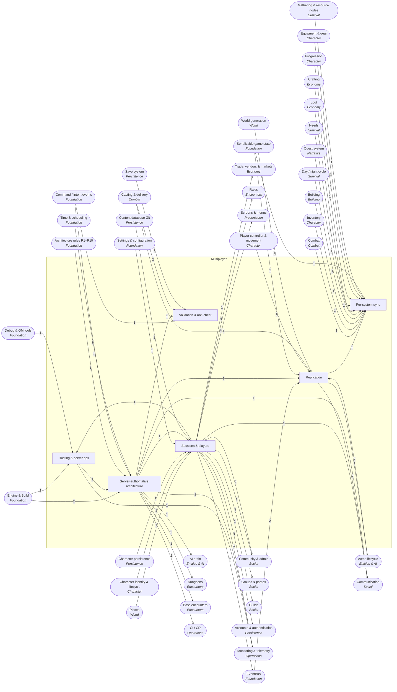

<!-- GENERATED by scripts/lib/systems-map.mjs render — do not edit; edit systems/registry/*.md and re-run. registry-hash: 943cd456f349 -->
# Multiplayer `multiplayer`

[← Atlas index](../ATLAS.md) · source: [`registry/`](../registry/) · decision: [ADR-0065](../../adr/0065-systems-atlas-and-impact-map.md) · ask: `scripts/systems-map.sh impact <id>`

[P4][spec][orchestrator] · Server-authoritative networking for 2 to 10 players

> **Analogy:** A hosted table where one referee holds the only true board

| Where | Spec |
|---|---|
| `core/net/`, `server/` | §12, §13 Phase 4, §10 |

## Systems and parts

Badge = `[phase][status][owner]`. Indentation = containment.

- `net_architecture` **Server-authoritative architecture** [P4][spec][orchestrator] — Dedicated server, client and server roles, command ingest, tick sync · `core/net/`
  - `mmo_scale_sharding` **MMO scale and sharding** [P—][non-goal][director] — Thousands of concurrent players and sharding: the spec says do not build and do not prepare for it
  - `dedicated_server_build` **Dedicated server build** [P4][spec][orchestrator] — Headless server export · `export_presets.cfg` +1
  - `client_server_roles` **Client and server roles** [P4][spec][orchestrator] — The server simulates; clients present and send intents · `core/net/roles.gd`
  - `command_ingest_server` **Command ingest** [P4][spec][orchestrator] — Client intents arrive in the server's queue · `core/net/ingest.gd`
  - `tick_rate_sync` **Tick rate sync** [P4][spec][orchestrator] — The server tick is the clock; clients follow · `core/net/tick.gd`
  - `godot_multiplayer_api` **Godot multiplayer transport** [P4][implied][orchestrator] — ENet and the MultiplayerAPI as the transport · `core/net/`
  - `listen_server_option` **Listen server option** [P—][candidate][director] — A player hosts instead of a dedicated server · `core/net/`
- `replication` **Replication** [P4][spec][orchestrator] — Server events and state mirrored to clients · `core/net/replication/`
  - `event_replication` **Event replication** [P4][spec][orchestrator] — Server-emitted signals replicated to clients · `core/net/replication/events.gd`
  - `state_snapshots_sync` **State snapshots** [P4][implied][orchestrator] — Periodic state sync for actors and world · `core/net/replication/state.gd`
  - `spawn_replication` **Spawn replication** [P4][implied][orchestrator] — Spawns and despawns mirrored on clients · `core/net/replication/spawn.gd`
  - `bandwidth_budget` **Bandwidth budget** [P4][implied][orchestrator] — Bytes per tick per client kept within a budget · `core/net/replication/`
  - `interpolation_prediction` **Interpolation & prediction** [P—][candidate][director] — Client prediction and smoothing; feel versus complexity · `core/net/replication/`
  - `interest_management` **Interest management** [P—][candidate][orchestrator] — Send only what is near; small at ten players · `core/net/replication/`
- `sessions_players` **Sessions & players** [P4][spec][orchestrator] — Join, leave, slots, reconnect, passwords, admin · `core/net/session/`
  - `matchmaking_service` **Matchmaking service** [P—][non-goal][director] — No matchmaking service; players join by address
  - `join_leave_flow` **Join and leave** [P4][implied][orchestrator] — Handshake, spawn and departure; emits player joined and left · `core/net/session/join.gd`
  - `player_slots_cap` **Player slots** [P4][spec][orchestrator] — 2 to 10 players · `core/net/session/`
  - `reconnection` **Reconnection** [P4][implied][orchestrator] — Rejoin to the same character · `core/net/session/reconnect.gd`
  - `player_identity_local` **Local player identity** [P4][implied][orchestrator] — A local id per player; no accounts · `core/net/session/identity.gd`
  - `direct_ip_join` **Direct join** [P4][spec][orchestrator] — Join by address; no matchmaking service · `core/net/session/`
  - `content_version_handshake` **Content version handshake** [P4][implied][orchestrator] — Client and server compare build and data/ versions on join; a mismatch is refused with a clear message · `core/net/session/version.gd`
- `sync_domains` **Per-system sync** [P4][implied][orchestrator] — Combat, inventory, building, time, quests and survival mirrored from the server · `core/net/sync/`
  - `combat_sync` **Combat sync** [P4][implied][orchestrator] — Hits, casts and effects from the server · `core/net/sync/`
  - `inventory_sync` **Inventory sync** [P4][implied][orchestrator] — Inventories owned by the server · `core/net/sync/`
  - `building_sync` **Building sync** [P4][implied][orchestrator] — Placed pieces mirrored to clients · `core/net/sync/`
  - `world_time_sync` **World time sync** [P4][implied][orchestrator] — One clock for everyone · `core/net/sync/`
  - `quest_sync` **Quest sync** [P4][implied][orchestrator] — Quest state per player from the server · `core/net/sync/`
  - `survival_sync` **Survival sync** [P4][implied][orchestrator] — Needs owned by the server · `core/net/sync/`
- `net_validation_security` **Validation & anti-cheat** [P4][implied][orchestrator] — The server checks every command; light anti-cheat for co-op · `core/net/validate/`
  - `command_validation` **Command validation** [P4][implied][orchestrator] — Range, cooldown and ownership checks server-side · `core/net/validate/commands.gd`
  - `rate_limits` **Rate limits** [P—][candidate][orchestrator] — Per-client command rate caps · `core/net/validate/`
  - `save_tamper_resistance` **Save tamper resistance** [P—][candidate][director] — Signed or server-owned saves · `core/saving/`
- `hosting_ops` **Hosting & server ops** [P4][implied][orchestrator] — Headless CLI, persistence, admin commands, metrics · `server/` +1
  - `server_cli_headless` **Headless server CLI** [P4][implied][orchestrator] — Start, stop and configure from the command line · `server/`
  - `server_admin_commands` **Server admin commands** [P4][implied][orchestrator] — Console commands for the host: kick, ban, whitelist and the GM console with admin rights · `server/admin`

## Wiring at tier 2

Boxes inside the frame are this domain's systems; rounded boxes are the outside systems they wire to. Arrow labels count edges; direction is influence (a change at the tail can affect the head).

## Director decisions in this domain

| Candidate | Tier | Owner | What it would be |
|---|---|---|---|
| `save_tamper_resistance` Save tamper resistance | 3 | director | Signed or server-owned saves |
| `rate_limits` Rate limits | 3 | orchestrator | Per-client command rate caps |
| `interest_management` Interest management | 3 | orchestrator | Send only what is near; small at ten players |
| `interpolation_prediction` Interpolation & prediction | 3 | director | Client prediction and smoothing; feel versus complexity |
| `listen_server_option` Listen server option | 3 | director | A player hosts instead of a dedicated server |

**Non-goals (spec §1):** `matchmaking_service` Matchmaking service · `mmo_scale_sharding` MMO scale and sharding

## Cross-domain edges

22 outbound (a change here reaches out), 41 inbound (a change elsewhere reaches in).

| Direction | Edge | How | Via | Strength | Why |
|---|---|---|---|---|---|
| → out | `join_leave_flow` → `sig_player_joined` | emits | — | hard | The session announces a joined player (proposed signal) |
| → out | `join_leave_flow` → `sig_player_left` | emits | — | hard | The session announces a departed player (proposed signal) |
| ← in | `sig_actor_spawned` → `spawn_replication` | listens | — | hard | The §5 Phase 4 note: server-emitted spawns replicate to clients |
| → out | `sessions_players` → `player_trade` | reads | `both players online` | hard | Trades need two connected players |
| → out | `replication` → `actor_state_sync_hooks` | reads | `replication api` | hard | Hooks are consumed by replication |
| → out | `client_server_roles` → `ai_brain` | reads | `server-only tick` | soft | AI thinks only on the server from Phase 4; until then the local authority runs it |
| → out | `net_architecture` → `instancing` | reads | `server model` | hard | Instancing is a server-side architecture choice |
| → out | `player_slots_cap` → `raid_size_scaling` | reads | `player count` | hard | Scaling reads the live player count |
| → out | `client_server_roles` → `boss_phases` | reads | — | soft | Boss phases advance only on the server from Phase 4; until then the local authority runs them |
| → out | `direct_ip_join` → `server_browser_join` | reads | `join by address` | hard | The join screen fronts direct joining |
| ← in | `export_presets` → `dedicated_server_build` | reads | `server preset` | hard | The server is an export preset |
| ← in | `sim_presentation_split` → `client_server_roles` | reads | `client is presentation` | hard | The split is what lets clients be presentation-only (R5) |
| ← in | `intent_schema` → `command_ingest_server` | reads | `typed intents` | hard | The server receives the same intents the sim already uses (§12) |
| ← in | `intent_dispatch` → `command_ingest_server` | reads | `server queue` | hard | Ingested intents go to the dispatcher |
| ← in | `fixed_tick_sim` → `tick_rate_sync` | reads | `server tick` | hard | The server's tick is the fixed tick |
| ← in | `project_settings` → `godot_multiplayer_api` | reads | `network settings` | hard | Transport settings are project settings |
| ← in | `event_bus` → `event_replication` | transports | `signals` | hard | Replication carries every server-emitted signal |
| ← in | `state_serialization` → `state_snapshots_sync` | transports | `state` | hard | Snapshots reuse the save serializer |
| ← in | `actor_state_sync_hooks` → `state_snapshots_sync` | reads | `actor state` | hard | Snapshots read the actor sync hooks |
| ← in | `actor_lifecycle` → `spawn_replication` | transports | `spawns` | hard | Spawns are mirrored |
| ← in | `locomotion` → `interpolation_prediction` | reads | `predicted movement` | soft | Prediction usually starts with movement |
| ← in | `casting` → `interpolation_prediction` | reads | `predicted casts` | soft | Casts may be predicted for feel |
| ← in | `chunk_streaming` → `interest_management` | reads | `relevance by area` | soft | Relevance can follow streaming chunks |
| ← in | `actor_registry` → `interest_management` | reads | `distance` | hard | Relevance is computed per actor |
| ← in | `spawn_hubs` → `join_leave_flow` | reads | `where to spawn` | hard | New players spawn at a hub |
| ← in | `character_save_state` → `join_leave_flow` | reads | `restore character` | hard | A returning player gets their character back |
| ← in | `per_player_save_in_world` → `reconnection` | reads | `saved character` | hard | Reconnecting restores the saved character |
| ← in | `user_settings_store` → `player_identity_local` | reads | `stored id` | hard | The local id is stored with settings |
| ← in | `combat` → `combat_sync` | transports | `hits, casts, effects` | hard | Combat outcomes are server-owned |
| ← in | `inventory` → `inventory_sync` | transports | `bags` | hard | Inventories are server-owned |
| ← in | `building` → `building_sync` | transports | `placed pieces` | hard | Placement is server-owned |
| ← in | `day_night_cycle` → `world_time_sync` | transports | `clock` | hard | The clock is server-owned |
| ← in | `quests` → `quest_sync` | transports | `quest state` | hard | Quest state is server-owned |
| ← in | `needs` → `survival_sync` | transports | `needs` | hard | Needs are server-owned |
| ← in | `intent_validation` → `command_validation` | extends | `server side` | hard | Server validation is the intent validation run with authority |
| ← in | `cooldown_manager` → `command_validation` | reads | `cooldown check` | hard | The server refuses casts on cooldown |
| ← in | `range_los_check` → `command_validation` | reads | `range check` | hard | The server refuses out-of-range casts |
| ← in | `world_save_json` → `save_tamper_resistance` | reads | `signed saves` | hard | Tamper resistance wraps the save format |
| ← in | `export_presets` → `server_cli_headless` | reads | `headless preset` | hard | The CLI runs the headless build |
| ← in | `gm_console` → `server_admin_commands` | extends | `server variant` | hard | Admin commands are the GM console with authority |
| ← in | `server_rules_config` → `join_leave_flow` | reads | — | hard | Password and rules are checked on join |
| ← in | `server_rules_config` → `player_slots_cap` | reads | — | hard | The slot cap is a server rule |
| ← in | `loot` → `sync_domains` | transports | — | hard | Loot rolls are server-owned; clients never roll; no dedicated sync part yet |
| ← in | `crafting` → `sync_domains` | transports | — | hard | Craft timers and outputs are server-owned; no dedicated sync part yet |
| ← in | `progression` → `sync_domains` | transports | — | hard | XP and levels are server-owned; no dedicated sync part yet |
| ← in | `equipment` → `sync_domains` | transports | — | hard | Equipped state replicates from the server; no dedicated sync part yet |
| ← in | `gathering` → `sync_domains` | transports | — | hard | Node depletion and yields are server-owned; no dedicated sync part yet |
| ← in | `world_state_flags` → `sync_domains` | transports | — | hard | Flags and counters replicate as a snapshot; no dedicated sync part yet |
| ← in | `local_authority_mode` → `client_server_roles` | extends | — | hard | Phase 4 replaces the local authority with server roles |
| ← in | `content_database_git` → `content_version_handshake` | reads | — | hard | The data/ version is what is compared |
| → out | `sessions_players` → `party_membership` | reads | `connected players` | hard | The party is drawn from connected players |
| → out | `player_identity_local` → `party_membership` | reads | `identities` | hard | Members are identities |
| → out | `player_identity_local` → `guild_defs_membership` | reads | `members` | hard | Members are identities |
| → out | `sessions_players` → `text_chat` | reads | `senders` | hard | Chat is between connected players |
| → out | `event_replication` → `text_chat` | reads | `relay` | soft | Chat rides on replication |
| → out | `event_replication` → `pings_markers` | reads | `broadcast` | hard | Pings are replicated |
| → out | `net_architecture` → `voice_chat` | reads | `transport` | hard | Voice rides the network layer |
| → out | `player_identity_local` → `block_mute` | reads | `who` | hard | Blocks are per identity |
| → out | `player_identity_local` → `account_identity` | reads | `upgrade path` | hard | Accounts would replace local identities |
| → out | `dedicated_server_build` → `nightly_soak_builds` | reads | `server` | hard | Soak runs the server |
| → out | `server_cli_headless` → `log_aggregation` | reads | `logs` | hard | Logs come from the server process |
| → out | `tick_rate_sync` → `server_health_metrics` | reads | — | hard | Tick rate is the first health metric |
| → out | `sessions_players` → `server_health_metrics` | reads | — | hard | Player count and session churn are health metrics |

