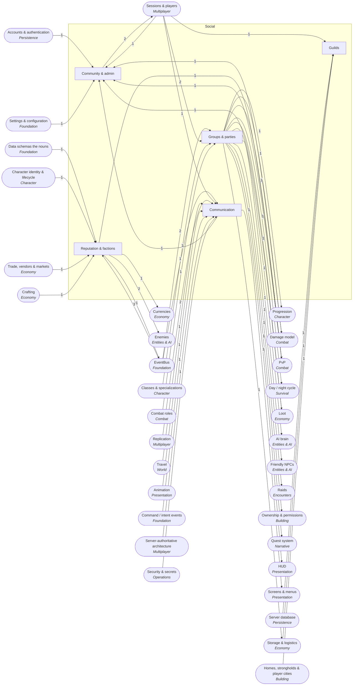

<!-- GENERATED by scripts/lib/systems-map.mjs render — do not edit; edit systems/registry/*.md and re-run. registry-hash: 95b296a15be1 -->
# Social `social`

[← Atlas index](../ATLAS.md) · source: [`registry/`](../registry/) · decision: [ADR-0065](../../adr/0065-systems-atlas-and-impact-map.md) · ask: `scripts/systems-map.sh impact <id>`

[P4][implied][orchestrator] · Groups, guilds, reputation and factions, communication, community rules

> **Analogy:** The guild hall

| Where | Spec |
|---|---|
| `core/social/` | §1 co-op |

## Systems and parts

Badge = `[phase][status][owner]`. Indentation = containment.

- `groups_parties` **Groups & parties** [P4][implied][orchestrator] — Membership, roles, loot rules, raid groups · `core/social/party.gd`
  - `party_membership` **Party membership** [P4][implied][orchestrator] — Who is in the party; in co-op the server is the party · `core/social/party.gd`
  - `party_roles` **Party roles** [P4][implied][orchestrator] — Declared roles for frames and raid checks · `core/social/party.gd`
  - `ready_checks` **Ready checks** [P—][candidate][orchestrator] — Everyone ready before a pull · `core/social/party.gd`
- `guilds` **Guilds** [P—][candidate][director] — Persistent clubs with banks and ranks; an MMO structure at co-op scale · `core/social/guild.gd`
  - `guild_defs_membership` **Guild identity & membership** [P—][candidate][director] — Guild identity and members · `core/social/guild.gd`
  - `guild_bank` **Guild bank** [P—][candidate][director] — Shared storage with permissions · `core/social/guild.gd`
  - `guild_ranks_permissions` **Guild ranks** [P—][candidate][director] — Ranks and what they may do · `core/social/guild.gd`
  - `guild_halls` **Guild halls** [P—][candidate][director] — A guild-owned building · `core/building/`
- `reputation_factions` **Reputation & factions** [P—][candidate][director] — Factions, standing tiers, sources, unlocks, hostility, alignment · `data/factions/` +1
  - `faction_defs` **Faction definitions** [P—][candidate][director] — Data-defined factions · `data/factions/`
  - `reputation_tiers` **Reputation tiers** [P—][candidate][orchestrator] — Thresholds from hated to exalted · `core/social/reputation.gd`
  - `reputation_sources` **Reputation sources** [P—][candidate][orchestrator] — Kills and quests move standing; emits reputation_changed · `core/social/reputation.gd`
  - `faction_unlocks_vendors` **Faction unlocks** [P—][candidate][director] — Vendors and recipes gated by standing · `data/factions/`
  - `player_alignment` **Player alignment** [P—][candidate][director] — A player-side alignment track · `core/social/`
- `communication` **Communication** [P4][implied][orchestrator] — Chat, pings, and candidate emotes and voice · `ui/` +1
  - `text_chat` **Text chat** [P4][implied][orchestrator] — Server-relayed text · `core/net/chat.gd`
  - `pings_markers` **Pings & markers** [P4][implied][orchestrator] — Shared world markers · `core/net/pings.gd`
  - `emotes` **Emotes** [P—][candidate][director] — Animated emotes · `data/emotes/`
  - `voice_chat` **Voice chat** [P—][candidate][director] — In-game voice; a new dependency · `core/net/voice.gd`
- `community_admin` **Community & admin** [P4][implied][orchestrator] — House rules, friends, blocking · `server/`
  - `server_rules_config` **Server rules** [P4][implied][orchestrator] — Password, slot cap, friendly fire, loot rule and PvP flag as one server config · `server/config`
  - `friends_list` **Friends list** [P—][candidate][director] — Needs identity that spans servers · `core/social/`
  - `block_mute` **Block & mute** [P—][candidate][orchestrator] — Per-player mute and block · `core/social/`

## Wiring at tier 2

Boxes inside the frame are this domain's systems; rounded boxes are the outside systems they wire to. Arrow labels count edges; direction is influence (a change at the tail can affect the head).

## Director decisions in this domain

| Candidate | Tier | Owner | What it would be |
|---|---|---|---|
| `block_mute` Block & mute | 3 | orchestrator | Per-player mute and block |
| `friends_list` Friends list | 3 | director | Needs identity that spans servers |
| `voice_chat` Voice chat | 3 | director | In-game voice; a new dependency |
| `emotes` Emotes | 3 | director | Animated emotes |
| `reputation_factions` Reputation & factions | 2 (+5 parts) | director | Factions, standing tiers, sources, unlocks, hostility, alignment |
| `player_alignment` Player alignment | 3 | director | A player-side alignment track |
| `faction_unlocks_vendors` Faction unlocks | 3 | director | Vendors and recipes gated by standing |
| `reputation_sources` Reputation sources | 3 | orchestrator | Kills and quests move standing; emits reputation_changed |
| `reputation_tiers` Reputation tiers | 3 | orchestrator | Thresholds from hated to exalted |
| `faction_defs` Faction definitions | 3 | director | Data-defined factions |
| `guilds` Guilds | 2 (+4 parts) | director | Persistent clubs with banks and ranks; an MMO structure at co-op scale |
| `guild_halls` Guild halls | 3 | director | A guild-owned building |
| `guild_ranks_permissions` Guild ranks | 3 | director | Ranks and what they may do |
| `guild_bank` Guild bank | 3 | director | Shared storage with permissions |
| `guild_defs_membership` Guild identity & membership | 3 | director | Guild identity and members |
| `ready_checks` Ready checks | 3 | orchestrator | Everyone ready before a pull |

## Cross-domain edges

20 outbound (a change here reaches out), 32 inbound (a change elsewhere reaches in).

| Direction | Edge | How | Via | Strength | Why |
|---|---|---|---|---|---|
| ← in | `sig_actor_died` → `reputation_sources` | listens | — | soft | Killing faction members changes standing (candidate) |
| ← in | `sig_quest_completed` → `reputation_sources` | listens | — | soft | Quests change faction standing (candidate) |
| ← in | `sig_player_joined` → `party_membership` | listens | — | hard | The party adds the player |
| ← in | `sig_player_left` → `party_membership` | listens | — | hard | The party removes the player |
| ← in | `sig_player_joined` → `text_chat` | listens | — | soft | A joined line in chat |
| → out | `reputation_sources` → `sig_reputation_changed` | emits | — | hard | Standing changes are announced (proposed signal) |
| ← in | `sig_reputation_changed` → `faction_unlocks_vendors` | listens | — | hard | Unlocks open when a tier is crossed |
| → out | `party_membership` → `xp_award` | reads | — | soft | Kill XP is shared with the party |
| → out | `party_membership` → `friendly_fire_rules` | reads | `ally check` | soft | In co-op, party members are usually immune to each other |
| → out | `party_membership` → `pvp_flagging` | reads | `party exception` | hard | Party members stay unflagged to each other |
| → out | `faction_defs` → `faction_warfare` | reads | `hostile factions` | hard | Warfare needs factions to exist |
| → out | `party_membership` → `time_skip_sleep` | reads | `everyone sleeping` | soft | In multiplayer the whole party must agree |
| → out | `party_membership` → `group_loot_rules` | reads | `who rolls` | hard | Rules are applied among party members |
| → out | `reputation_tiers` → `faction_currencies` | reads | `earn rate` | hard | Earned through faction standing |
| → out | `party_membership` → `shared_storage` | reads | `who may open` | hard | Access follows the party |
| → out | `faction_defs` → `enemy_factions_hostility` | reads | `faction ids` | soft | If factions are approved, enemies belong to them |
| → out | `party_membership` → `ai_director` | reads | `player count` | soft | Pressure scales with players present |
| → out | `party_membership` → `companions_pets` | reads | `owner` | soft | Ownership follows the party |
| → out | `reputation_tiers` → `enemy_factions_hostility` | reads | — | hard | Hostility toward a player follows their standing |
| → out | `party_roles` → `raid_roles_check` | reads | `roles present` | soft | The check reads party roles if they exist |
| → out | `party_membership` → `build_permissions` | reads | `party rights` | hard | Rights follow the party |
| → out | `party_membership` → `shared_group_quests` | reads | `who shares` | hard | Sharing follows the party |
| → out | `party_membership` → `group_frames` | renders | `members` | hard | Frames show party members |
| → out | `text_chat` → `chat_window` | renders | `messages` | hard | The window shows chat |
| → out | `server_rules_config` → `join_leave_flow` | reads | — | hard | Password and rules are checked on join |
| → out | `server_rules_config` → `player_slots_cap` | reads | — | hard | The slot cap is a server rule |
| ← in | `sessions_players` → `party_membership` | reads | `connected players` | hard | The party is drawn from connected players |
| ← in | `player_identity_local` → `party_membership` | reads | `identities` | hard | Members are identities |
| ← in | `role_specs` → `party_roles` | reads | `declared spec` | soft | If specs exist, roles come from them |
| ← in | `player_identity_local` → `guild_defs_membership` | reads | `members` | hard | Members are identities |
| ← in | `server_database` → `guild_defs_membership` | reads | `persistence` | hard | Guilds persist on the server |
| ← in | `shared_storage` → `guild_bank` | reads | `storage` | hard | A guild bank is shared storage |
| ← in | `player_home` → `guild_halls` | reads | `building` | hard | A hall is a home owned by the guild |
| ← in | `schema_faction_def` → `faction_defs` | reads | `FactionDef` | hard | Factions need a schema |
| ← in | `character_save_state` → `reputation_sources` | reads | `saved standing` | hard | Standing is saved per character |
| ← in | `npc_vendors_stores` → `faction_unlocks_vendors` | reads | `gated stock` | hard | Unlocks gate vendor stock |
| ← in | `recipe_unlocks` → `faction_unlocks_vendors` | reads | `gated recipes` | soft | Unlocks can gate recipes |
| ← in | `sessions_players` → `text_chat` | reads | `senders` | hard | Chat is between connected players |
| ← in | `event_replication` → `text_chat` | reads | `relay` | soft | Chat rides on replication |
| ← in | `markers_waypoints` → `pings_markers` | reads | `marker model` | hard | A ping is a temporary marker |
| ← in | `event_replication` → `pings_markers` | reads | `broadcast` | hard | Pings are replicated |
| ← in | `facial_emotes` → `emotes` | reads | `animations` | hard | Emotes play animations |
| ← in | `intent_schema` → `emotes` | reads | `emote intent` | soft | An emote is an intent |
| ← in | `net_architecture` → `voice_chat` | reads | `transport` | hard | Voice rides the network layer |
| ← in | `dependency_policy_r10` → `voice_chat` | gated_by | `voice library` | hard | A voice library is a new dependency |
| ← in | `friendly_fire_rules` → `server_rules_config` | reads | `friendly fire default` | hard | The host sets friendly fire |
| ← in | `pvp_flagging` → `server_rules_config` | reads | `pvp default` | soft | If PvP exists, the host can disable it |
| ← in | `account_identity` → `friends_list` | reads | `cross-server identity` | hard | Friends need identity beyond one server |
| ← in | `player_identity_local` → `block_mute` | reads | `who` | hard | Blocks are per identity |
| ← in | `user_settings_store` → `server_rules_config` | reads | — | soft | The host's saved server settings seed the rules |
| ← in | `group_loot_rules` → `server_rules_config` | reads | — | hard | The server's loot rule is the party's default |
| ← in | `roles` → `party_roles` | reads | — | soft | A party role is a combat role |

