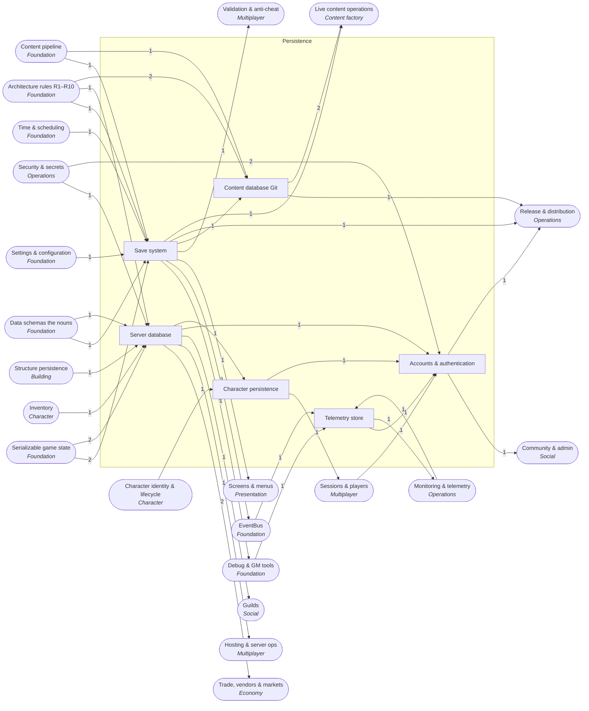

<!-- GENERATED by scripts/lib/systems-map.mjs render — do not edit; edit systems/registry/*.md and re-run. registry-hash: 949cf432b712 -->
# Persistence `persistence`

[← Atlas index](../ATLAS.md) · source: [`registry/`](../registry/) · decision: [ADR-0065](../../adr/0065-systems-atlas-and-impact-map.md) · ask: `scripts/systems-map.sh impact <id>`

[P3][spec][orchestrator] · Saves, server database, content database, accounts, character records, telemetry store

> **Analogy:** The filing cabinet: what survives when the lights go off

| Where | Spec |
|---|---|
| `core/saving/`, `server/db/`, `data/` | §10 |

## Systems and parts

Badge = `[phase][status][owner]`. Indentation = containment.

- `save_system` **Save system** [P3][spec][orchestrator] — JSON world saves per slot, autosave, migrations, restore · `core/saving/`
  - `world_save_json` **World save file** [P3][spec][orchestrator] — user://saves/<slot>/world.json · `core/saving/world.gd`
  - `save_slots` **Save slots** [P3][spec][orchestrator] — Named slots per world · `core/saving/slots.gd`
  - `autosave_scheduler` **Autosave** [P3][implied][orchestrator] — Periodic and event-driven saves · `core/saving/autosave.gd`
  - `save_ids_plus_state` **Ids plus state rule** [P3][spec][orchestrator] — Saves store content ids plus state, never copies of defs, so patches apply to old saves · `core/saving/`
  - `save_migrations` **Save migrations** [P3][spec][orchestrator] — Upgrade old saves by schema_version · `core/saving/migrate.gd` +1
  - `load_restore_flow` **Load and restore** [P3][spec][orchestrator] — Rebuilds state from a save and resolves ids through the registry · `core/saving/load.gd`
  - `backup_rotation` **Backup rotation** [P—][candidate][orchestrator] — Keep the last N saves · `core/saving/`
- `server_database` **Server database** [P4][spec][orchestrator] — The Phase 4 SQLite store for world state, inventories and structures · `server/db/`
  - `sqlite_world_store` **SQLite world store** [P4][spec][orchestrator] — One SQLite file per dedicated-server world · `server/db/store.gd`
  - `db_schema_design` **Database schema design** [P4][implied][orchestrator] — Tables and indexes for players, characters, inventories, structures, flags · `server/db/schema.sql`
  - `transactional_writes_crash_safety` **Transactional writes** [P4][spec][orchestrator] — Atomic writes so a crash never corrupts a world · `server/db/store.gd`
  - `db_migrations` **Database migrations** [P4][implied][orchestrator] — Versioned schema migrations · `server/db/migrations/`
  - `player_inventory_tables` **Player inventory tables** [P4][spec][orchestrator] — Inventories per character · `server/db/schema.sql`
  - `placed_structures_tables` **Placed structure tables** [P4][spec][orchestrator] — Placed pieces per world · `server/db/schema.sql`
- `content_database_git` **Content database (Git)** [P0][spec][orchestrator] — Git is the content database: diffable, mergeable, agent-editable, time travel included · `data/` +1
  - `data_dir_as_db` **data/ as the database** [P0][spec][orchestrator] — data/ in Git is the only content store · `data/`
  - `content_versioning` **Content versioning** [P0][spec][orchestrator] — History and branches as content versions · `.git`
  - `id_immutability_migrations` **Id immutability** [P0][spec][orchestrator] — Ids never change once shipped; add a new id and a migration note · `docs/migrations.md`
- `accounts_auth` **Accounts & authentication** [P—][candidate][director] — Accounts, sign-in, cross-server characters, cloud DB, leaderboards; only with a spec change · `server/auth/`
  - `account_identity` **Account identity** [P—][candidate][director] — A persistent identity beyond one server · `server/auth/`
  - `authentication_provider` **Authentication provider** [P—][candidate][director] — Steam or OAuth sign-in · `server/auth/`
  - `cross_server_characters` **Cross-server characters** [P—][candidate][director] — One character across servers · `server/auth/`
  - `cloud_db_postgres` **Cloud database** [P—][candidate][director] — Postgres or Supabase only if accounts become real · `server/db/`
  - `leaderboards` **Leaderboards** [P—][candidate][director] — Rankings across servers · `server/`
- `character_persistence` **Character persistence** [P3][spec][orchestrator] — The character record and its per-world storage · `core/saving/character.gd`
  - `character_state_record` **Character state record** [P3][spec][orchestrator] — The stored character: ids plus state · `core/saving/character.gd`
  - `per_player_save_in_world` **Per-player save in world** [P4][spec][orchestrator] — Player inventories stored in the server's world database · `server/db/`
  - `character_migration_between_worlds` **Character migration** [P—][candidate][director] — Moving a character between worlds · `core/saving/`
- `telemetry_store` **Telemetry store** [P—][candidate][orchestrator] — Gameplay analytics and crash report storage · `server/analytics/`
  - `gameplay_analytics_events` **Gameplay analytics events** [P—][candidate][orchestrator] — Anonymous gameplay events for tuning · `server/analytics/`
  - `crash_reports_store` **Crash report store** [P—][candidate][orchestrator] — Crash bundles · `server/analytics/`

## Wiring at tier 2

Boxes inside the frame are this domain's systems; rounded boxes are the outside systems they wire to. Arrow labels count edges; direction is influence (a change at the tail can affect the head).

## Director decisions in this domain

| Candidate | Tier | Owner | What it would be |
|---|---|---|---|
| `telemetry_store` Telemetry store | 2 (+2 parts) | orchestrator | Gameplay analytics and crash report storage |
| `crash_reports_store` Crash report store | 3 | orchestrator | Crash bundles |
| `gameplay_analytics_events` Gameplay analytics events | 3 | orchestrator | Anonymous gameplay events for tuning |
| `character_migration_between_worlds` Character migration | 3 | director | Moving a character between worlds |
| `accounts_auth` Accounts & authentication | 2 (+5 parts) | director | Accounts, sign-in, cross-server characters, cloud DB, leaderboards; only with a spec change |
| `leaderboards` Leaderboards | 3 | director | Rankings across servers |
| `cloud_db_postgres` Cloud database | 3 | director | Postgres or Supabase only if accounts become real |
| `cross_server_characters` Cross-server characters | 3 | director | One character across servers |
| `authentication_provider` Authentication provider | 3 | director | Steam or OAuth sign-in |
| `account_identity` Account identity | 3 | director | A persistent identity beyond one server |
| `backup_rotation` Backup rotation | 3 | orchestrator | Keep the last N saves |

## Cross-domain edges

18 outbound (a change here reaches out), 24 inbound (a change elsewhere reaches in).

| Direction | Edge | How | Via | Strength | Why |
|---|---|---|---|---|---|
| → out | `save_system` → `in_game_bug_report` | reads | `current save snapshot` | hard | A report bundles the world save so the bug can be reloaded |
| → out | `save_system` → `sig_world_saved` | emits | — | hard | A completed save is announced with its slot |
| → out | `save_system` → `sig_world_loaded` | emits | — | hard | A completed load is announced with its slot |
| → out | `server_database` → `market_board_auction` | reads | `listings` | hard | Listings need server persistence |
| → out | `server_database` → `mail_system` | reads | `mailboxes` | hard | Mail needs server persistence |
| → out | `save_slots` → `main_menu_world_select` | reads | `worlds` | soft | The menu lists save slots once saving exists in Phase 3; Phase 1 has one world |
| → out | `per_player_save_in_world` → `reconnection` | reads | `saved character` | hard | Reconnecting restores the saved character |
| → out | `world_save_json` → `save_tamper_resistance` | reads | `signed saves` | hard | Tamper resistance wraps the save format |
| → out | `sqlite_world_store` → `world_persistence_sqlite` | reads | `store` | hard | The server uses the SQLite store |
| → out | `server_database` → `guild_defs_membership` | reads | `persistence` | hard | Guilds persist on the server |
| → out | `account_identity` → `friends_list` | reads | `cross-server identity` | hard | Friends need identity beyond one server |
| ← in | `state_serialization` → `world_save_json` | reads | `serializer` | hard | The save file is serialized state |
| ← in | `user_settings_store` → `save_slots` | reads | `last slot` | soft | The last-used slot is remembered |
| ← in | `timers_cooldowns` → `autosave_scheduler` | reads | `interval` | hard | Autosave is a timer |
| ← in | `id_convention` → `save_ids_plus_state` | reads | `ids` | hard | The rule depends on stable ids |
| ← in | `state_serialization` → `save_ids_plus_state` | reads | `state shape` | hard | The serializer enforces ids plus state |
| ← in | `schema_versioning` → `save_migrations` | reads | `schema_version` | hard | Migrations are keyed by schema version |
| ← in | `data_registry_loader` → `load_restore_flow` | reads | `id resolution` | hard | Loading resolves content ids through the registry |
| ← in | `state_serialization` → `sqlite_world_store` | reads | `rows` | hard | Rows hold serialized state |
| ← in | `dependency_policy_r10` → `sqlite_world_store` | gated_by | `godot-sqlite addon` | hard | The SQLite addon is a new dependency in Phase 4 |
| ← in | `state_model` → `db_schema_design` | reads | `entities` | hard | Tables mirror the state model |
| ← in | `id_convention` → `db_schema_design` | reads | `keys` | hard | Content ids are foreign keys |
| ← in | `schema_versioning` → `db_migrations` | reads | `content versions` | hard | Database and content versions move together |
| ← in | `inventory` → `player_inventory_tables` | persists | `bags per character` | hard | Inventories are rows in Phase 4 |
| ← in | `structure_persistence` → `placed_structures_tables` | persists | `placed pieces` | hard | Placed pieces are rows in Phase 4 |
| ← in | `content_pipeline` → `data_dir_as_db` | reads | `filed .tres` | hard | The pipeline files content into data/ |
| ← in | `plain_text_formats` → `data_dir_as_db` | reads | `text only` | hard | Git as a database works because content is text |
| ← in | `id_convention` → `id_immutability_migrations` | reads | `ids` | hard | The rule is about ids |
| ← in | `player_identity_local` → `account_identity` | reads | `upgrade path` | hard | Accounts would replace local identities |
| ← in | `dependency_policy_r10` → `account_identity` | gated_by | `external service` | hard | Accounts mean an external service |
| ← in | `env_secrets` → `authentication_provider` | reads | `provider keys` | hard | Provider credentials live in env |
| ← in | `character_save_state` → `character_state_record` | persists | `record` | hard | The stored record is the character's save state |
| ← in | `event_bus` → `gameplay_analytics_events` | reads | `all signals` | hard | Analytics subscribe to the bus |
| ← in | `crash_reporting` → `crash_reports_store` | reads | `bundles` | hard | The store receives crash bundles |
| ← in | `in_game_bug_report` → `crash_reports_store` | reads | `bundles` | soft | Player reports land in the same store |
| → out | `save_migrations` → `patching_updates` | reads | `old saves` | hard | A patch must keep old saves loading |
| → out | `authentication_provider` → `steam_platform` | reads | `steam auth` | soft | Steam brings its own identity |
| → out | `data_dir_as_db` → `mod_support` | reads | `mod data` | hard | Mods are data in the same store |
| → out | `gameplay_analytics_events` → `gameplay_analytics` | reads | `events` | hard | Analytics aggregate stored events |
| → out | `content_versioning` → `content_patches` | reads | `versions` | hard | A patch is a content version |
| → out | `save_migrations` → `content_patches` | reads | `old saves` | hard | Patches must keep old saves loading |
| → out | `data_dir_as_db` → `hotfix_data_only` | reads | `store` | hard | A hotfix is a data commit |

