<!-- GENERATED by scripts/lib/systems-map.mjs render — do not edit; edit systems/registry/*.md and re-run. registry-hash: 943cd456f349 -->
# Operations `operations`

[← Atlas index](../ATLAS.md) · source: [`registry/`](../registry/) · decision: [ADR-0065](../../adr/0065-systems-atlas-and-impact-map.md) · ask: `scripts/systems-map.sh impact <id>`

[P0][spec][test-pilot/orchestrator] · Gates, CI, release, monitoring, hardware scalability, security, documentation, agent harness

> **Analogy:** The pit crew, the inspectors, and the maintenance logs

| Where | Spec |
|---|---|
| `tests/`, `.github/workflows/`, `tools/`, `docs/` | §8, §13 |

## Systems and parts

Badge = `[phase][status][owner]`. Indentation = containment.

- `validation_gates` **Validation gates** [P0][spec][test-pilot/orchestrator] — G0 to G5 plus determinism and performance checks · `.github/workflows/gates.yml` +2
  - `g0_style_parse` **G0 style and parse** [P0][spec][test-pilot] — gdformat, gdlint and a headless import check · `.github/workflows/gates.yml`
  - `g1_unit_tests_gut` **G1 unit tests** [P0][spec][test-pilot] — GUT unit tests with seeded RNG · `tests/unit/`
  - `g2_data_integrity` **G2 data integrity** [P0][spec][orchestrator/test-pilot] — Ids, references, paths, enums and ranges · `tools/validate_data.gd`
  - `g3_smoke_boot` **G3 smoke** [P0][spec][test-pilot] — Main scene boots headless for 30 s with zero ERROR lines · `.github/workflows/gates.yml`
  - `g4_bot_playtest` **G4 bot playtest** [P1][spec][test-pilot] — Scripted walk, gather, craft, fight; assert outcomes and no floor falls · `tools/testing/bot.gd`
  - `g5_vision_review` **G5 vision review** [P1][spec][test-pilot] — Screenshot set reviewed against the art bible; advisory · `tools/testing/screens.gd`
  - `determinism_replay_tests` **Determinism replay tests** [P1][implied][test-pilot] — Same seed and intents produce the same state · `tests/integration/`
  - `perf_budget_tests` **Performance budget tests** [P—][candidate][test-pilot] — Frame time under budget on a benchmark scene · `tests/perf/`
- `ci_cd` **CI / CD** [P0][spec][test-pilot] — The PR workflow that runs the gates, plus build and governance jobs · `.github/workflows/`
  - `pr_gates_workflow` **PR gates workflow** [P0][spec][test-pilot] — G0 to G3 on every PR · `.github/workflows/gates.yml`
  - `export_build_pipeline` **Export build pipeline** [P1][implied][test-pilot] — Export desktop builds in CI · `.github/workflows/build.yml`
  - `loom_doctor_gate` **Loom governance gate** [P0][implied][orchestrator] — Loom's governance gate, doctor and atlas check on every PR · `.github/workflows/governance-gate.yml`
  - `nightly_soak_builds` **Nightly soak builds** [P—][candidate][test-pilot] — Long headless server runs · `.github/workflows/`
- `release_distribution` **Release & distribution** [P1][implied][orchestrator] — Versioning, builds, server distribution, and candidate patching, Steam and mods · `export_presets.cfg` +1
  - `mobile_console_ports` **Mobile and console ports** [P—][non-goal][director] — Desktop only; revisit after Phase 5
  - `patching_updates` **Patching & updates** [P—][candidate][director] — How builds and data-only content patches ship, with save migrations when needed · `docs/release_process.md`
  - `steam_platform` **Steam platform** [P—][candidate][director] — Steamworks integration · `addons/godotsteam/`
  - `mod_support` **Mod support** [P—][candidate][director] — Player-made content through the same data pipeline · `data/` +1
- `monitoring_telemetry` **Monitoring & telemetry** [P1][implied][orchestrator] — Client overlays, server metrics, logs, crashes, alerts, analytics · `server/metrics` +1
  - `server_health_metrics` **Server health metrics** [P4][implied][orchestrator] — Tick time, players, memory, save latency · `server/metrics`
  - `log_aggregation` **Log aggregation** [P—][candidate][orchestrator] — Collect server logs centrally · `server/`
  - `crash_reporting` **Crash reporting** [P—][candidate][orchestrator] — Client and server crash bundles · `tools/crash/`
  - `alerting` **Alerting** [P—][candidate][orchestrator] — Notify the host on unhealthy metrics · `server/`
  - `gameplay_analytics` **Gameplay analytics** [P—][candidate][director] — Aggregate gameplay events for tuning · `server/analytics/`
- `hardware_scalability` **Hardware range & scalability** [P1][implied][orchestrator] — Specs, presets, scaling, fallbacks, benchmark, frame budget · `project.godot` +1
  - `frame_time_budget` **Frame time budget** [P1][implied][orchestrator] — Milliseconds per frame per system on the target machine · `docs/balance_ranges.md`
  - `min_recommended_specs` **Minimum and recommended specs** [P1][implied][director] — The hardware the game targets · `docs/hardware_targets.md`
  - `graphics_quality_presets` **Graphics quality presets** [P1][implied][orchestrator] — Low, medium and high bundles · `core/settings/graphics.gd`
  - `resolution_scaling` **Resolution scaling** [P1][implied][orchestrator] — Render scale · `core/settings/graphics.gd`
  - `lod_shadow_scaling` **LOD and shadow scaling** [P1][implied][orchestrator] — LOD bias and shadow quality · `core/settings/graphics.gd`
  - `low_end_fallbacks` **Low-end fallbacks** [P—][candidate][orchestrator] — Simplified shader paths · `art/shaders/`
  - `benchmark_scene` **Benchmark scene** [P—][candidate][test-pilot] — A fixed scene for measuring · `tools/testing/benchmark.tscn`
- `security_secrets` **Security & secrets** [P0][spec][orchestrator] — Secrets in env, the dependency policy, Loom's secrets doctor · `.env.example` +1
  - `env_secrets` **Environment secrets** [P0][spec][orchestrator] — Keys only in environment variables; never in code, data, logs or commits · `.env.example`
  - `dependency_policy_r10` **Dependency policy (R10)** [P0][spec][director] — A new addon, library, service or API requires a spec-change PR · `GAME_INFRA_SPEC.md`
  - `loom_secrets_doctor` **Loom secrets doctor** [P0][implied][orchestrator] — Loom's retrospective secret scan · `scripts/secrets-doctor.sh`
- `documentation` **Documentation** [P0][spec][director/orchestrator] — The spec, changelog, tech debt, migrations, engine version, the atlas · `docs/`
  - `game_infra_spec` **GAME_INFRA_SPEC.md** [P0][spec][director] — The single source of truth; contract changes are PRs to it · `GAME_INFRA_SPEC.md`
  - `changelog` **Changelog** [P0][spec][orchestrator] — One line per task; version tags are cut from it (spec §7.1: every role may append) · `docs/changelog.md`
  - `tech_debt_log` **Tech debt log** [P0][spec][orchestrator] — Debt filed instead of fixed out of scope · `docs/tech_debt.md`
  - `migrations_doc` **Migrations doc** [P2][spec][orchestrator] — Schema version notes · `docs/migrations.md`
  - `systems_atlas` **Systems atlas** [P0][implied][orchestrator] — This registry and its generated atlas; the impact map · `systems/`
- `agent_harness` **Agent harness** [P0][spec][orchestrator] — Skills, write scopes, the Godot MCP bridge, Loom's governance layer · `.claude/` +2
  - `skills_materialized` **Skills materialized** [P0][spec][orchestrator] — content-smith, world-builder, quest-writer and test-pilot as portable skills · `.claude/skills/` +1
  - `write_scope_enforcement` **Write scope enforcement** [P0][spec][orchestrator] — The orchestrator rejects diffs outside a role's write scope · `scripts/write-scope-check.sh` +1
  - `godot_mcp_bridge` **Godot MCP bridge** [P0][spec][orchestrator] — Run scenes headless, capture output, run tests · `.mcp.json`
  - `loom_governance_layer` **Loom governance layer** [P0][implied][orchestrator] — Loom's constitution, hooks, doctor and atlas on top of the spec · `constitution/` +2
  - `subagent_mirrors` **Subagent mirrors** [P—][candidate][orchestrator] — Optional subagents mirroring the four skills · `.claude/agents/`
  - `harness_adapters` **Harness adapters (CLAUDE.md, AGENTS.md)** [P0][spec][orchestrator] — The always-loaded adapters that point any harness at the spec, the session ritual, the write scopes and the atlas · `CLAUDE.md` +3

## Wiring at tier 2

Boxes inside the frame are this domain's systems; rounded boxes are the outside systems they wire to. Arrow labels count edges; direction is influence (a change at the tail can affect the head).

```mermaid
flowchart LR
  subgraph operations["Operations"]
    agent_harness["Agent harness"]
    documentation["Documentation"]
    security_secrets["Security & secrets"]
    hardware_scalability["Hardware range & scalability"]
    monitoring_telemetry["Monitoring & telemetry"]
    release_distribution["Release & distribution"]
    ci_cd["CI / CD"]
    validation_gates["Validation gates"]
  end
  event_bus(["EventBus<br/><i>Foundation</i>"])
  data_schemas(["Data schemas the nouns<br/><i>Foundation</i>"])
  architecture_rules(["Architecture rules R1–R10<br/><i>Foundation</i>"])
  engine_platform(["Engine & Build<br/><i>Foundation</i>"])
  condition_grammar(["Condition grammar<br/><i>Foundation</i>"])
  player_controller(["Player controller & movement<br/><i>Character</i>"])
  ai_brain(["AI brain<br/><i>Entities & AI</i>"])
  art_pipeline(["Art pipeline<br/><i>Presentation</i>"])
  vfx_spell_effects(["VFX & spell effects<br/><i>Presentation</i>"])
  ui_screens(["Screens & menus<br/><i>Presentation</i>"])
  communication(["Communication<br/><i>Social</i>"])
  server_database(["Server database<br/><i>Persistence</i>"])
  accounts_auth(["Accounts & authentication<br/><i>Persistence</i>"])
  telemetry_store(["Telemetry store<br/><i>Persistence</i>"])
  save_system(["Save system<br/><i>Persistence</i>"])
  damage_model(["Damage model<br/><i>Combat</i>"])
  loot(["Loot<br/><i>Economy</i>"])
  attributes_stats(["Attributes & stats<br/><i>Character</i>"])
  content_pipeline(["Content pipeline<br/><i>Foundation</i>"])
  items(["Items<br/><i>Economy</i>"])
  spell_effect_content(["Spells & effects content<br/><i>Combat</i>"])
  enemies(["Enemies<br/><i>Entities & AI</i>"])
  terrain_biomes(["Terrain & biomes<br/><i>World</i>"])
  quests(["Quest system<br/><i>Narrative</i>"])
  npcs(["Friendly NPCs<br/><i>Entities & AI</i>"])
  melee_weapons(["Melee & weapon combat<br/><i>Combat</i>"])
  command_intents(["Command / intent events<br/><i>Foundation</i>"])
  content_review(["Content review<br/><i>Content factory</i>"])
  debug_tools(["Debug & GM tools<br/><i>Foundation</i>"])
  net_architecture(["Server-authoritative architecture<br/><i>Multiplayer</i>"])
  hosting_ops(["Hosting & server ops<br/><i>Multiplayer</i>"])
  time_and_tick(["Time & scheduling<br/><i>Foundation</i>"])
  dialogue(["Dialogue system<br/><i>Narrative</i>"])
  crafting(["Crafting<br/><i>Economy</i>"])
  gathering(["Gathering & resource nodes<br/><i>Survival</i>"])
  config_settings(["Settings & configuration<br/><i>Foundation</i>"])
  sessions_players(["Sessions & players<br/><i>Multiplayer</i>"])
  content_database_git(["Content database Git<br/><i>Persistence</i>"])
  agent_content_loop(["Agent content loop<br/><i>Content factory</i>"])
  balance_tuning(["Balance & tuning<br/><i>Content factory</i>"])
  asset_generation(["Asset generation<br/><i>Content factory</i>"])
  documentation -- "1" --> event_bus
  documentation -- "1" --> data_schemas
  documentation -- "1" --> architecture_rules
  security_secrets -- "1" --> engine_platform
  documentation -- "1" --> condition_grammar
  documentation -- "1" --> engine_platform
  documentation -- "1" --> player_controller
  security_secrets -- "2" --> ai_brain
  documentation -- "1" --> art_pipeline
  hardware_scalability -- "1" --> art_pipeline
  hardware_scalability -- "1" --> vfx_spell_effects
  hardware_scalability -- "1" --> ui_screens
  security_secrets -- "1" --> communication
  security_secrets -- "1" --> server_database
  security_secrets -- "2" --> accounts_auth
  monitoring_telemetry -- "1" --> telemetry_store
  monitoring_telemetry -- "1" --> accounts_auth
  documentation -- "1" --> save_system
  engine_platform -- "3" --> validation_gates
  architecture_rules -- "3" --> validation_gates
  damage_model -- "1" --> validation_gates
  loot -- "2" --> validation_gates
  attributes_stats -- "1" --> validation_gates
  content_pipeline -- "1" --> validation_gates
  items -- "1" --> validation_gates
  spell_effect_content -- "1" --> validation_gates
  enemies -- "1" --> validation_gates
  terrain_biomes -- "2" --> validation_gates
  quests -- "2" --> validation_gates
  npcs -- "1" --> validation_gates
  player_controller -- "1" --> validation_gates
  melee_weapons -- "1" --> validation_gates
  command_intents -- "1" --> validation_gates
  art_pipeline -- "1" --> validation_gates
  content_review -- "1" --> validation_gates
  debug_tools -- "1" --> validation_gates
  hardware_scalability -- "2" --> validation_gates
  validation_gates -- "1" --> ci_cd
  engine_platform -- "3" --> ci_cd
  agent_harness -- "1" --> ci_cd
  documentation -- "1" --> ci_cd
  net_architecture -- "1" --> ci_cd
  save_system -- "1" --> release_distribution
  accounts_auth -- "1" --> release_distribution
  security_secrets -- "1" --> release_distribution
  content_pipeline -- "1" --> release_distribution
  hosting_ops -- "1" --> monitoring_telemetry
  ci_cd -- "1" --> monitoring_telemetry
  debug_tools -- "1" --> monitoring_telemetry
  time_and_tick -- "1" --> hardware_scalability
  engine_platform -- "1" --> hardware_scalability
  art_pipeline -- "2" --> hardware_scalability
  terrain_biomes -- "1" --> hardware_scalability
  documentation -- "2" --> security_secrets
  data_schemas -- "1" --> documentation
  event_bus -- "1" --> documentation
  documentation -- "5" --> agent_harness
  engine_platform -- "1" --> agent_harness
  security_secrets -- "1" --> agent_harness
  dialogue -- "1" --> validation_gates
  crafting -- "2" --> validation_gates
  gathering -- "1" --> validation_gates
  documentation -- "1" --> release_distribution
  config_settings -- "1" --> hardware_scalability
  net_architecture -- "1" --> monitoring_telemetry
  sessions_players -- "1" --> monitoring_telemetry
  event_bus -- "1" --> monitoring_telemetry
  content_database_git -- "1" --> release_distribution
  security_secrets -- "1" --> ci_cd
  validation_gates -- "2" --> agent_content_loop
  ci_cd -- "1" --> agent_content_loop
  agent_harness -- "1" --> agent_content_loop
  documentation -- "1" --> balance_tuning
  security_secrets -- "2" --> asset_generation
  validation_gates -- "1" --> content_review
  documentation -- "1" --> agent_content_loop
```

## Director decisions in this domain

| Candidate | Tier | Owner | What it would be |
|---|---|---|---|
| `subagent_mirrors` Subagent mirrors | 3 | orchestrator | Optional subagents mirroring the four skills |
| `benchmark_scene` Benchmark scene | 3 | test-pilot | A fixed scene for measuring |
| `low_end_fallbacks` Low-end fallbacks | 3 | orchestrator | Simplified shader paths |
| `gameplay_analytics` Gameplay analytics | 3 | director | Aggregate gameplay events for tuning |
| `alerting` Alerting | 3 | orchestrator | Notify the host on unhealthy metrics |
| `crash_reporting` Crash reporting | 3 | orchestrator | Client and server crash bundles |
| `log_aggregation` Log aggregation | 3 | orchestrator | Collect server logs centrally |
| `mod_support` Mod support | 3 | director | Player-made content through the same data pipeline |
| `steam_platform` Steam platform | 3 | director | Steamworks integration |
| `patching_updates` Patching & updates | 3 | director | How builds and data-only content patches ship, with save migrations when needed |
| `nightly_soak_builds` Nightly soak builds | 3 | test-pilot | Long headless server runs |
| `perf_budget_tests` Performance budget tests | 3 | test-pilot | Frame time under budget on a benchmark scene |

**Non-goals (spec §1):** `mobile_console_ports` Mobile and console ports

## Cross-domain edges

29 outbound (a change here reaches out), 51 inbound (a change elsewhere reaches in).

| Direction | Edge | How | Via | Strength | Why |
|---|---|---|---|---|---|
| → out | `game_infra_spec` → `event_bus` | reads | `§5 signal table` | hard | The §5 table IS the signal API; the autoload implements it and changes ship in the same PR (R-EB1) |
| → out | `game_infra_spec` → `data_schemas` | reads | `§6 schema tables` | hard | Every schema field is specified in §6; the class scripts implement the tables |
| → out | `game_infra_spec` → `architecture_rules` | reads | `§4` | hard | R1–R10 are defined by the spec; the codebase enforces them |
| → out | `dependency_policy_r10` → `addon_management` | gated_by | `spec-change PR` | hard | No addon enters addons/ without a §2 or §9 edit approved by the DIRECTOR |
| → out | `game_infra_spec` → `condition_parser` | reads | `§6.8 grammar (Phase 3)` | hard | The grammar is defined in the spec before the parser exists |
| → out | `game_infra_spec` → `repo_layout` | reads | `§3` | hard | §3 defines the layout |
| → out | `game_infra_spec` → `character_capsule` | reads | `§11 units` | hard | 1 unit = 1 m and the 1.8 m capsule are contract values |
| → out | `env_secrets` → `llm_npc_intelligence` | reads | `API key` | hard | Any model call needs a key from the environment (R-SEC1) |
| → out | `dependency_policy_r10` → `llm_npc_intelligence` | gated_by | `new external service` | hard | A model API is a new dependency and needs a spec change |
| → out | `game_infra_spec` → `import_hook` | reads | `§11 units and collision rules` | hard | The hook implements the §11 contract |
| → out | `frame_time_budget` → `lod_texture_budgets` | reads | `budget` | hard | Asset budgets derive from the frame budget |
| → out | `frame_time_budget` → `vfx_pooling_budget` | reads | `budget` | hard | The pool size derives from the frame budget |
| → out | `graphics_quality_presets` → `settings_screens` | reads | — | hard | The graphics tab lists the presets |
| → out | `dependency_policy_r10` → `voice_chat` | gated_by | `voice library` | hard | A voice library is a new dependency |
| → out | `dependency_policy_r10` → `sqlite_world_store` | gated_by | `godot-sqlite addon` | hard | The SQLite addon is a new dependency in Phase 4 |
| → out | `dependency_policy_r10` → `account_identity` | gated_by | `external service` | hard | Accounts mean an external service |
| → out | `env_secrets` → `authentication_provider` | reads | `provider keys` | hard | Provider credentials live in env |
| → out | `crash_reporting` → `crash_reports_store` | reads | `bundles` | hard | The store receives crash bundles |
| → out | `gameplay_analytics` → `leaderboards` | reads | — | hard | Leaderboards are aggregated analytics |
| → out | `migrations_doc` → `save_migrations` | reads | — | hard | Every migration has a note |
| ← in | `gdscript_static_typing` → `g0_style_parse` | validates | `gdformat, gdlint` | hard | G0 is the style law run by machine |
| ← in | `deterministic_sim` → `g1_unit_tests_gut` | validates | `seeded tests` | hard | Unit tests are seeded so they replay |
| ← in | `damage_formula` → `g1_unit_tests_gut` | validates | `property tests` | hard | Damage math is property-tested |
| ← in | `weighted_rolls` → `g1_unit_tests_gut` | validates | `property tests` | hard | Loot weights are property-tested |
| ← in | `stat_formulas` → `g1_unit_tests_gut` | validates | `property tests` | hard | Stat formulas are property-tested |
| ← in | `addon_management` → `g1_unit_tests_gut` | reads | `GUT addon` | hard | The test framework is an addon |
| ← in | `data_validator_g2` → `g2_data_integrity` | extends | `the gate` | hard | G2 is the validator run as a gate |
| ← in | `items` → `g2_data_integrity` | validates | `item files` | hard | G2 checks every item |
| ← in | `spell_effect_content` → `g2_data_integrity` | validates | `spells and effects` | hard | G2 checks every spell and effect |
| ← in | `enemies` → `g2_data_integrity` | validates | `enemy files` | hard | G2 checks every enemy |
| ← in | `biome_defs` → `g2_data_integrity` | validates | `biome files` | hard | G2 checks every biome |
| ← in | `prereq_dag` → `g2_data_integrity` | validates | `no cycles` | hard | G2 rejects prerequisite cycles |
| ← in | `npc_defs` → `g2_data_integrity` | validates | `npc files` | soft | G2 will check NPCs once they have a schema |
| ← in | `engine_platform` → `g3_smoke_boot` | validates | `boot` | hard | Smoke proves the project boots |
| ← in | `locomotion` → `g4_bot_playtest` | validates | `walk` | hard | The bot walks |
| ← in | `melee_weapons` → `g4_bot_playtest` | validates | `fight` | hard | The bot fights one enemy |
| ← in | `intent_schema` → `g4_bot_playtest` | reads | `scripted intents` | hard | The bot plays by sending intents |
| ← in | `art_bible_palette` → `g5_vision_review` | reads | `palette` | hard | Review compares against the art bible |
| ← in | `screenshot_review_sets` → `g5_vision_review` | reads | `screenshots` | hard | Review consumes the standard set |
| ← in | `deterministic_sim` → `determinism_replay_tests` | validates | `replay equality` | hard | The test is the proof of R4 |
| ← in | `replay_recorder` → `determinism_replay_tests` | reads | `recorded intents` | soft | Recorded sessions become tests |
| ← in | `export_presets` → `export_build_pipeline` | reads | `presets` | hard | CI exports the presets |
| ← in | `dedicated_server_build` → `nightly_soak_builds` | reads | `server` | hard | Soak runs the server |
| ← in | `save_migrations` → `patching_updates` | reads | `old saves` | hard | A patch must keep old saves loading |
| ← in | `authentication_provider` → `steam_platform` | reads | `steam auth` | soft | Steam brings its own identity |
| ← in | `content_pipeline` → `mod_support` | reads | `same pipeline` | hard | Mods enter through the same pipeline |
| ← in | `server_cli_headless` → `log_aggregation` | reads | `logs` | hard | Logs come from the server process |
| ← in | `in_game_bug_report` → `crash_reporting` | reads | `bundles` | soft | Player reports share the format |
| ← in | `fixed_tick_sim` → `frame_time_budget` | reads | `tick cost` | hard | The sim tick is part of the budget |
| ← in | `project_settings` → `resolution_scaling` | reads | `scaling mode` | hard | Render scale is a project setting |
| ← in | `lod_texture_budgets` → `lod_shadow_scaling` | reads | `budgets` | hard | Scaling respects asset budgets |
| ← in | `master_toon_shader` → `low_end_fallbacks` | reads | `simplified path` | hard | Fallbacks are shader variants |
| ← in | `gray_box_island` → `benchmark_scene` | reads | `scene` | soft | The benchmark can be the island |
| ← in | `schema_versioning` → `migrations_doc` | reads | `versions` | hard | Notes are per schema version |
| ← in | `event_bus` → `systems_atlas` | reads | `§5 cross-check` | hard | The atlas validates its signals against the bus |
| ← in | `engine_platform` → `godot_mcp_bridge` | reads | `headless runs` | hard | The bridge drives the engine |
| ← in | `loot_table_defs` → `g2_data_integrity` | validates | `loot table files` | hard | G2 checks every loot table file: item ids, weights |
| ← in | `quest_defs` → `g2_data_integrity` | validates | `quest files` | hard | G2 checks every quest file: prereqs, objective targets, rewards, dialogue |
| ← in | `dialogue_nodes_choices` → `g2_data_integrity` | validates | `dialogue files` | hard | G2 checks every dialogue file: gotos resolve, speakers exist |
| ← in | `recipe_defs` → `g2_data_integrity` | validates | `recipe files` | hard | G2 checks every recipe file: output, inputs, station, unlock |
| ← in | `gathering` → `g4_bot_playtest` | validates | — | soft | §8 lists gather in G4 from Phase 1 while §13 lands gathering in Phase 3 — soft until the §8/§13 inconsistency is resolved by a spec PR |
| ← in | `crafting` → `g4_bot_playtest` | validates | — | soft | §8 lists craft in G4 from Phase 1 while §13 lands crafting in Phase 3 — soft until the spec PR |
| ← in | `gray_box_island` → `g3_smoke_boot` | validates | — | soft | Phase 0 boots an empty project; the island is what boots from Phase 1 |
| ← in | `user_settings_store` → `graphics_quality_presets` | reads | — | hard | The chosen preset is a saved setting |
| ← in | `tick_rate_sync` → `server_health_metrics` | reads | — | hard | Tick rate is the first health metric |
| ← in | `sessions_players` → `server_health_metrics` | reads | — | hard | Player count and session churn are health metrics |
| ← in | `event_bus` → `gameplay_analytics` | reads | — | hard | Analytics subscribe to the bus and record events off the tick |
| ← in | `content_database_git` → `mod_support` | reads | — | hard | Mods would be extra data/ trees |
| ← in | `godot_version_pin` → `pr_gates_workflow` | reads | — | hard | CI installs the pinned engine version |
| ← in | `godot_version_pin` → `export_build_pipeline` | reads | — | hard | Builds use the pinned engine version |
| ← in | `plain_text_formats` → `g0_style_parse` | validates | — | soft | The headless import rejects binaries outside art/ and audio/ |
| → out | `g2_data_integrity` → `converter_gate_run` | reads | `G2` | hard | The loop runs G2 |
| → out | `g1_unit_tests_gut` → `converter_gate_run` | reads | `G1` | hard | The loop runs G1 |
| → out | `ci_cd` → `pr_review_flow` | reads | `gates on PR` | hard | The PR is checked by CI |
| → out | `write_scope_enforcement` → `pr_review_flow` | reads | `scope check` | hard | The orchestrator rejects out-of-scope diffs |
| → out | `game_infra_spec` → `balance_ranges` | reads | `§8 G2` | hard | The ranges document is required by G2 |
| → out | `env_secrets` → `model_generation_api` | reads | `API keys` | hard | Keys come from the environment (R-SEC1) |
| → out | `dependency_policy_r10` → `model_generation_api` | gated_by | `external API` | hard | An asset API is a dependency recorded in §9 |
| → out | `g1_unit_tests_gut` → `flaky_test_policy` | reads | `tests` | hard | The policy governs unit tests |
| → out | `tech_debt_log` → `pr_review_flow` | reads | — | soft | R9: unrelated debt is filed, not fixed |

