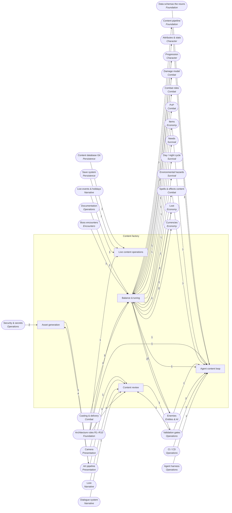

<!-- GENERATED by scripts/lib/systems-map.mjs render — do not edit; edit systems/registry/*.md and re-run. registry-hash: 949cf432b712 -->
# Content factory `content_factory`

[← Atlas index](../ATLAS.md) · source: [`registry/`](../registry/) · decision: [ADR-0065](../../adr/0065-systems-atlas-and-impact-map.md) · ask: `scripts/systems-map.sh impact <id>`

[P2][spec][orchestrator] · The agent content loop, balance, asset generation, review, live content

> **Analogy:** A factory line where agents stamp out content and inspectors check every unit

| Where | Spec |
|---|---|
| `tools/`, `data/_inbox/`, `art/_inbox/` | §6.9, §9, §13 Phase 5 |

## Systems and parts

Badge = `[phase][status][owner]`. Indentation = containment.

- `agent_content_loop` **Agent content loop** [P2][spec][content-smith] — Request to JSON to converter to gates to PR; the loop the architecture exists for · `data/_inbox/`
  - `request_to_json` **Request to JSON** [P2][spec][content-smith] — A plain-English request becomes schema-exact JSON, one file per def · `data/_inbox/`
  - `balance_anchoring` **Balance anchoring** [P2][spec][content-smith] — Read three to five comparable defs before choosing numbers · `data/`
  - `converter_gate_run` **Converter and gate run** [P2][spec][content-smith] — Run the converter, then G2, then G1 · `tools/`
  - `pr_review_flow` **PR review flow** [P2][spec][orchestrator] — The PR with .tres files, inbox JSON removed, ids listed, gates pasted · `.github/`
- `balance_tuning` **Balance & tuning** [P2][spec][content-smith/director] — Ranges, curves, difficulty, and candidate simulations · `docs/balance_ranges.md` +1
  - `balance_ranges` **Balance ranges** [P0][spec][director] — Allowed numeric ranges per field that G2 enforces · `docs/balance_ranges.md`
  - `stat_curves_level_scaling` **Stat curves** [P2][implied][content-smith] — How numbers grow by level and tier · `docs/balance_ranges.md`
  - `difficulty_curve` **Difficulty curve** [P2][implied][director] — Intended difficulty by biome and boss · `docs/balance_ranges.md`
  - `loot_economy_sim` **Loot economy simulation** [P—][candidate][test-pilot] — Monte Carlo over loot tables · `tools/balance/loot_sim.gd`
  - `combat_sim_harness` **Combat simulation harness** [P—][candidate][test-pilot] — Headless fights over many seeds · `tools/balance/combat_sim.gd`
- `asset_generation` **Asset generation** [P2][spec][world-builder/content-smith] — Icon and model generation through scripts and the import pipeline · `tools/gen/` +1
  - `icon_generation_prompts` **Icon generation prompts** [P2][spec][content-smith] — One-line prompts filed when an icon is missing · `art/_inbox/icon_requests.md`
  - `model_generation_api` **Model generation API** [P2][spec][world-builder] — Meshy or Tripo called only from tools with env keys · `tools/gen/`
  - `asset_intake_pipeline` **Asset intake pipeline** [P2][spec][world-builder] — Generated files enter only through the import hook · `art/_inbox/` +1
  - `icon_placeholder_fallback` **Icon placeholder fallback** [P2][spec][content-smith] — Use the placeholder until the icon exists · `art/icons/_placeholder.png`
- `content_review` **Content review** [P1][spec][test-pilot] — Screenshot sets, lore voice, id listing, flaky-test policy · `tests/` +1
  - `screenshot_review_sets` **Screenshot review sets** [P1][spec][test-pilot] — The standard camera set for review · `tools/testing/screens.gd`
  - `lore_voice_check` **Lore voice check** [P3][spec][quest-writer] — Would a player skip this line? Tighten until no · `docs/lore_bible.md`
  - `id_listing_in_pr` **Id listing in PR** [P2][spec][content-smith] — New ids listed in every content PR · `.github/`
  - `flaky_test_policy` **Flaky test policy** [P0][spec][test-pilot] — A test that would not pass 100 of 100 does not merge · `tests/`
- `live_content_ops` **Live content operations** [P—][candidate][director] — Patches, seasonal drops, data-only hotfixes · `data/` +1
  - `content_patches` **Content patches** [P—][candidate][director] — Content-only releases · `data/`
  - `seasonal_drops` **Seasonal drops** [P—][candidate][director] — Event-timed content · `data/events/`
  - `hotfix_data_only` **Data-only hotfixes** [P—][candidate][orchestrator] — Fix numbers without an engine build · `data/`

## Wiring at tier 2

Boxes inside the frame are this domain's systems; rounded boxes are the outside systems they wire to. Arrow labels count edges; direction is influence (a change at the tail can affect the head).

## Director decisions in this domain

| Candidate | Tier | Owner | What it would be |
|---|---|---|---|
| `live_content_ops` Live content operations | 2 (+3 parts) | director | Patches, seasonal drops, data-only hotfixes |
| `hotfix_data_only` Data-only hotfixes | 3 | orchestrator | Fix numbers without an engine build |
| `seasonal_drops` Seasonal drops | 3 | director | Event-timed content |
| `content_patches` Content patches | 3 | director | Content-only releases |
| `combat_sim_harness` Combat simulation harness | 3 | test-pilot | Headless fights over many seeds |
| `loot_economy_sim` Loot economy simulation | 3 | test-pilot | Monte Carlo over loot tables |

## Cross-domain edges

18 outbound (a change here reaches out), 40 inbound (a change elsewhere reaches in).

| Direction | Edge | How | Via | Strength | Why |
|---|---|---|---|---|---|
| → out | `balance_ranges` → `data_validator_g2` | reads | `docs/balance_ranges.md` | hard | G2 rejects numbers outside the documented balance ranges |
| → out | `balance_ranges` → `stat_formulas` | reads | `curve constants` | soft | Formula constants are documented as balance ranges |
| → out | `balance_ranges` → `level_curve` | reads | `curve` | soft | The curve constants are balance data |
| → out | `balance_ranges` → `damage_formula` | reads | `curve constants` | soft | Mitigation curves are balance data |
| → out | `balance_ranges` → `role_balance_targets` | reads | `targets` | hard | Role targets live with the other balance numbers |
| → out | `balance_ranges` → `pvp_balance_split` | reads | `pvp ranges` | hard | PvP numbers are a second column of balance data |
| → out | `balance_ranges` → `spell_defs_content` | reads | `number ranges` | soft | Spell numbers are anchored to balance ranges |
| → out | `balance_ranges` → `hunger` | reads | `drain rate` | soft | Drain rates are balance data |
| → out | `balance_ranges` → `phase_transitions` | reads | `day length` | soft | Day and night lengths are tunable |
| → out | `balance_ranges` → `fall_damage` | reads | `height curve` | soft | The damage curve is balance data |
| → out | `balance_ranges` → `item_stats_block` | reads | `stat ranges` | hard | G2 rejects stats outside the documented ranges |
| → out | `balance_ranges` → `loot_economy_tuning` | reads | `drop rates` | hard | Drop rates are balance numbers |
| → out | `loot_economy_sim` → `loot_economy_tuning` | reads | `simulated outcomes` | soft | A simulation would inform the numbers |
| → out | `balance_ranges` → `sinks_faucets` | reads | `inflation targets` | soft | Targets are balance data |
| → out | `balance_ranges` → `enemy_defs` | reads | `stat ranges` | soft | Enemy numbers are anchored to balance ranges |
| → out | `balance_ranges` → `enemy_stats_scaling` | reads | `bands` | hard | Scaling bands are balance data |
| → out | `asset_intake_pipeline` → `asset_generation_intake` | reads | `generator flow` | hard | Intake is the receiving end of the generation pipeline |
| → out | `screenshot_review_sets` → `g5_vision_review` | reads | `screenshots` | hard | Review consumes the standard set |
| ← in | `data_schemas` → `request_to_json` | reads | `schema shape` | hard | The JSON must match the schema exactly |
| ← in | `inbox_json` → `request_to_json` | reads | `drop location` | hard | Files land in the inbox |
| ← in | `id_convention` → `request_to_json` | reads | `ids` | hard | New ids follow R7 |
| ← in | `items` → `balance_anchoring` | reads | `comparable items` | hard | Anchoring reads existing items |
| ← in | `spell_defs_content` → `balance_anchoring` | reads | `comparable spells` | hard | Anchoring reads existing spells |
| ← in | `enemy_defs` → `balance_anchoring` | reads | `comparable enemies` | hard | Anchoring reads existing enemies |
| ← in | `json_to_tres_converter` → `converter_gate_run` | reads | `convert` | hard | The loop runs the converter |
| ← in | `g2_data_integrity` → `converter_gate_run` | reads | `G2` | hard | The loop runs G2 |
| ← in | `g1_unit_tests_gut` → `converter_gate_run` | reads | `G1` | hard | The loop runs G1 |
| ← in | `ci_cd` → `pr_review_flow` | reads | `gates on PR` | hard | The PR is checked by CI |
| ← in | `write_scope_enforcement` → `pr_review_flow` | reads | `scope check` | hard | The orchestrator rejects out-of-scope diffs |
| ← in | `game_infra_spec` → `balance_ranges` | reads | `§8 G2` | hard | The ranges document is required by G2 |
| ← in | `level_curve` → `stat_curves_level_scaling` | reads | `player curve` | hard | Curves describe the level curve |
| ← in | `enemy_stats_scaling` → `stat_curves_level_scaling` | reads | `enemy bands` | hard | Curves describe enemy bands |
| ← in | `boss_encounters` → `difficulty_curve` | reads | `boss tuning` | hard | Bosses are the difficulty milestones |
| ← in | `enemy_stats_scaling` → `difficulty_curve` | reads | `bands` | hard | Difficulty is expressed through stat bands |
| ← in | `weighted_rolls` → `loot_economy_sim` | reads | `roll function` | hard | The sim calls the real roll |
| ← in | `loot_table_defs` → `loot_economy_sim` | reads | `tables` | hard | The sim rolls the real tables |
| ← in | `deterministic_sim` → `loot_economy_sim` | reads | `seeds` | hard | The sim sweeps seeds |
| ← in | `deterministic_sim` → `combat_sim_harness` | reads | `seeds` | hard | Fights are seeded |
| ← in | `damage_model` → `combat_sim_harness` | reads | `real formula` | hard | The harness uses the real damage model |
| ← in | `casting` → `combat_sim_harness` | reads | `real casting` | hard | The harness uses the real casting verbs |
| ← in | `icon_conventions` → `icon_generation_prompts` | reads | `target path` | hard | Prompts name the path the icon must land at |
| ← in | `env_secrets` → `model_generation_api` | reads | `API keys` | hard | Keys come from the environment (R-SEC1) |
| ← in | `model_naming` → `model_generation_api` | reads | `target path` | hard | Generated models are named by id |
| ← in | `dependency_policy_r10` → `model_generation_api` | gated_by | `external API` | hard | An asset API is a dependency recorded in §9 |
| ← in | `import_hook` → `asset_intake_pipeline` | extends | `intake step` | hard | Intake is the import hook applied to generated files |
| ← in | `placeholder_assets` → `icon_placeholder_fallback` | reads | `placeholder` | hard | The fallback is the placeholder |
| ← in | `camera` → `screenshot_review_sets` | reads | `standard shots` | hard | The set is captured with the camera rig |
| ← in | `art_bible_palette` → `screenshot_review_sets` | reads | `comparison target` | hard | Reviews compare against the palette |
| ← in | `lore_bible` → `lore_voice_check` | reads | `voice` | hard | The check is against the bible |
| ← in | `dialogue_nodes_choices` → `lore_voice_check` | reads | `lines` | hard | The check reads dialogue lines |
| ← in | `id_convention` → `id_listing_in_pr` | reads | `ids` | hard | Listed ids follow the convention |
| ← in | `g1_unit_tests_gut` → `flaky_test_policy` | reads | `tests` | hard | The policy governs unit tests |
| ← in | `deterministic_sim` → `flaky_test_policy` | reads | `seeded` | soft | Seeded tests are how flakiness is avoided once the sim exists in Phase 1 |
| ← in | `content_versioning` → `content_patches` | reads | `versions` | hard | A patch is a content version |
| ← in | `save_migrations` → `content_patches` | reads | `old saves` | hard | Patches must keep old saves loading |
| ← in | `holiday_defs` → `seasonal_drops` | reads | `events` | hard | Drops are tied to events |
| ← in | `systems_content_split` → `hotfix_data_only` | reads | `data only` | hard | Hotfixes are possible because content is data (R1) |
| ← in | `data_dir_as_db` → `hotfix_data_only` | reads | `store` | hard | A hotfix is a data commit |

